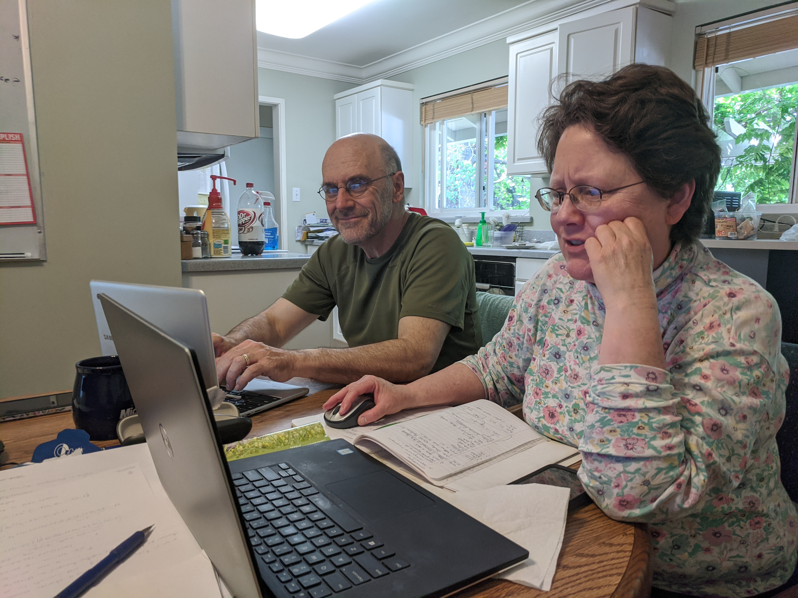
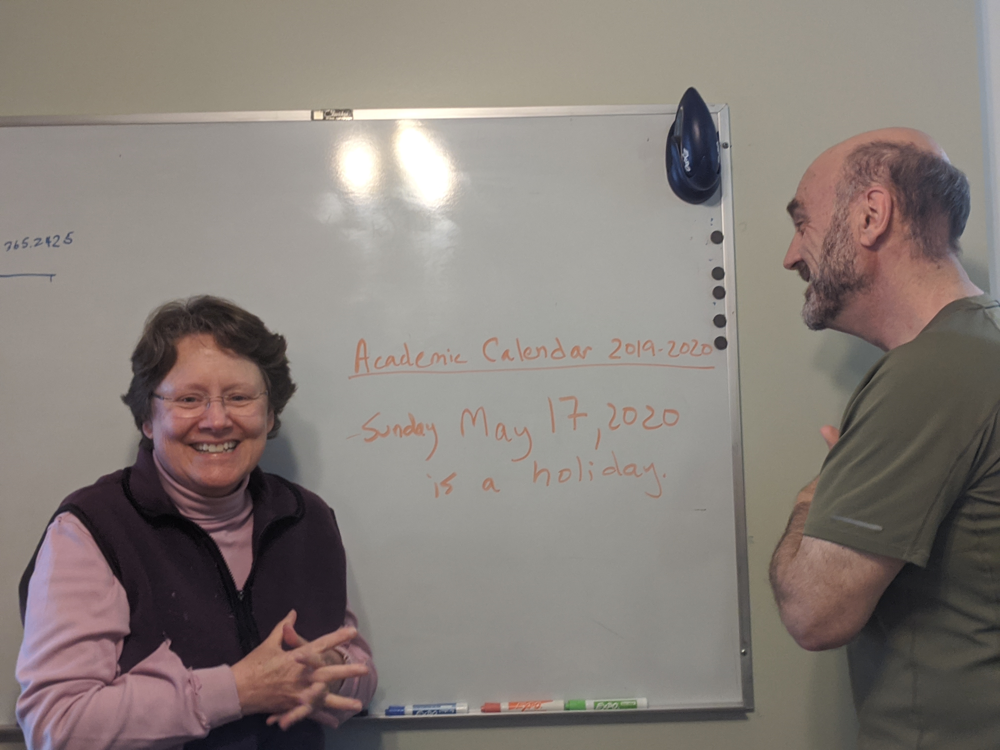
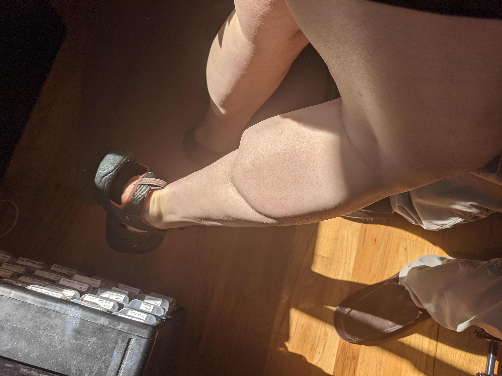

# The Idea Machine
## Learning at Harvard and MIT in the Age of Artificial Intelligence

### Background

One of my favorite books is <a href="https://mitpress.mit.edu/books/idea-factory">
The Idea Factory: Learning to Think at MIT</a> by Pepper White. It tells Pepper's story
as a student earning his Master's in Mechanical Engineering at MIT in the 1980s,
capturing his experiences as a student and as a researcher, including his constant feelings of inadequacy.
Forty years later, as a Master's student at Harvard conducting research in MIT's Brain and Cognitive
Science Department, these posts are my stories, inspired by Pepper and in tribute to
those who came before. To paraphrase my favorite quote, "If I could see \[...\] an insight,
a new way of looking at it that would maybe, just maybe, find its way into future generations
\[...\] In the Eiffel tower of technology, I would be a rivet."

### Coronavirus Career Development

My parents and I have often discussed the two of them trying to become more familiar with
quantitative topics. This past term, I was a teaching fellow for 
[Harvard's Data Science 10](https://github.com/stat10), and since I'm back at 
home due to Coronavirus, I proposed that I could teach them using the lectures, 
Jupyter notebooks and assignments. They both agreed and since then we've had an absolute
blast. The two of them have complementary strengths, with my father having an edge at 
coding and my mother having an edge with algebra. Here are the two of them, pair
programming on a Jupyter notebook.

 

I was expecting teaching the two of them to be uneventful, but
we've made so many enjoyable memories. During one lecture, my father fell asleep.
My mother and I couldn't believe it. Most of the time, he's a very good student.
I'm a big fan of students teaching me, so here he is, teaching us.

During another lecture, I was teaching conditional probability and introduced them
to the formula:

$$P(A|B) = \frac{P(A, B)}{P(B)}$$

I then gave them a practice problem and five minutes to solve it. Halfway through, my
mother exclaimed "I've been using the wrong formula!" Here she is laughing at her
mistake.

My favorite story concerns our cabin. We're legally required to remove the flammable
debris surrounding it, so once a year, we typically head up where we rake and burn
the pine needles. However, this year was going to need extra work. The winter had 
been dry, and had been followed by a heavy snowstorm that wrecked havoc on the
weakened trees; three trees had fallen on our cabin. My mother sent me the following
email, asking for a break from our lectures to take care of the cabin.

 

She then showed up in my office and told me that I was misreading the academic
calendar. I asked, "How's that?" She then wrote the following on the whiteboard.

One of my friends, V, has agreed to be a guest lecturer and we're so excited.
If you're interested in joining us or doing something similar with your family,
get in touch!

### Hosting Trivia

My supervisor Ila was promoted to full professor at MIT, so my lab decided to
host a remote celebration. My labmate Su, who was coordinating the celebration,
was a bit concerned that we might benefit from having an activity to do
together, so I volunteered to put together a round of trivia. We ended up not
using any of the questions I put together because we ended up listening to Ila
tell us her life's story. She spoke about wanting to pursue philosophy, but 
being advised that it wasn't a promising career. She told us she discovered
neuroscience almost by accident, and that she met her husband (another professor)
relatively early in their academic trajectories. At the end, she made a 
vulnerable confession, which I appreciated tremendously. She said that after
being a professor for ten years (and in academia for much, much longer), this
was the first year where she didn't ask herself if she was wasting her time
and if she was fail to measure up to her own expectations. She said not even
becoming a full professor at MIT quelled those concerns.

While I loved the story, sadly I didn't get to use my trivia questions. However,
my friend [Vincent Yang](https://www.yangvincent.com/) was already attending online 
trivia hosted by a friend of his and he wanted to host his own, so he and I started
developing questions for him to use. In my opinion, crafting trivia questions is
more challenging than playing trivia. Since our objective was for attendees to have
fun, we started by asking what makes trivia fun. Is it getting the answer correct?
Being asked questions about topics you enjoy, even if you don't know the answer? 
Struggling to answer questions? The answer, we decided, is a mixture. One particularly
fun aspect was taking some answer based on a cool fact and constructing an answer
around it. Ultimately, Vincent's trivia was a smashing success. He had 71 (ish)
attendees, and my sister, who showed up late and teamless, placed 4th by herself.
My friend Jessica's team, "Essential Twerkforce," came in first.

### Dad's Legs

This one is a bit gnarly, but honestly, I can't not talk about this. My father 
cycles for 90 minutes five nights a week, consistently, and I finally noticed
legs. I made him stand in the light where I could capture the following photos.

I showed some friends. One said "that is my h*ll of a gastrocnemius! must say,
 my jaw slightly dropped." Another wrote, "How come your dad is sportier than
 all my friends in my age."