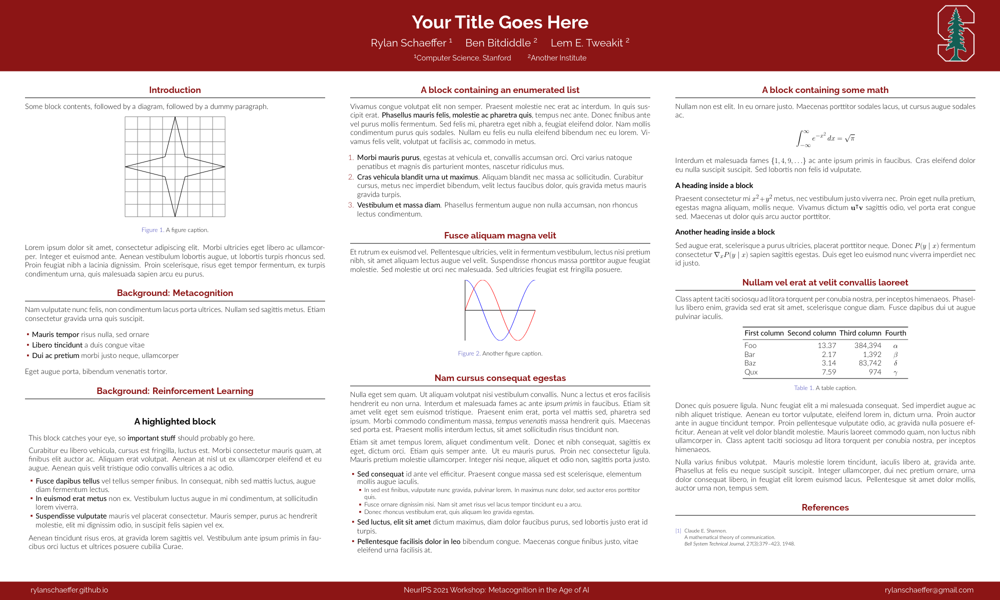
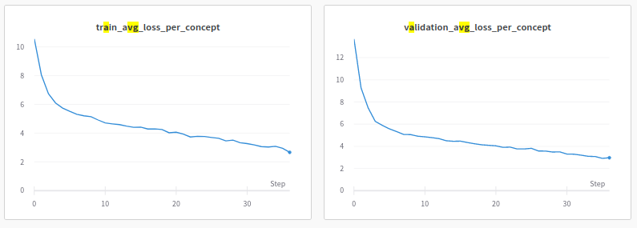
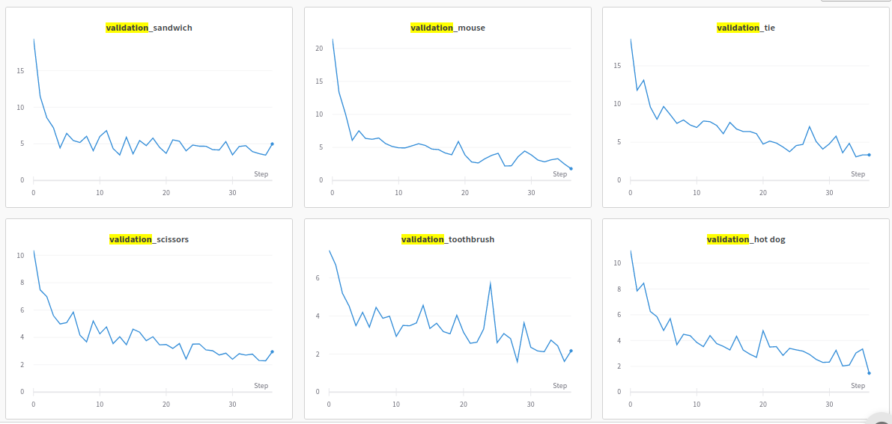
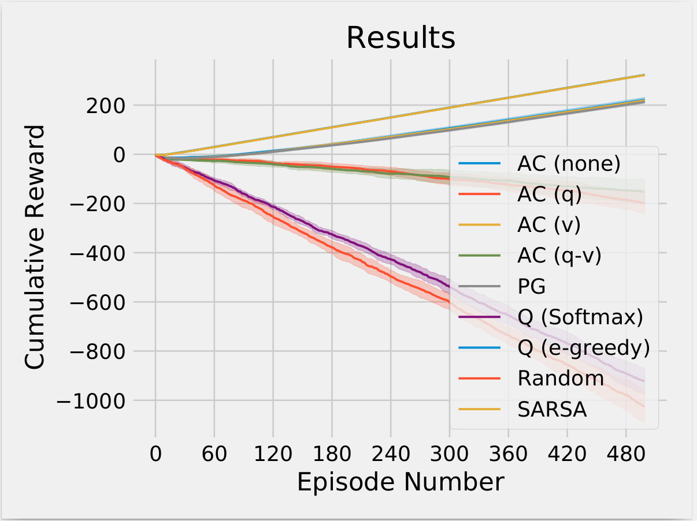

## Monday

## Tuesday

I couldn't find a Stanford LaTeX Poster template and no one else knew of one either,
so I made a [poster template](https://github.com/RylanSchaeffer/Stanford-LaTeX-Poster-Template)
and shared it on GitHub. It looks quite nice, if I do say so myself :)

## Wednesday

I sent Noah results from our CLIP-GPT2 experiment, trying to test whether
GPT-2 can learn to generate a natural-language utterance describing the COCO
class of each image.

On a concept-by-concept basis, losses are also falling. I'm keen to test how well
the model generalizes to (a) held-out concepts and (b) logical combinations of
concepts (e.g. human and dog).

At Dan Yamins's lab meeting, Eli Wang presented [Physion](https://arxiv.org/abs/2106.08261).
To me, the two takeaways were that:

1. Feedforward convolutional neural networks are bad at dynamic scene prediction
2. Graph neural networks applied to the physics engine's particles are much better

This raises the questions of (1) whether the brain tries to represent something like
physics engine particles or something similar but a bit more conceptually abstract,
and (2) how well neural networks can learn to predict particles from images. I thought
that the answer to (2) would be high performance because it's a supervised learning
problem on which we can generate an infinite amount of data, but Dan said networks 
almost always fail to generalize.

I met with my MIT UROP, who has decided she'd prefer to pursue a slightly different
project. I'm slowly learning how to adapt to peoples' interests.

My Metacognitive Actor Critic gridworld results are puzzling. An Actor-Critic
with a $$Q$$ baseline and an Actor-Critic with a $$Q-V$$ baseline both perform
pretty poorly compared to PG or Actor-Critic with a $$V$$ baseline. I'm not
sufficiently familiar with RL to know if this should be expected, but I thought
that $$Q-V$$ should be the optimal baseline?

