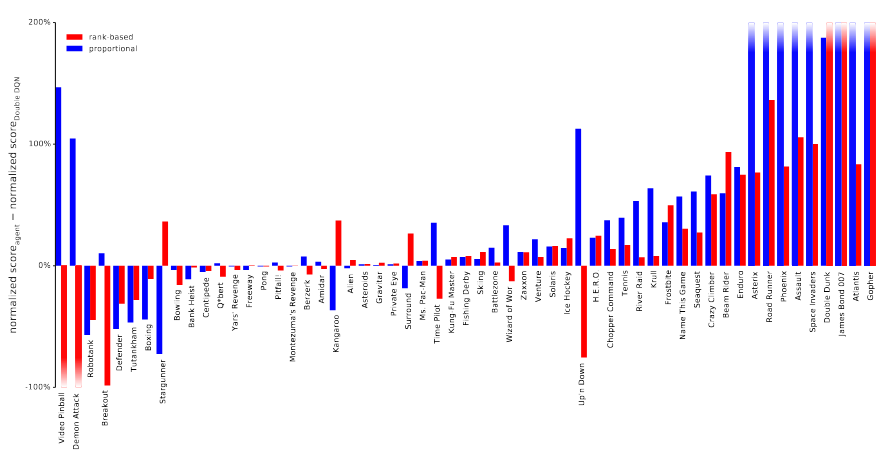

## Background

- Properties of human memory
  - Sparse recall: attend to only small portion of the past
    - Isn't that the point of memory? Thinking back to specific event(s) out of a large set
    - 
  - Detailed recall: level of recollection is detailed
- Recap of past 6 years
  - RNNs
    - don't separate memory from computation
    - TODO: Think about whether there's really any difference
  - External memory architectures e.g. Neural Turing Machine, Differentiable Neural Computer
    - Can't deal well with long temporal context
    - Where is Aran getting this from?
  - Attention
    - Dispense with recurrence -> this is wrong
    - Why doesn't work in RL?
  - Attention + Gating
  - 

## Idea

- Idea: combining attention with external memory
  - Given sequence of inputs, chunk into blocks
  - Generate a high level summary (average pool)
  - When query comes in, attend to top K of summaries, then recurse
  - This is an HCAM block
  - In practice, they stack 4 HCAM blocks
  - Self-supervised vision and language losses
  - Strongly forced to use memory system (I think) 

## Experiments

### Ballet Dancer

- Many shapes dancing a pattern, then given instruction to navigate to specific
  shape e.g. "go to dancer that danced in a square"
- TrXL is gated transformer
- Would LSTM would get there?
- 

- 1 billion training steps

### Object Permanence

- Objects pop out of boxes, then told to find a box with an object

### Rapid Work Learning with distractor

## Dirty Details
  - Without self-supervised losses, agent is no better than baseline
    - Figure 13
  - Language model and vision model are relatively simple
  - 

## Questions
  - How do they decide when to write? Always write 
  - Why not take a generative approach? Memory is reconstructive
  - What changes from NTM are necessary?
    - Hierarchy
    - Top K
    - Separate key-query transform
    - Multiple layers of memory
    - Placement of memory
    - Aran's hypothesized answer:
      - Key-query (Memo paper: see https://arxiv.org/abs/2001.10913)
      - Top K of chunks + Hierarchy
  - Why does vision have to go through memory
  - Is there a path from encoders, not decoders, that doesn't pass through memory layers?
    - Yes, skip connections

## Related Papers

- https://arxiv.org/abs/2006.03662
- https://arxiv.org/abs/2001.10913

## Summary

recall of event details, object permanence, rapidly binding/associate and
to generalize out of distribution
