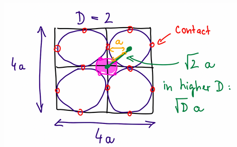

Stan just wrote a [post](https://stanislavfort.github.io/blog/sphere-spilling-out/)
about the counter-intuitive properties of high dimensions, focusing on a sphere touching
surrounding spheres packed inside surrounding squares:

He then shows as the dimensionality increase, the inner sphere
becomes this spiky object, popping out from between the surrounding
spheres:

It's a common example, but one that (in my opinion) is too complicated to explain simply,
especially when there's a much simpler example available: a single sphere.
Let's ask a simple question: __how much of a sphere is close to its boundary in high dimensions__?

### Dimensions = 2

Let's start with $$D=2$$ dimensions and ask what fraction of a radius-$$r$$ sphere (i.e. a circle)
is within $$\epsilon << r$$ of its surface. We know that the total volume is $$\pi r^2$$ and the 
inner volume is $$\pi (r - \epsilon)^2$$, so the fraction _not_ near the periphery is:

$$\frac{\pi (r - \epsilon)^2}{\pi r^2} = \Big(\frac{r - \epsilon}{r}\Big)^2 $$

For a small $$\epsilon$$ e.g. 0.01r, a high fraction of the volume is in the middle e.g. 98%.
and so most of the circle is not near the surface. 

### Dimensions = 3

In $$D=3$$ dimensions, we again ask: what fraction of a radius-$$r$$ sphere
is within $$\epsilon < r$$ of its surface. We know that the total volume is $$\frac{4}{3}\pi r^3$$ and the
inner volume is $$\frac{4}{3} \pi (r - \epsilon)^3$$, so the fraction _not_ near the surface is:

$$\frac{\frac{4}{3} \pi (r - \epsilon)^3}{\frac{4}{3} \pi (r)^3} = \Big(\frac{r - \epsilon}{r}\Big)^3 $$

Again, most of the volume is in the middle, and so most of the sphere is not near the boundary.

### Dimensions = D

What happens as the number of dimensions grow? We find that the volume in the center of the n-sphere is
given by

$$\Big( \frac{r-\epsilon}{r} \Big)^D$$

As $$D$$ gets larger, that fraction converges to 0 since the term being exponentiated, $$(r-\epsilon) / r$$
is less than $$1$$. Consequently, the fraction of the sphere in the middle goes to zero and the sphere
becomes hollow!  In 2D, almost all of a circle is more than $$\epsilon$$ away from its shell, but in high
dimensions, almost all of an n-sphere is within $$\epsilon$$ from its boundary.

To summarize: __spheres in high dimensions become hollow__!! 

So much simpler than boxes, spheres and spikes!!

