# Experience Replay

Experience replay is a fascinating topic spanning machine learning, neuroscience and 
cognitive science. At the heart of replay are 3 questions, asking how an
agent should use its past experiences

1. to build a model of its world?
2. to most efficiently propagate reward information in that model?
3. to plan future actions using that model?

The machine learning literature has historically focused on the second question, but emerging
work in neuroscience and cognitive science suggests that these three questions
are intimately related. This story begins with the second question and continues to the
forefront of the third and first questions.

## Notation

In reinforcement learning (RL), one common mathematical framework is to consider an agent
in a Markov Decision Process (MDP). An experience is commonly defined as a 4-tuple
of an agent's state, the action it takes, the reward it receives and the next state
it ends up in:

$$e_k = (s_k, a_k, r_k, s_{k+1})$$

As an agent moves through its environment, it builds a collection of these experience
often called a __replay buffer__.

## Advances

### Experience Replay

The right place to start is with model-free value-based RL: Q learning. The original 
idea of Q-Learning was when an agent obtains a new experience i.e. is in some state, 
takes an action, receives a reward, and moves to the next state), it should use that experience
to immediately perform a Bellman backup:

$$Q(s_t, a_t) \leftarrow Q(s_t, a_t) + \eta (r_t + \gamma \max_a Q(s_{t+1}, a) - Q(s_t, a_t))$$

The experience is then discarded. [In 1992, Lin introduced the idea of experience replay](https://link.springer.com/content/pdf/10.1007/BF00992699.pdf).
The idea was that instead of discarding past experiences immediately, the agent should store those experiences
in its replay buffer and then uniformly sample from the buffer. This idea proved critical
in [Minh et al.'s 2015 DQN Nature paper](https://www.nature.com/articles/nature14236).

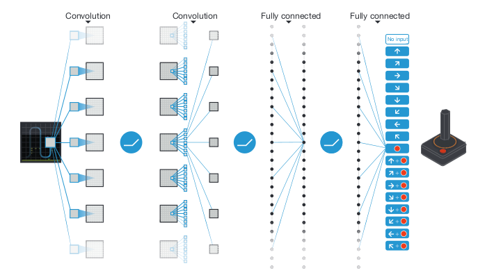

Many people remember the paper for showing that deep Q-Learning can surpass human performance at Atari games,
but the authors were clear that experience replay was critical: f"Notably, the successful integration of
reinforcement learning with deep network architectures was _critically dependent on our incorporation
of a replay algorithm involving the storage and representation of recently experienced transitions._"
On a subset of 5 games, removing replay eviscerated the agent's performance. 

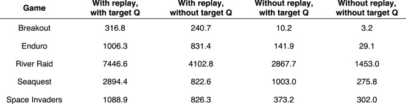

The specific replay mechanism was a queue (FIFO) with a capacity of 1 million experiences. that 
sampled experiences uniformly at random, on average 8 times. Note that because Q-learning is model
free, these experiences were not used to learn a model of any environment.

### Prioritized Experience Replay

At [ICLR 2016, Schaul et al.](https://arxiv.org/pdf/1511.05952.pdf) proposed that
sampling experiences uniformly at random might be a suboptimal approach. They suggested that
the agent could instead prioritize certain experiences, using the heuristic of
how wrong the agent's predictions were. Specifically, Schaul et al. suggested that when 
sampling experiences, the agent should take into account its temporal-difference (TD)
errors $$\deta_t$$ (also known as reward prediction errors):

$$ \delta_t := R_t + \gamma \max_a Q(S_t, a) - Q(S_{t-1}, A_{t-1})$$

As a motivating example, the authors present the "Blind Cliffwalk" environment, in which
there is a sequence of $$n$$ states, each state has 2 actions and in order to reach the goal state,
the agent must choose the correct action in each state or else go back to the beginning. 
If the agent samples uniformly over its
experiences, it needs a massive number of samples and updates to learn to reliably reach the goal,
whereas an oracle (which greedily selects a transition that maximimally reduces the global 
loss) requires significantly fewer samples and updates.

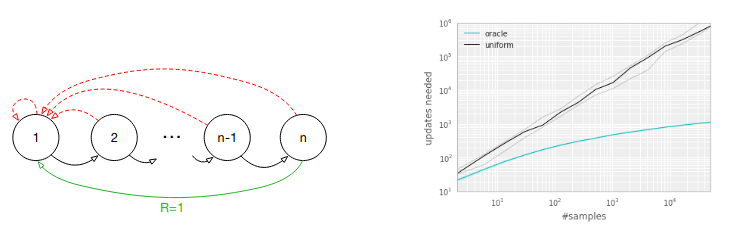

However, the agent can't just greedily select the experience with the highest TD error,
for at least 2 reasons:

1. The agent will overfit to experiences with high TD errors because states with low TD error will never be replayed
2. If rewards are stochastic, high TD errors will be monopolized by tails of the reward distributions

Instead of greedily selecting experiences to replay, Schaul and colleagues propose that experiences should
be sampled randomly. They propose two different ways to define the priority of the $$k$$th experience

1. Direct: $$p_k := \lvert \delta_k \lvert + \epsilon$$, where $$\epsilon > 0$$ is a small positive constant to
   ensure even experiences with no TD error have a chance at being replayed
2. Indirect: $$p_k := \frac{1}{rank(k)}$$

and then sample experiences proportional to the priority:

$$p(e_k) = \frac{p_k^{\alpha}}{\sum_{k'} p_{k'}^{\alpha}} $$

They then introduce one other change: they use importance sampling weights, defined as:

$$w_k := \Big( \frac{1}{N p(e_k)} \Big)^{\beta}$$

They found that both prioritization approaches yielded similar boosts in max and average
performance on the Atari suite of games

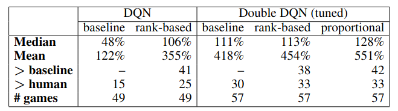

They also found that learning was faster for the prioritized replay agents.

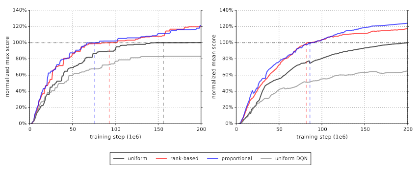

As a disclaimer, the authors later write "Note that mean performance is not a very reliable metric
because a single game (Video Pinball) has a dominant contribution." If that's the case, I don't 
understand why max score is a more reliable metric, since surely the same problem exists there?

Looking at each game individually, they found that while the effect of the replay sampling
differed depending on the game, both replay mechanisms typically offered an improvement.

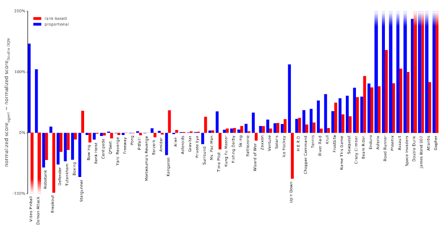

#### Prioritized Experience Replay: Questions and Details

Questions

- Why did they only try their sampling on Double DQN and not DQN? What impact does prioritize replay
  have on DQN?
- The paper claims that the importance sampling (IS) weights are useful and offers a handwavy explanation
  for why. Are there any ablations testing the effects of not using the IS weights?
  - Fig 12 in the appendix contains such ablation tests, but only for 4 environments and 
    only for rank-based sampling. Honestly, this evidence seems to suggest not only that IS is not critical
    but that uniform is indistinguishable from rank-based no IS and from rank-based IS.

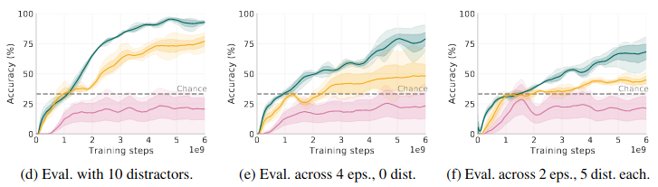

### Normative Prioritized Experience Replay

In [2018, Mattar and Daw](https://www.nature.com/articles/s41593-018-0232-z) presented a beautiful
and simple idea. Rather than proposing a heuristic for prioritizing experience, they asked: could the
problem of choosing experiences be written as an optimization problem? The answer
was yes! For a deeper dive, read my [blog post](../_kernel_papers/mattar_natneuro_2018_prioritize_memory.html),
but I've included a high level summary here.

Mattar and Daw's approach starts with consider what effect replaying an experience will have. 
Suppose the agent is in state $$s_t$$ and considers replaying experience $$e_k$$. 
Before replaying that experience, the agent has some value function for its current state:

$$V^{\pi_{old}}(S = s_t) := \mathbb{E}_{\pi_{old}} \Big[ \sum_{i=t}^{\infty} \gamma^i R_{i+1} \Big] $$

After replaying that experience, the agent has a new (although possibly identical) value function
for its current state:

$$V^{\pi_{new, k}}(S = s_t) := \mathbb{E}_{\pi_{new, k}} \Big[ \sum_{i=t}^{\infty} \gamma^i R_{i+1} \Big] $$

Mattar and Daw's idea is that the agent should choose to replay whichever experience maximizes the 
increase from the old value function in the current state to the new value function in the current state
i.e. how much **more** value the agent will accrue moving forward. They pose the following optimization problem:

$$\arg \max_{e_k} V^{\pi_{new, k}}(S = s_t) - V^{\pi_{old}}(S = s_t)$$

They term this improvement, this difference, the __Expected Value of Backup (EVB)__:

$$EVB(s_t, e_k) := V^{\pi_{new, k}}(S = s_t) - V^{\pi_{old}}(S = s_t)$$

Mattar and Daw then show that the expected value of a backup can be decomposed into the product of
two terms:

$$ EVB(s_t, e_k) := Need(s_t, s_k) Gain(s_k)$$

1. __Need__: How likely is the agent is to find itself in $$s_k$$ in the future?
2. __Gain__: How much more value will the agent accrue in $$s_k$$, following $$\pi_{new, k}$$ instead
 of $$\pi_{old}$$?

The need is defined as:

$$Need(s_t, s_k) := \sum_{t' = t}^{\infty} \gamma^{t' - t} \delta(S_{t'}, s_k) $$

The gain is defined as:

$$Gain(s_k) := \sum_{a \in A} Q^{\pi_{new, k}} (s_k, a) \Big(\pi_{new, k}(a|s_k) - \pi_{old}(a|s) \Big) $$

In their simulations, Mattar and Daw assumes that the agent solves this optimization 
problem by brute force i.e. computing each experience's EVB and then replaying the
experience with the highest EVB. Before showing the wealth of experimental phenomena
that this approach can explain, we should acknowledge some of its shortcomings:

- This approach only works for a known, discrete state space and a known transition function $$P(s_{t+1} | s_t, a_t)$$ 
- The proof assumes that changing the agent's policy in one state has no effect on the agent's
policy any other state. This is unrealistic if the agent uses function approximation.
- The proposed prioritization scheme is circular, in that when deciding whether to replay an experience 
  that will change its action value function, the agent must first compute the action value function
  after replaying the experience $$Q^{\pi_{new}}$$, which requires performing the backup!
- The optimization problem is greedy, in that it asks for the single best experience to replay
- Their solution to the optimization problem is to compute the EVB for each experience and is therefore
  linear in the number of experiences at each time step
- The theory doesn't explain _when_ to replay, just _what_ to replay (although see Agrawal, Mattar, Daw and Cohen 2020)

Mattar and Daw consider two abstract versions of tasks used by mouse experimentalists:
the open field and the linear track. They show that their prioritized replay learns
to significantly faster learning:

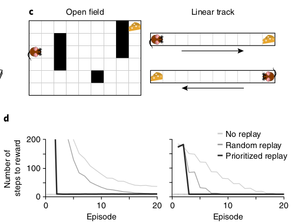

Two experimental phenomena that Mattar and Daw are interested in are (a) reverse replay and
(b) reverse replay. Reverse replay refers to when a sequence of hippocampal cells fire
starting from the animal and typically tracing the animal's path backwards, whereas
forward replay refers to when a sequence of hippocampal
cells fire starting from the animal's current position and tracing the path the animal
will take. Reverse replay almost always occur at the end of a trial and forward replay
almost always occurs at the start of a trial:

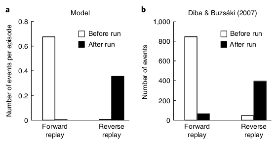

In Mattar and Daw's model, reverse replay occurs when the animal encounters
a reward, it now wants to propagate that reward information
backwards (i.e. gain dominates) to know how to return to the reward location.

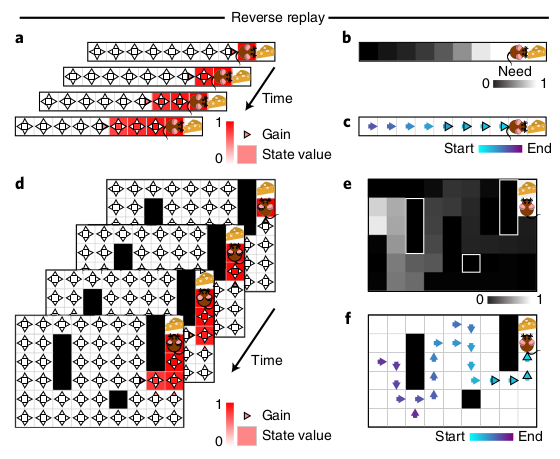

In contrast, forward replay occurs when the animal needs to figure out where
to go.

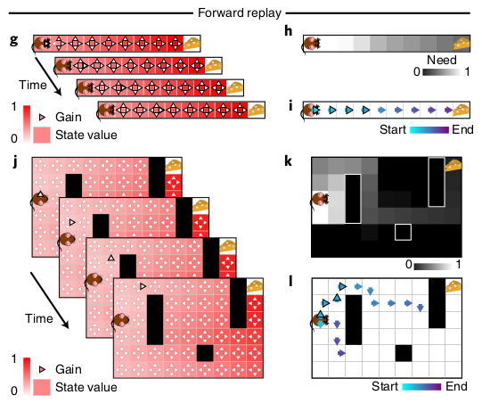

In the model, replay almost always starts from the animal's current position,
matching experimental data.

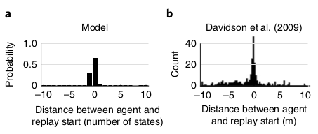

Next, Mattar and Daw explain asymmetric effects of positive and negative
prediction errors. Ambrose et al. tried increasing the reward four-fold in half 
the trials and found that forward replay was unaffected but reverse replay
increased. This is caused by more reverse replay for 4x reward trials and fewer
reverse replay for 1x reward trials. 

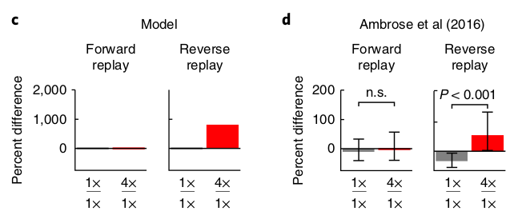

However, when the authors tried decreasing the reward to 0 in half the trials,
they again found no effect on forward replay, but that no reward has a
negative effect on reverse replay, which is caused by more reverse replay for 1x 
trials and less replay for 0x trials.

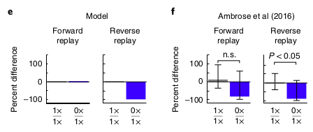

However, Wu and colleagues found a difference result if the reward is negative (i.e. a shock)
instead of just zero: the amount of reverse replay increases. The model explains 
this because a negative reward prediction error only matters if a better option
is available; since the mice are running back and forth on a linear track, 1 reward or 0 reward is
better than not running, but when the shock is introduced, 0 reward or -1 reward means
that the animal should stop running.

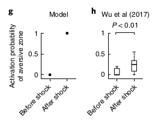

#### Prioritized Experience Replay: Questions and Details

Details

- Again, one key assumption is that changing the agent's policy in one state has no effect on the agent's
  policy in other state.

Questions

- 

## Theory

https://ieeexplore.ieee.org/abstract/document/8636075

## Empirical Study

http://proceedings.mlr.press/v119/fedus20a.html

https://arxiv.org/pdf/1712.01275.pdf

## Replay for Changing Goals

https://arxiv.org/abs/1707.01495

https://arxiv.org/pdf/1906.08387.pdf

## Replay in Continual Learning

https://arxiv.org/abs/1811.11682

https://ojs.aaai.org/index.php/AAAI/article/view/11595