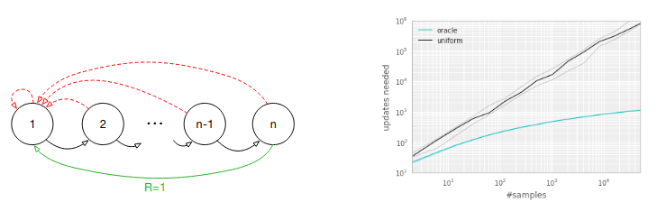

# Experience Replay in Machines

## Algorithms

### Experience Replay

DQN used large sliding window, sampled uniformly at random, revisited each transition ~8 times

### Prioritized Experience Replay

At [ICLR 2016, Schaul et al.](https://arxiv.org/pdf/1511.05952.pdf) proposed prioritizing 
experienced based on temporal-difference (TD) errors.

$$ \delta_t := R_t + \gamma \max_a Q(S_t, a) - Q(S_{t-1}, A_{t-1})$$

However, greedily prioritizing experiences with high TD errors is problematic for 2 reasons:

1. Model overfits to experiences with high TD errors because states with low TD error are never replayed
2. If rewards are stochastic, high TD errors can be monopolized by tails of the reward distributions

Instead of greedily selecting experiences to replay, Schaul and colleagues propose that experiences should
be sampled randomly. They propose two different ways to define the priority of the $$k$$th experience

1. Direct: $$p_k := \lvert \delta_k \lvert + \epsilon$$, where $$\epsilon > 0$$ is a small positive constant to
   ensure even experiences with no TD error have a chance at being replayed
2. Indirect: $$p_k := \frac{1}{rank(k)}$$

and then sample experiences proportional to the priority:

$$p(e_k) = \frac{p_k^{\alpha}}{\sum_{k'} p_{k'}^{\alpha}} $$

They then introduce one other change: they use importance sampling weights, defined as:

$$w_k := \Big( \frac{1}{N p(e_k)} \Big)^{\beta}$$

They found that both prioritization approaches yielded similar boosts in max and average
performance on the Atari suite of games

They also found that learning was faster for the prioritized replay agents.

Looking at each game individually, they found that 

However, I

#### Prioritized Experience Replay: Questions and Details

Questions

- Why did they only try their sampling on Double DQN and not DQN?
- The paper claims that the importance sampling weights are useful and offers a handwavy explanation
  for why. Are there any ablations testing the effects of not using the importance sampling weights?
  - Fig 12 in the appendix contains such ablation tests

Details
- 

## Empirical Study

http://proceedings.mlr.press/v119/fedus20a.html

https://arxiv.org/pdf/1712.01275.pdf

## Replay for Changing Goals

https://arxiv.org/abs/1707.01495

https://arxiv.org/pdf/1906.08387.pdf

## Replay in Continual Learning

https://arxiv.org/abs/1811.11682

https://ojs.aaai.org/index.php/AAAI/article/view/11595