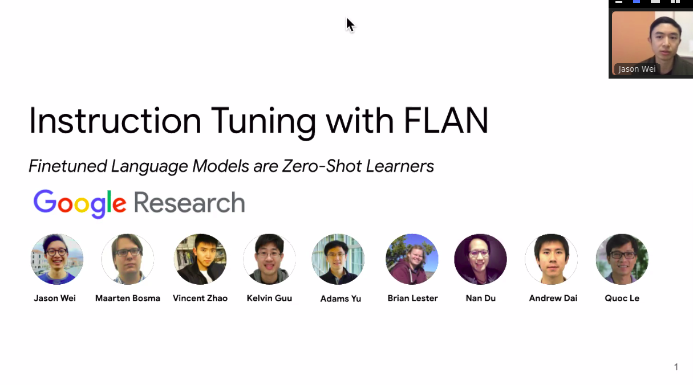

# Experience Replay in Machines

## Algorithms

### Experience Replay

DQN used large sliding window, sampled uniformly at random, revisited each transition ~8 times

### Prioritized Experience Replay

At [ICLR 2016, Schaul et al.](https://arxiv.org/pdf/1511.05952.pdf) proposed prioritizing 
experienced based on temporal-difference (TD) errors.

However, greedily prioritizing experiences with high TD errors several problems:

1. Model overfits to experiences with high TD errors because states with low TD error are never replayed
2. High TD errors can be driven by tails of stochastic reward distributions, so the data
  being learnt from is not representative

So instead of greedily selecting experiences to replay, sample experiences randomly:

$$p(e_k) = \frac{p_k^{\alpha}}{\sum_{k'} p_{k'}^{\alpha}} $$

where $$p_k$$ is the prioritization of the $$k$$th experience. The authors explored 2 different
ways of defining $$p_k$$:

1. Direct: $$p_k := |\delta_k| + \epsilon$$, where $$\epsilon > 0$$ is a small positive constant  

[In a 2017 retrospective called Rainbow, Hessel and colleagues](https://arxiv.org/pdf/1710.02298.pdf) decided to 
empirically test to what extent new algorithms improved performance over the original DQN paper from 
Minh et al. 2015. What they found is the three best performing algorithms were:

1. Prioritized DDQN

Rainbow: https://arxiv.org/pdf/1710.02298.pdf

## Empirical Study

http://proceedings.mlr.press/v119/fedus20a.html

https://arxiv.org/pdf/1712.01275.pdf

## Replay for Changing Goals

https://arxiv.org/abs/1707.01495

https://arxiv.org/pdf/1906.08387.pdf

## Replay in Continual Learning

https://arxiv.org/abs/1811.11682

https://ojs.aaai.org/index.php/AAAI/article/view/11595