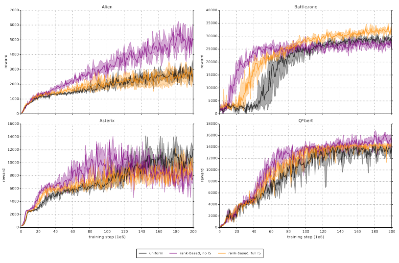

# Experience Replay

Experience replay is a fascinating topic spanning machine learning, neuroscience and 
cognitive science. At the heart of replay are 3 questions, asking how an
agent should use its past experiences

1. to build a model of its world?
2. to most efficiently propagate reward information in that model?
3. to plan future actions using that model?

The machine learning literature has historically focused on the second question, but emerging
work in neuroscience and cognitive science suggests that these three questions
are intimately related. This story begins with the second question and continues to the
forefront of the third and first questions.

## Notation

In reinforcement learning (RL), one common mathematical framework is to consider an agent
in a Markov Decision Process (MDP). An experience is commonly defined as a 4-tuple
of an agent's state, the action it takes, the reward it receives and the next state
it ends up in:

$$e_k = (s_k, a_k, r_k, s_{k+1})$$

As an agent moves through its environment, it builds a collection of these experience
often called a __replay buffer__.

## Advances

### Experience Replay

The right place to start is with model-free value-based RL: Q learning. The original 
idea of Q-Learning was when an agent obtains a new experience i.e. is in some state, 
takes an action, receives a reward, and moves to the next state), it should use that experience
to immediately perform a Bellman backup:

$$Q(s_t, a_t) \leftarrow Q(s_t, a_t) + \eta (r_t + \gamma \max_a Q(s_{t+1}, a) - Q(s_t, a_t))$$

The experience is then discarded. [In 1992, Lin introduced the idea of experience replay](https://link.springer.com/content/pdf/10.1007/BF00992699.pdf).
Rather than discarding experiences immediately, Lin proposed that the agent should store the experiences
in a replay buffer and then uniformly sample experiences from the buffer. This idea proved critical
in [Minh et al.'s 2015 DQN Nature paper](https://www.nature.com/articles/nature14236).

Many people remember the paper for showing that deep Q-Learning can surpass human performance at Atari games,
but the authors were clear that replay was critical: f"Notably, the successful integration of
reinforcement learning with deep network architectures was _critically dependent on our incorporation
of a replay algorithm involving the storage and representation of recently experienced transitions._"
On a subset of 5 games, removing replay eviscerated the agent's performance. 

The specific replay mechanism was a queue (FIFO) with a capacity of 1 million experiences. that 
sampled experiences uniformly at random, on average 8 times. Note that because Q-learning is model
free, these experiences were not used to learn a model of any environment.

### Prioritized Experience Replay

At [ICLR 2016, Schaul et al.](https://arxiv.org/pdf/1511.05952.pdf) proposed that
sampling experiences uniformly at random might not be optimal. Rather, they suggested that
the agent could instead prioritize certain experiences, using the heuristic of
how wrong the agent's predictions were. Specifically, the authors suggested that when 
sampling experiences, the agent should take into account its temporal-difference (TD)
errors $$\deta_t$$ (also known as reward prediction errors):

$$ \delta_t := R_t + \gamma \max_a Q(S_t, a) - Q(S_{t-1}, A_{t-1})$$

As a motivating example, the authors present the "Blind Cliffwalk" environment, in which
there is a sequence of $$n$$ states, each state has 2 actions and in order to reach the goal state,
the agent must choose the correct action in each state or else go back to the beginning. 
If the agent samples uniformly over its
experiences, it needs a massive number of samples and updates to learn to reliably reach the goal,
whereas an oracle (which greedily selects a transition that maximimally reduces the global 
loss) requires significantly fewer samples and updates.

However, the agent can't just greedily select the experience with the highest TD error,
for at least 2 reasons:

1. The agent will overfit to experiences with high TD errors because states with low TD error will never be replayed
2. If rewards are stochastic, high TD errors will be monopolized by tails of the reward distributions

Instead of greedily selecting experiences to replay, Schaul and colleagues propose that experiences should
be sampled randomly. They propose two different ways to define the priority of the $$k$$th experience

1. Direct: $$p_k := \lvert \delta_k \lvert + \epsilon$$, where $$\epsilon > 0$$ is a small positive constant to
   ensure even experiences with no TD error have a chance at being replayed
2. Indirect: $$p_k := \frac{1}{rank(k)}$$

and then sample experiences proportional to the priority:

$$p(e_k) = \frac{p_k^{\alpha}}{\sum_{k'} p_{k'}^{\alpha}} $$

They then introduce one other change: they use importance sampling weights, defined as:

$$w_k := \Big( \frac{1}{N p(e_k)} \Big)^{\beta}$$

They found that both prioritization approaches yielded similar boosts in max and average
performance on the Atari suite of games

They also found that learning was faster for the prioritized replay agents.

As a disclaimer, the authors later write "Note that mean performance is not a very reliable metric
because a single game (Video Pinball) has a dominant contribution." If that's the case, I don't 
understand why max score is a more reliable metric, since surely the same problem exists there?

Looking at each game individually, they found that while the effect of the replay sampling
differed depending on the game, both replay mechanisms typically offered an improvement.

#### Prioritized Experience Replay: Questions and Details

Questions

- Why did they only try their sampling on Double DQN and not DQN? What impact does prioritize replay
  have on DQN?
- The paper claims that the importance sampling (IS) weights are useful and offers a handwavy explanation
  for why. Are there any ablations testing the effects of not using the IS weights?
  - Fig 12 in the appendix contains such ablation tests, but only for 4 environments and 
    only for rank-based sampling. Honestly, this evidence seems to suggest not only that IS is not critical
    but that uniform is indistinguishable from rank-based no IS and from rank-based IS.

## Theory

https://ieeexplore.ieee.org/abstract/document/8636075

## Empirical Study

http://proceedings.mlr.press/v119/fedus20a.html

https://arxiv.org/pdf/1712.01275.pdf

## Replay for Changing Goals

https://arxiv.org/abs/1707.01495

https://arxiv.org/pdf/1906.08387.pdf

## Replay in Continual Learning

https://arxiv.org/abs/1811.11682

https://ojs.aaai.org/index.php/AAAI/article/view/11595