Jason Wei presented his 2021 ICLR paper [Finetuned Language Models Are Zero-Shot Learners](https://arxiv.org/abs/2109.01652)
at the Stanford NLP journal club:

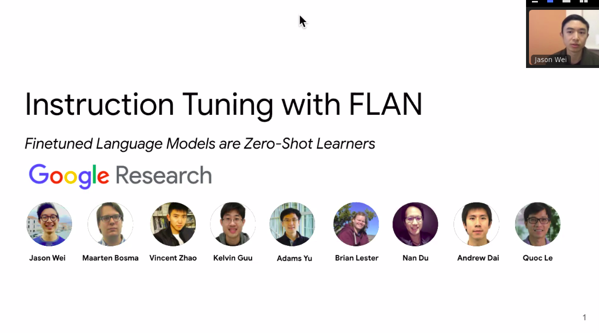

The idea is simple: finetune a language model on a collection of NLP tasks, described using natural
language. The result is that the model performs tasks it hasn't seen before via instructions.

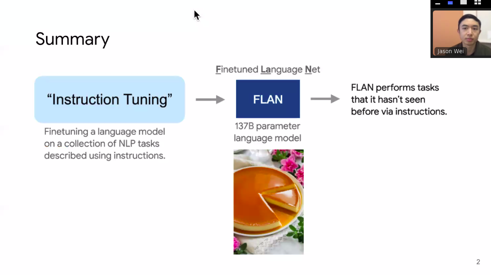

The proof

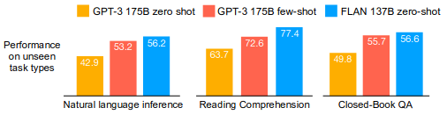

## Background

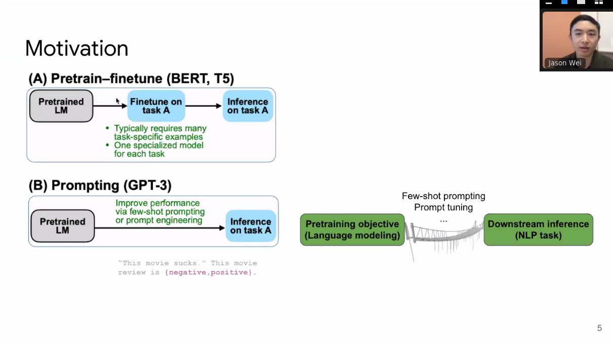

"Instruction tuning" .

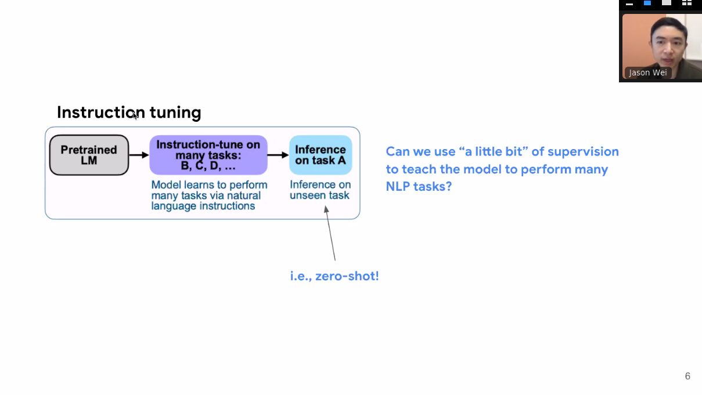

## Motivation

## Training

62 NLP datasets, with 12 task clusters

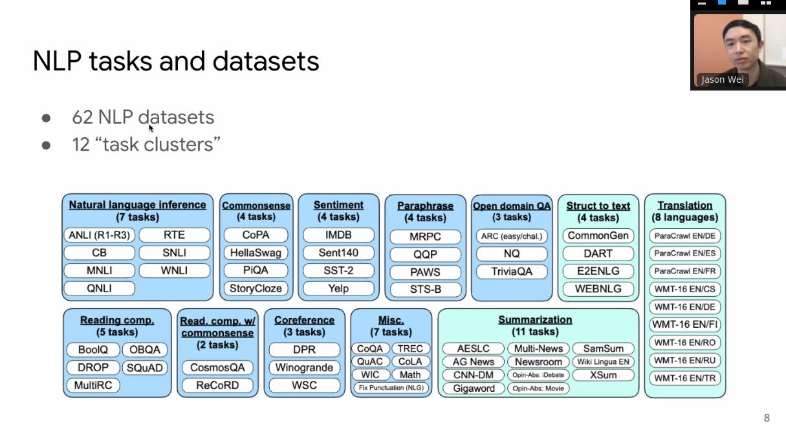

Generate natural language instruction templates for each task

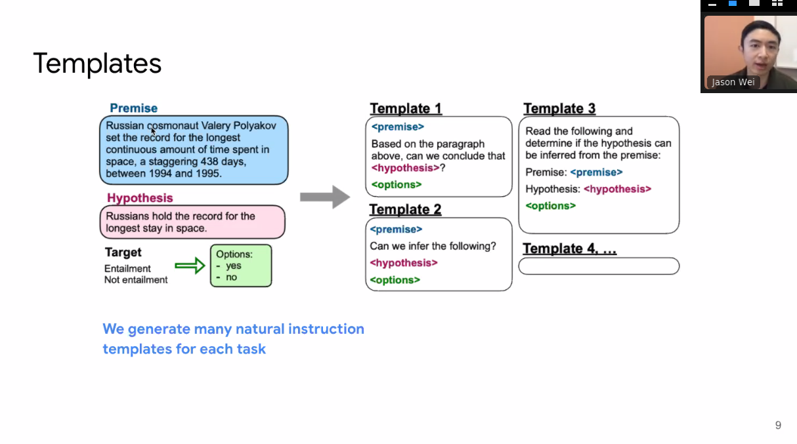

137B parameter pretrained checkpoint. Instruction tune all parameters for 30 k steps on 62 datasets,
spanning 12 task clusters.

## Results

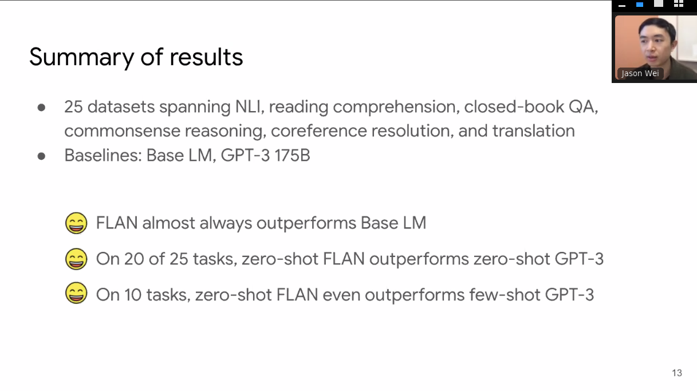

More effective on tasks where verbalizing instructions is easy

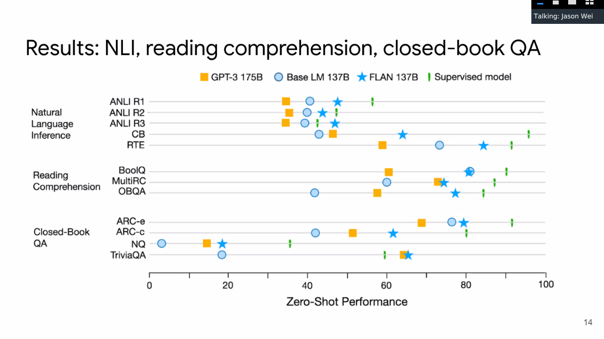

Performs better from prompt tuning

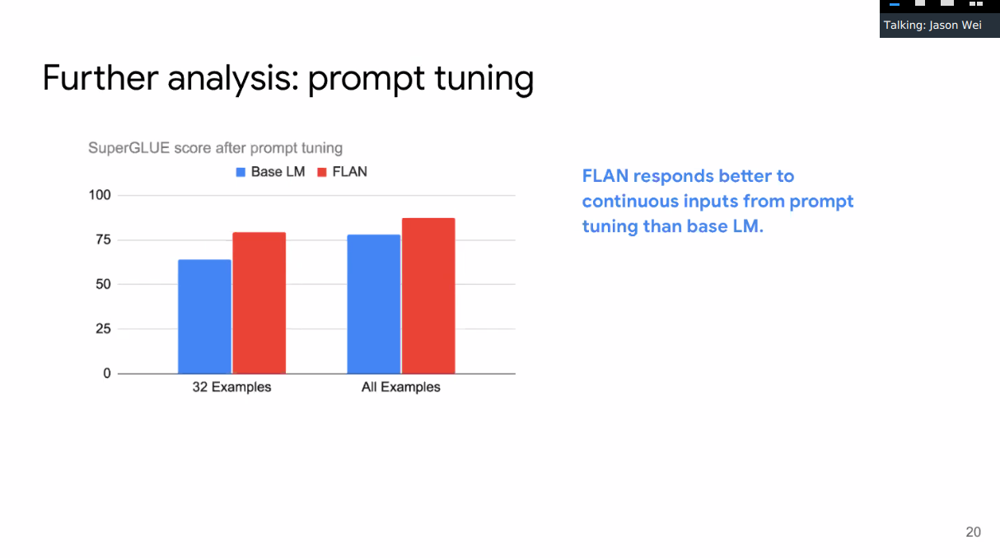

## Scaling Laws

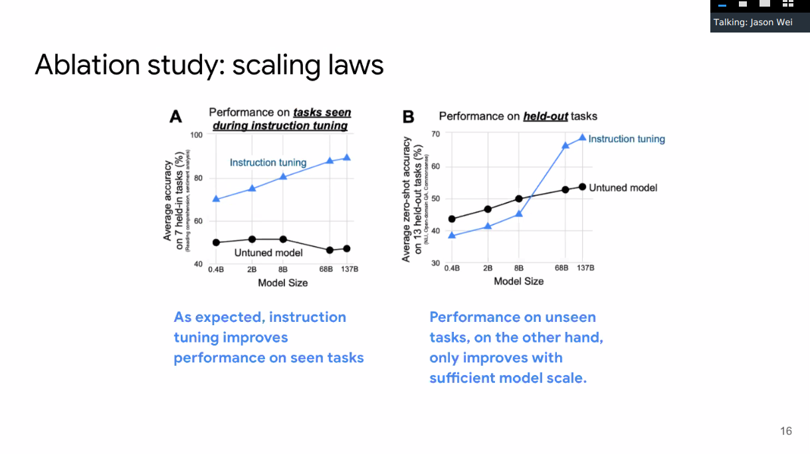

## Ablation

Clusters don't have same number of datasets and different datasets have different sizes

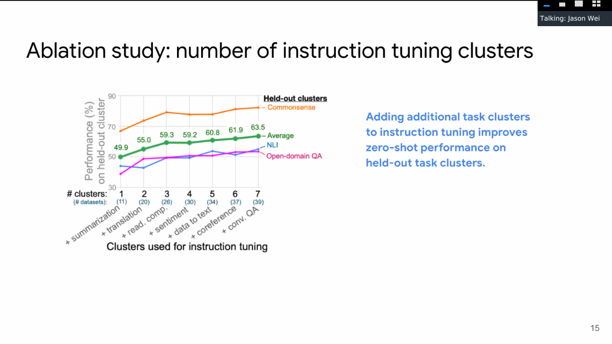

10 templates per dataset, trying different ways of rephrasing the same goal. Additional
templates has little effect

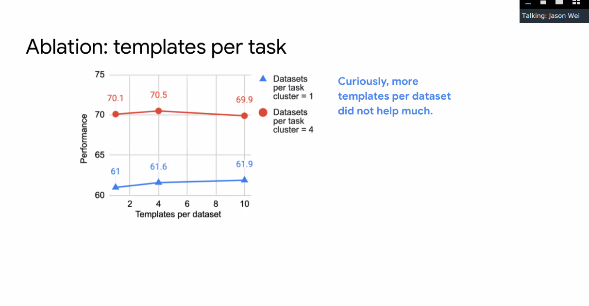

Natural language instructions critical to zero-shot learning

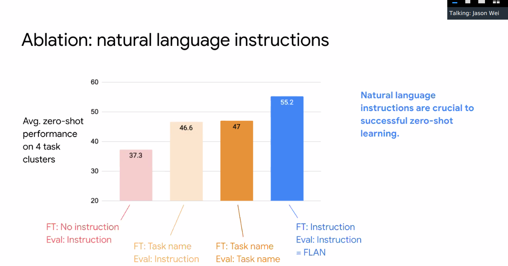

Contact: jasonwei@google.com