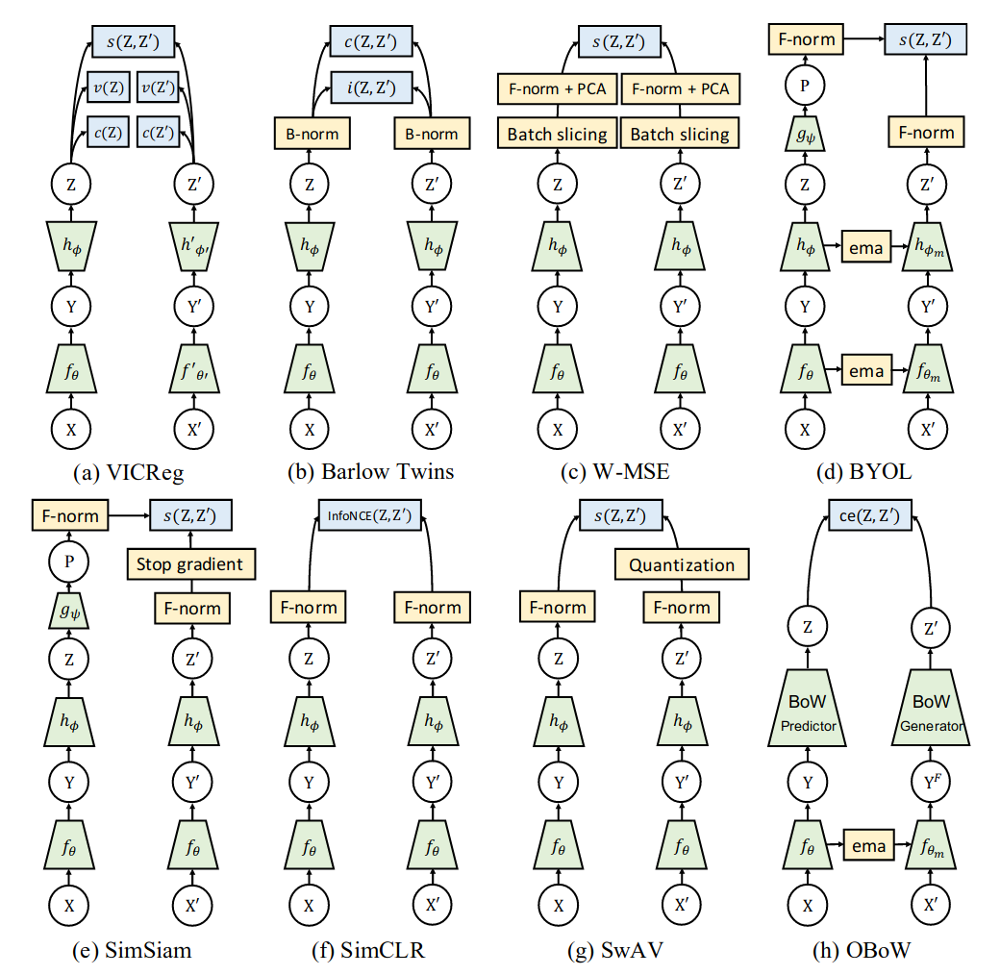
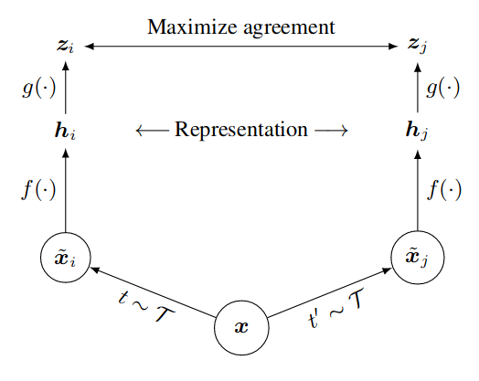
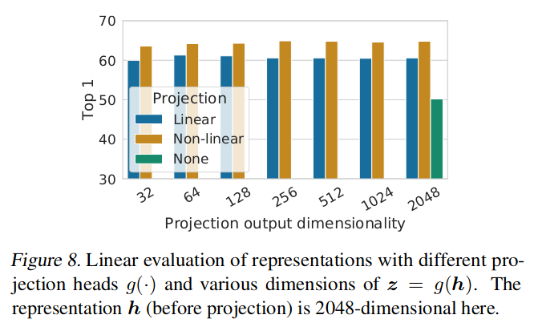
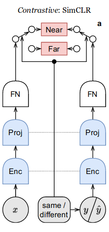
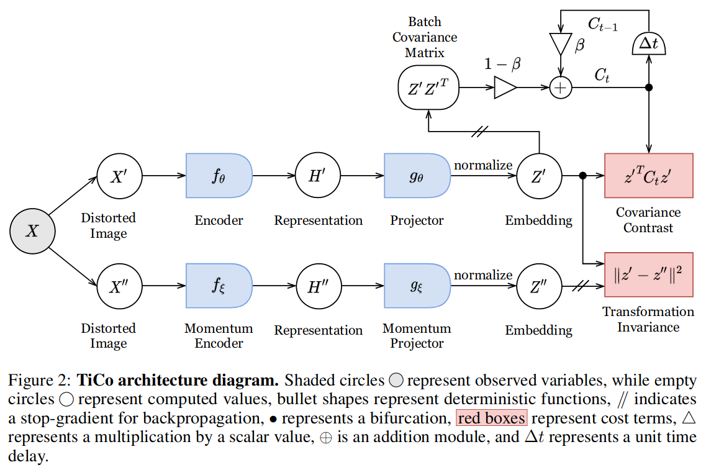
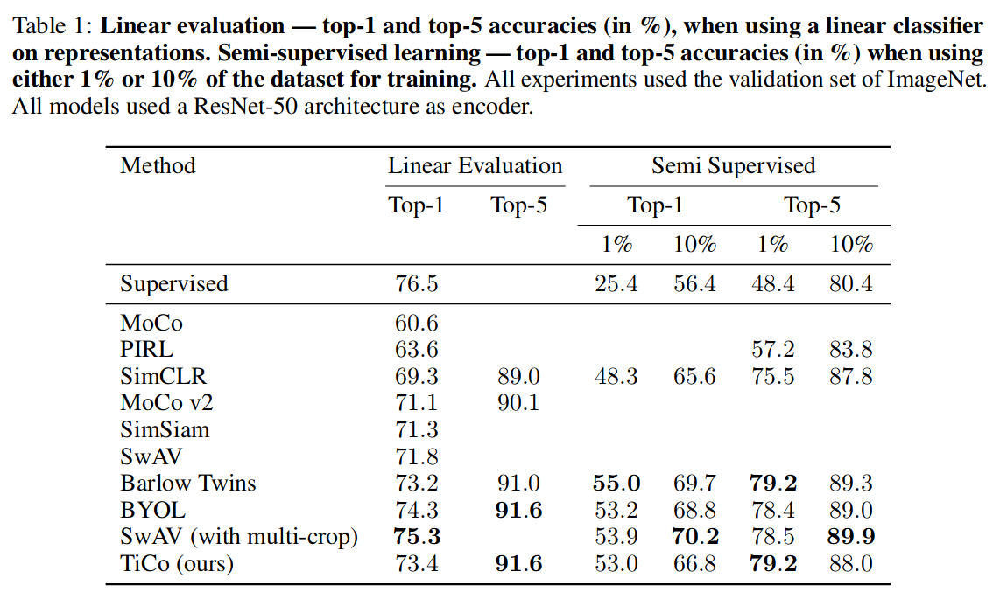
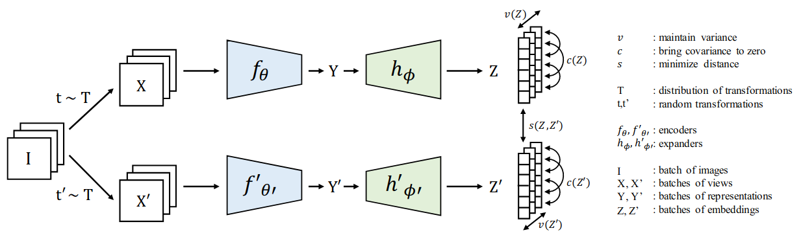
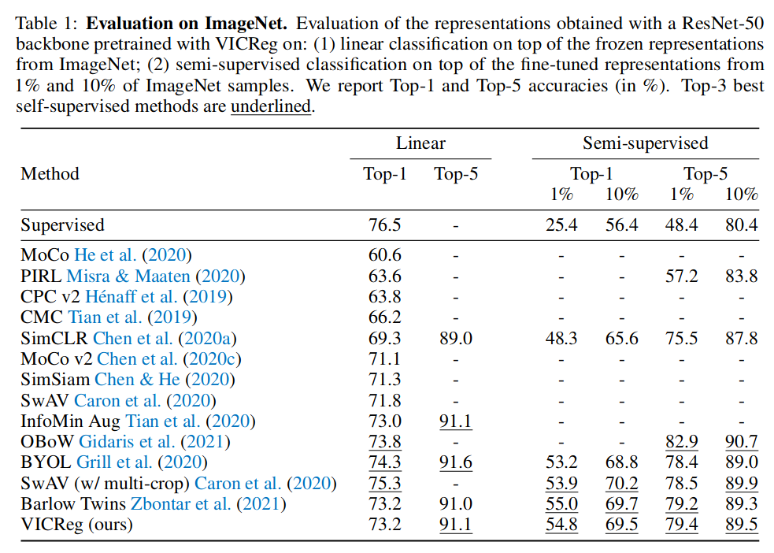

| Method | Latent Dim | Batch Size | Optimizer | Learning Rate | Weight Decay | Scheduler                   | Epochs | 
|--------|------------|------------|-----------|---------------|--------------|-----------------------------|--------|
| SimCLR | 128        | 4096       | LARS      | 4.8           | 1e-6         | Linear Warmup, Cosine Decay | 100    |
| TiCo   | 256        | 4096       | LARS      | 3.2           | 1.5e-6       | Linear Warmup, Cosine Decay | 1000   |
| VICReg | 8192       | 2048       | LARS      | 1.6           | 1e-6         | Linear Warmup, Cosine Decay | 1000   |

Figure from VICReg (ICLR 2022):

## CPC (Arxiv 2018)

## Deep InfoMax (DIM) (ICLR 2019)

## AMDIM (NeurIPS 2019)

## MoCo (CVPR 2020)

## SimCLR (ICML 2020)

- 3 data augmentations, applied sequentially: random cropping, random color distortions, random Gaussian blur
- Base encoder $$f(\cdot)$$
- Projection head $$g(\cdot)$$; specifically use a 1-hidden-layer MLP
- Normalized temperature-scaled Cross Entropy (NT-Xent) loss:

$$\ell_{i, j} = -\log \frac{\exp (sim(z_i, z_j) / \tau)}{\sum_k^{2N} \mathbb{1} \exp (sim(z_i, z_k) / \tau)} $$

- Uses only augmented data in the batch
- No projection significantly hurts performance; why?

- Paper claims that using $$h_i$$ rather than $$z_i$$ is better, but I don't see in what sense, or where the evidence is?
- NY-Xent loss outperforms logistic loss and margin loss
- Another nice graphic from TiCo
 

## SwAV (NeurIPS 2020)

## BYOL (NeurIPS 2020)

## SimSiam (CVPR 2021)

- No negative sample pairs, no large batches, no momentum encoders

## W-MSE

- Whitening Mean-Squared Error

- Criticism: matrix inversion is slow and possibly numerically unstable
- Criticism: Whitening operator is estimated over multiple batches, and may have high variance

## TiCo (Rejected at NeurIPS 2021)

- Loss has 2 terms: transformation invariance and covariance contrast

$$\ell = -\frac{1}{N} \sum_n ||z_n^' z_n^{''}||_2^2 + \frac{\rho}{N} \sum_{n} (z_n^')^T C_t z_n^' $$

where $$C_t$$ is the second moment matrix of the representations.

Equivalently:

$$ \ell = -\frac{1}{N} \sum_n z_n^{'} \cdot z_n^{''} + \frac{\rho}{N^2} \sum_{ij} (z_i^{'} \cdot z_j^{''})^2 $$

- TiCo is both a contrastive and redundancy reduction method
- The covariance contrast loss incentivizes (transformations of) different data to be orthogonal
- The covariance contrast loss can also be viewed as regularizing the Frobenius (matrix norm) of $$\frac{1}{N} Z_{F}^T Z_F$$
  where $$Z_F$$ is the $$N \times F$$ matrix of normalized features 

## VICReg (ICLR 2022)

- VICReg = Variance-Invariance-Covariance Regularization
- Avoids collapse by (1) maintaining variance of each embedding dimension above a threshold and (2) decorrelating each pair of variables
- Invariance loss:

$$\ell = \frac{1}{N} \sum_n ||z_n^{'} - z_{n}^{''}||^2$$

- Variance regularization loss:

$$\ell = \frac{1}{D} \sum_d \max(0, \gamma - S(z_d, \epsilon)) $$

where $S(x, \epsilon) = \sqrt{\mathbb{V}[x] + \epsilon}$

- Using the standard deviation, not the variance, is critical for ensuring the gradient isn't too small
- Covariance regularization loss:

$$\ell = \frac{1}{N - 1} \sum_n (z_n - \bar{z}_n) (z_n - \bar{z}_n)^T $$

- Encourages off-diagonal elements of covariance to be close to 0
- Decorrelation at embedding level had a decorrelation effect at the representation level
- Standardization of embeddings hurts performance very slightly (0.2%), but removing standardization in the
  hidden layers hurts performance (1.2%)
- Results:

## Barlow Twins