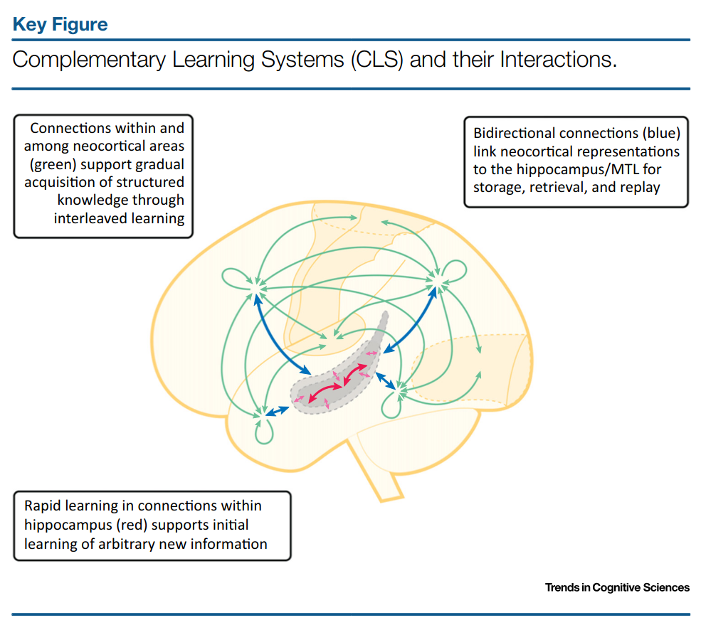

The below are my notes on Kumaran, Hassabis and McClelland's paper
[What Learning Systems do
Intelligent Agents Need?
Complementary Learning
Systems Theory Updated](https://web.stanford.edu/~jlmcc/papers/KumaranHassabisMcC16CLSUpdate.pdf).

## Summary

- Complementary Learning Systems (CLS) Theory posits that intelligent agents require
  two complementary learning systems: one for specific individual experiences, and one
  for generalized knowledge
- CLS posits that in the human brain, the hippocampus records specific experiences
  and the neocortex learns generalized knowledge

## Why are two learning systems necessary?

- Because both instance-specific information and generalizable information are useful
- For instance, after finishing grocery shopping, I have general knowledge to know I should
  look for my car, but I need the specific memory of where I parked this time to find my car
- CLS holds that the generalizing learning system is slow to learn because:
  - The generalizing system needs to aggregate information over many experiences
  - The optimal adjustment of the generalizing system relies on relating one experience
    to all other experiences, a possibly intensive comparison process, and one that needs
    to be carefully performed to avoid catastrophic forgetting 
- The instance learning system is quick to learn and doesn't require careful adjustment: experiences should be immediately recorded
- In CLS, dentate gyrus and CA3 are the heart of the instance learning system
  - DG is a pattern separator: it creates unique neural activity for each experience
  - CA3 is a pattern completor: it completes a possibly noisy pattern

## Replay of Hippocampal Memories

- CLS holds that the instance learning system passes along its recorded experiences
  to the generalizing learning system by replaying its experiences
- Which experiences are selected for replay and when is an important and open question
- In rodents, during sleep, CA3 produces sharp-wave ripples that propagate to neocortex
  at an accelerated rate
- Replay is biased towards rewarding events, suggesting different experiences should be 
  preferentially weighted

## Evidence Against Complementary Learning Systems 

- 