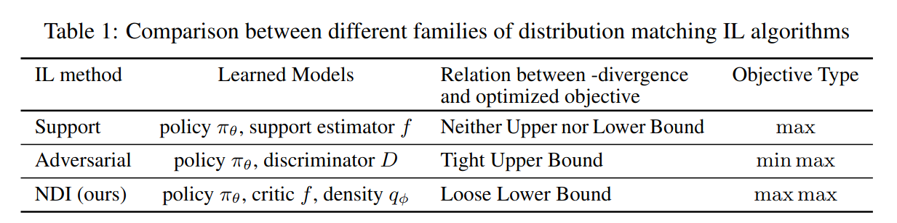
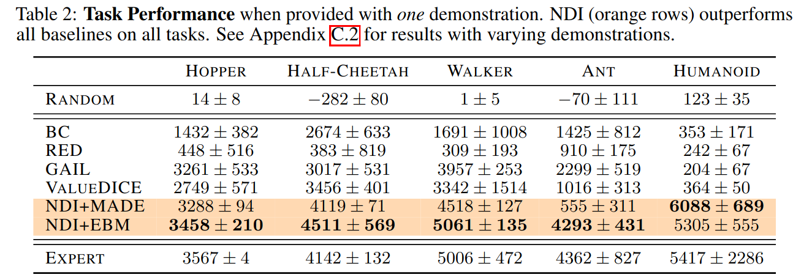

The below are my notes on Kim et al. 2021's
[Imitation with Neural Density Models](https://openreview.net/pdf?id=TrjbxzRcnf-).

## Summary

- Proposes a framework for Imitation Learning by combining:
  - density estimation of expert's occupancy measure, and
  - Maximum Occupancy Entropy RL with density as the reward
- Proposes an imitation learning algorithm, Neural Density Imitation (NDI)

## Background

- Imitation Learning (IL) aims to learn optimal behavior by mimicking expert demonstrations
- Many IL approaches try to minimize a statistical distance between state-action distributions 
  (i. the "occupancy measures" $$\rho_{\pi_E}$$ and $$\rho_{\pi_{\theta}})$$

## Method

- 2-Phase Approach
- First, Learn a density estimate $$q_{\phi}$$ of the expert's occupancy measure $$\rho_{\pi_{E}}$$
- Second, use Maximum Occupancy Entropy RL (MaxOccEntRL) i.e. use the density estimate $$q_{\phi}$$
  as a fixed reward for RL and maximizes the occupancy entropy $$H[\rho_{\pi_{\theta}}]$$
- The objective is:

$$\mathbb{E}_{\rho_{\pi_{\theta}}}[\log q_{\phi}(s, a)] +  H[\rho_{\pi_{\theta}}]$$

- MaxOccEntRL applies regularization to the occupancy measure instead of the policy, whereas
  MaxEntRL only applies to the policy

## Challenges

- The expert occupancy measure $$\rho_{\pi_E}$$ is unknown and must be estimated from demonstrations
- The entropy $$H[\rho_{\pi_{\theta}}]$$ may not exist in closed form, especially if $$\rho_{\pi_{\theta}}$$ is an implicit density

## Estimating the Expert Occupancy Measure

- Goal: Learn a parameterized density model $$q_{\phi}(s, a)$$ of $$\rho_{\pi_{E}}$$ from samples
- Approach: Try autoregressive models and energy-based models (EBMs)

## Results

