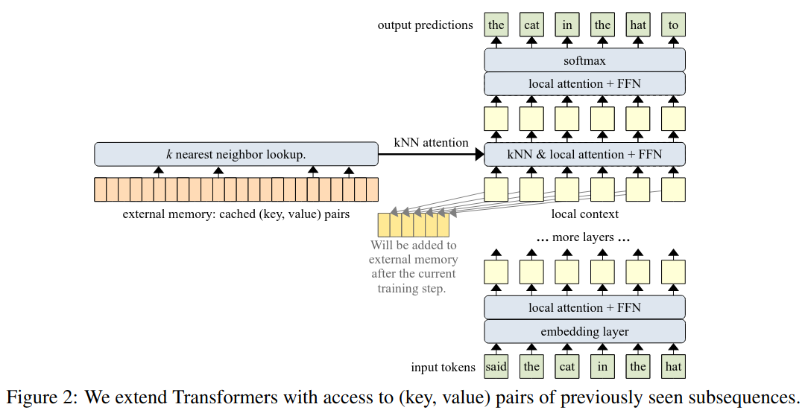
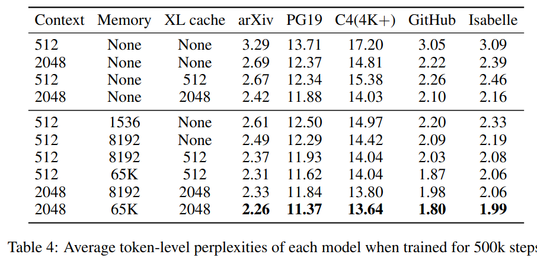
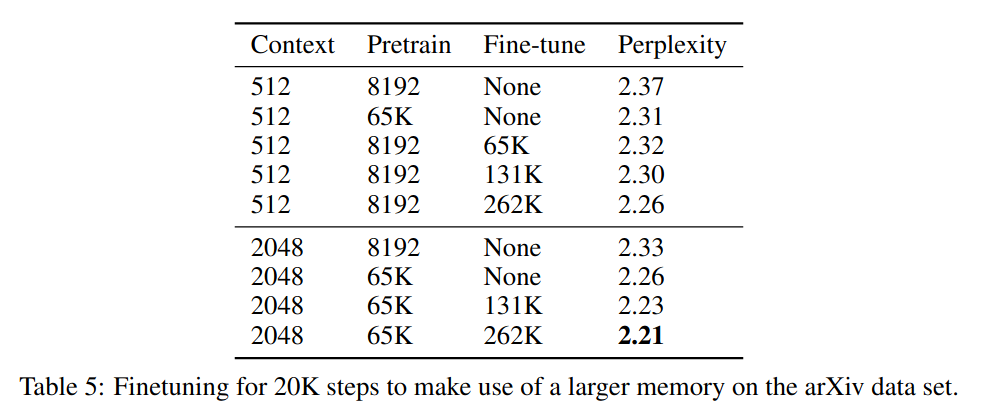

The below are my notes on Wu, Rabe, Hutchins and Szegedy's 2022's 
[Memorizing Transformers](https://openreview.net/pdf?id=TrjbxzRcnf-).

## Summary

- Goal: Language models that can read and memorize new data at inference 
  time, acquiring new knowledge immediately
- Demonstrate that a kNN lookup of non-differentiable memory of key-value pairs improves language modeling
  across benchmarks and tasks
- Memorizing Transformer is capable of using newly defined information during test time

## Method

- High level: Increase the size of attention context using a k-nearest-neighbor lookup
- Input text is tokenized, then embedded
- One transformer layer near the top is a kNN-augmented attention layer
  - Uses standard dense self-attention on the _local context_ i.e. the input subsequence
  - Also does an approximate kNN search into an external memory
- After each training step, the (key, value) pairs in the local context are appended to the 
  end of the external memory, and the old pairs are dropped
- Gradients are not backpropagated through the external memory
- Results of kNN-attention and local attention are combined using a learnt gate
- Keys and queries are normalized to ensure older and newer keys don't change in magnitude during training

## Results

- Datasets:
  - Arxiv Math 
  - GitHub 
  - Isabelle (Formal Math language)
  - Colossal Cleaned Common Crawl (C4)
  - PG-19 (English-language books), good for long-range natural language text modeling
- Adding the kNN memory improved the token-level perplexity

- Increasing the memory size increases the benefit of the memory

- The model was most often retrieving rare words (e.g. proper names, references, citations) 