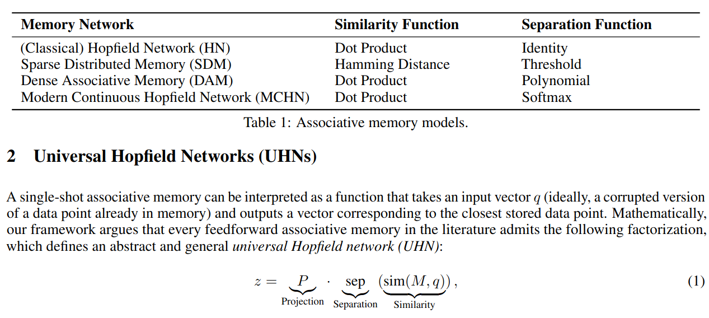
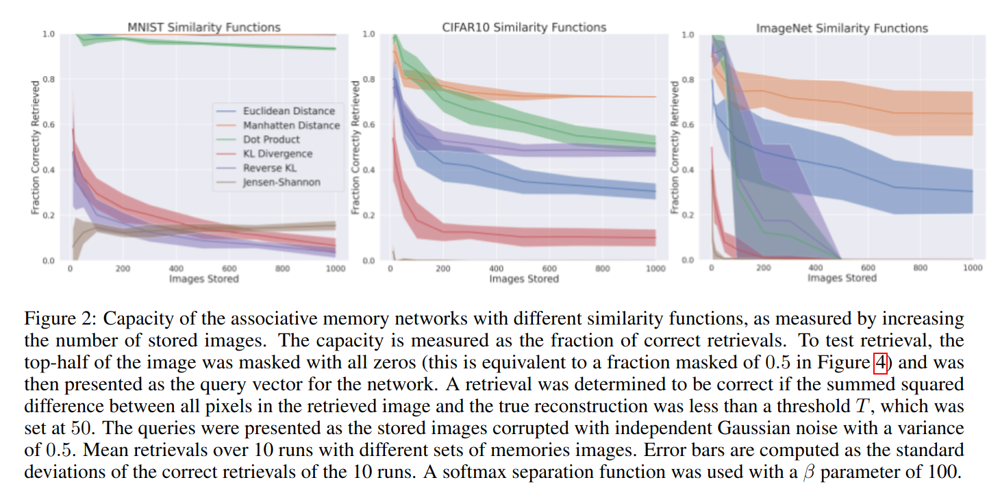

The below are my notes on Millidge et al. 2022's 
[Universal Hopfield Networks](https://arxiv.org/pdf/2202.04557.pdf).

## Summary

- Associative memory models consider the challenge of storing and retrieving memories 
- Many neural network associative memory models have been proposed, including Hopfield Networks
  Sparse Distributed Memories and modern continuous Hopfield networks
- This paper proposes a general framework for understanding different associative memory models
- This paper also demonstrates that each model has a corresponding energy function that is a Lyapunov function
  of the dynamics
- This paper then empirically investigates the capacity of different models

## Universal Hopfield Networks

- Many (all?) associative memory models can be understood with three steps:
  - Similarity: The input is compared to previous patterns 
  - Separation: The similarity scores are separated
  - Projection: The similarity scores are used to determine what information to retrieve

### Hopfield Networks

$$z = sign(M^T identity(M q))$$

### Sparse Distributed Memories

$$z = P thresh(hamming(M, q)) $$ 

### Modern Continuous Hopfield Networks

$$ z = W^T softmax (W q)$$

### Continuous Sparse Distributed Memories

$$ z = P softmax (A q)$$

## Auto-associative vs Hetero-associative Memories

If the project matrix $$P$$ is the same as $$M$$, then a memory model
is called auto-associative; if the two are different, then the memory model
is called hetero-associative.

## Relation to Transformer Networks

A hetero-associative Modern Continuous Hopfield Network is equivalent 
to a self-attention layer:

$$z = V softmax(K q) $$

## Neural Dynamics

## Experiments

Using the dot product for similarity performs more poorly than using
 a Manhattan or Euclidean distance.  

