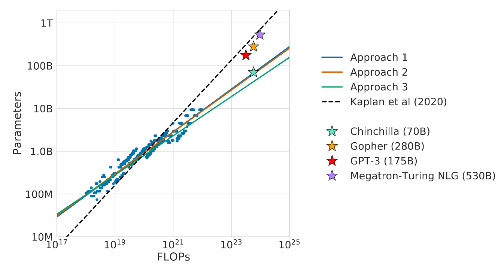
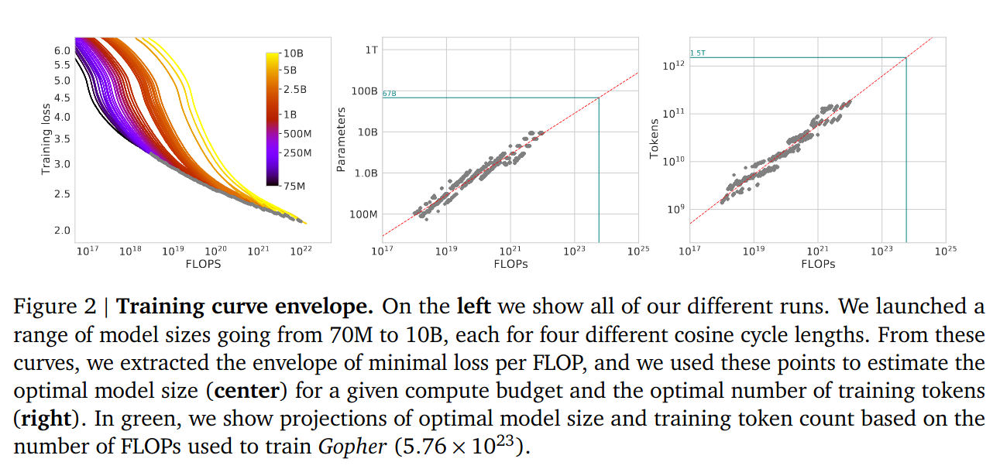
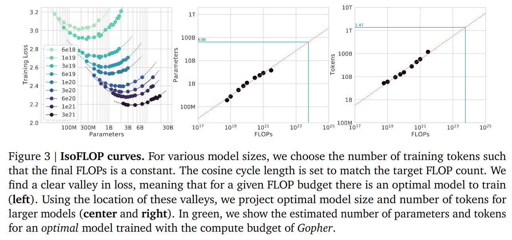
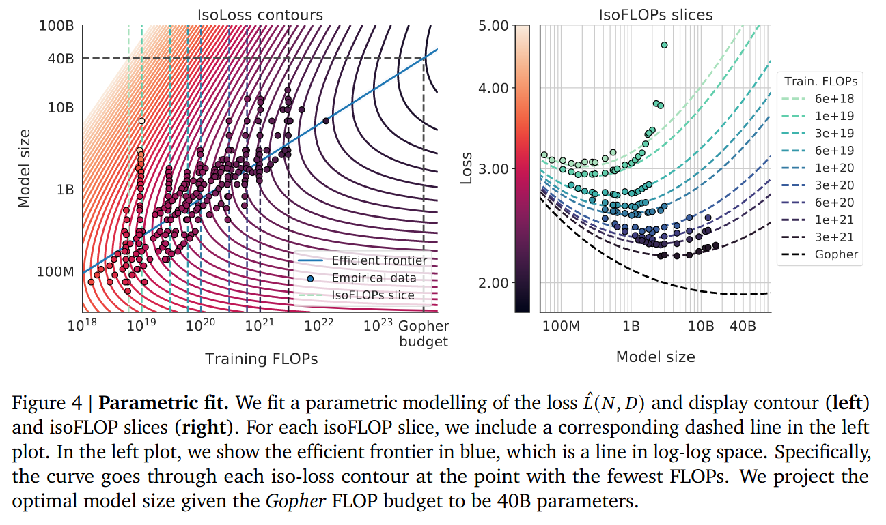
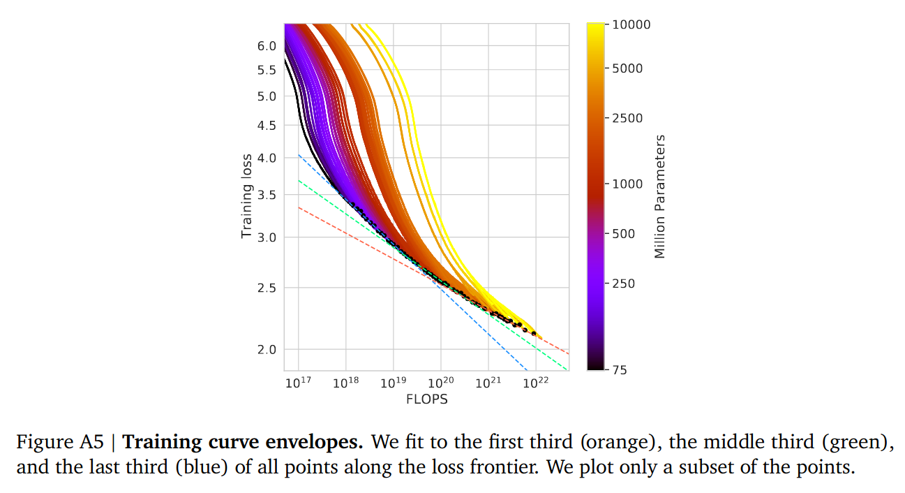
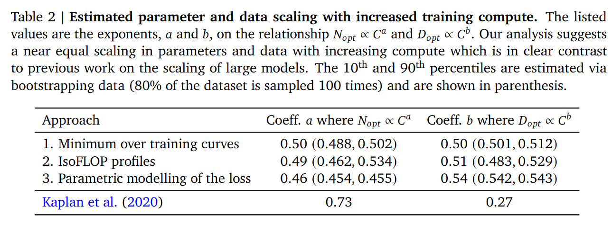

## Main Claims

- Each dot is an experiment
- 3 different approaches for computing scaling laws
- Chinchilla, Gopher, Megatron all very similar to GPT-3 scaling law
- Why are the 3 Chinchilla results so different from Kaplan?

Use science to pick optimal model size for our budget

$$N_{opt}(C), D_{opt}(C) = \arg \min_{N, D s.t. FLOPs(N,D) = C} L(N, D) $$ 

$$N_{opt} \propto C^a$$

$$D_{opt} \propto C^b$$

where $$a = 1 - b$$. This is because $$C \approx 6 N D$$

Q: Why use 3 different approaches?

- Didn't understand answer?

Q: Why Kaplan is so different?
  - Chinchilla people said: tune your LR schedule to the length of your run. Kaplan just truncate runs.
    - Want low learning rate at the end
  - Loss curve bending: Chinchilla's largest runs ~16B bend, and Kaplan only went up to 100M

Q: What are the 3 different approaches:

1. Vary D for various fixed N

2. For FLOP budgets, vary N, fixed C, find model with minimal loss

Note: some sort of suspicious curve bending for larger FLOPs

3. Fit a parametric loss function

Q: Why is (3) different from (1) and (2)?

The Huber loss is robust to outliers, and the smaller models are outliers.
Is paying more attention to the really big runs done at the end.

Loss curves start bending: fit using smallest runs (blue), fit using medium runs (teal),
fit using largest runs (red). The curve is flattening.

It's weird that they posit a fit and say the fit is great, then say the fit isn't great because
of outliers and then propose another fit.

Also, these confidence intervals are very narrow.

Can we get all the data points they plotted?

Q: Given a fixed FLOPs budget, where is the tradeoff between fitting scaling law & then training the big model?

