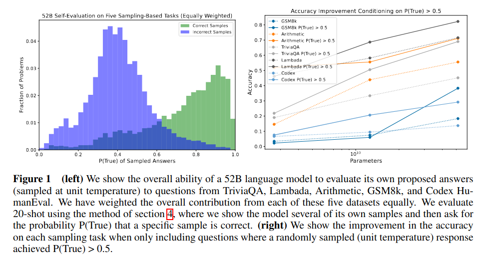
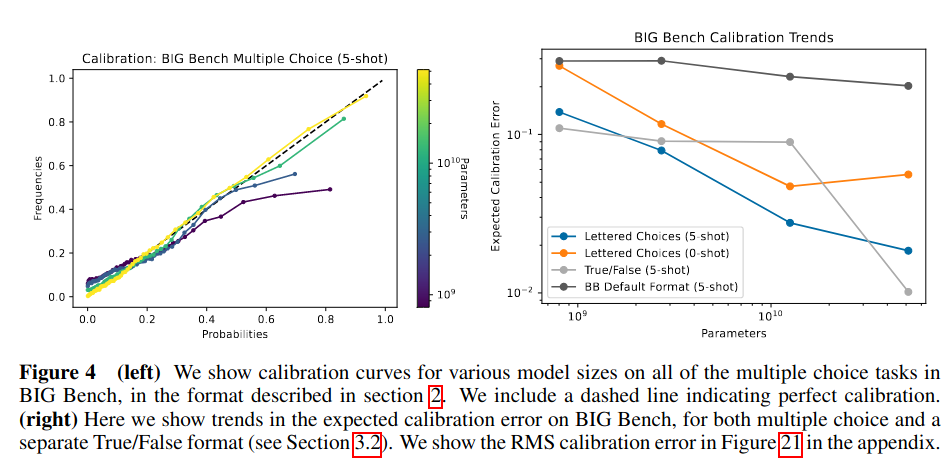
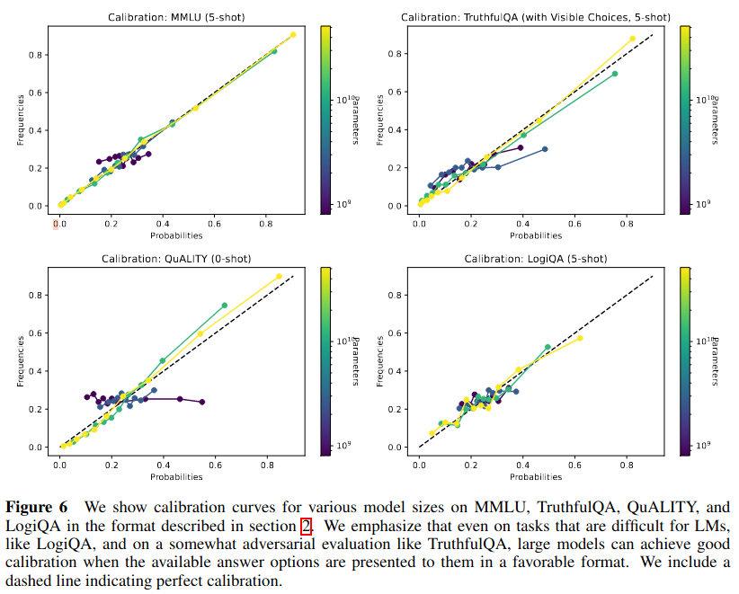
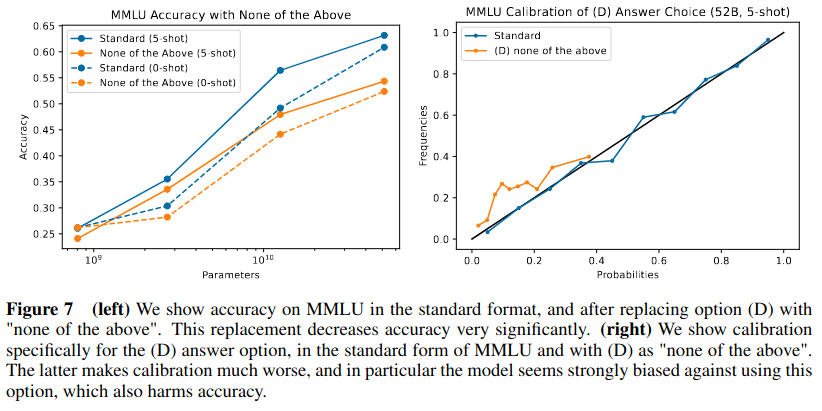
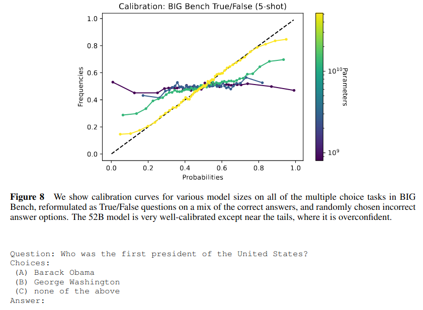
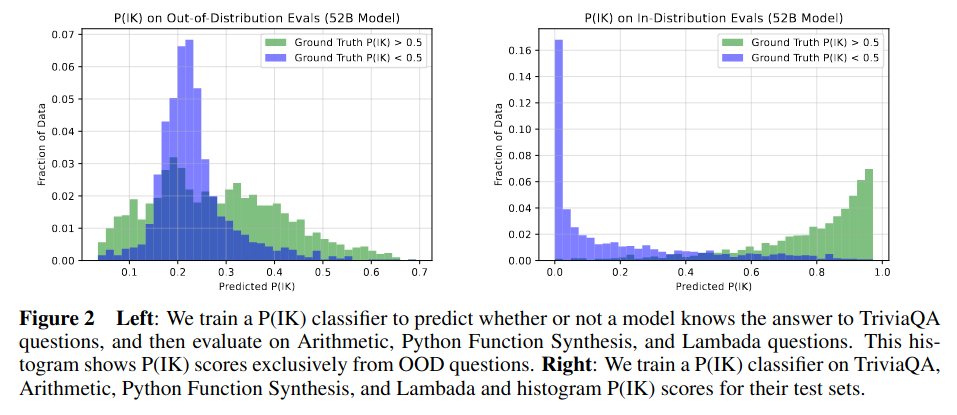

## Main Claims

- When prompted in the right format, large models accurately estimate the probability that a given answer is correct
  (sometimes called "well-calibrated")
- When prompted in the right format, large models can accurately estimate the probability that they'll be able to
  answer a question correctly (specifically without being given an answer to evaluate)

## Terminology

- P(True) = the model's subjective belief that a given question and corresponding answer will be correct

- P(IK) = the model's subjective belief that it will be able to answer a given question correctly

- Ground Truth P(IK) – The fraction of unit temperature samples to a question that are correct.

- Calibration Charts - We often plot prediction probability vs frequency that a prediction was correct,
  see Figure 4 as an example. We use all predictions (not just predictions for the correct answer) and
  put the same number of predictions in each bin (rather than using equally spaced bins).

Q: Why do the authors put the same number of predictions in each bin, as opposed to using equally spaced bins?

## Models

- 800M, 3B, 12B, 52B parameters
- Smaller models perform poorly
- Models match "Training a Helpful and Harmless Assistant with Reinforcement Learning from Human Feedback"

Q: Temperature is 2.5 - why?

## Datasets

- TriviaQA
- Lambada
- GSM8k
- Codex HumanEval
- Arithmetic problems
- Natural function synthesis problems scraped from GitHub

## Can models accurately estimate whether a given question and corresponding answer will be correct?

Background: Language models are known to produce calibrated token-level probabilities.

When prompted in a particular manner, and under 20-shot evaluation, LMs are decent at estimating P(True) (left).
The right plot shows that self-estimated accuracy improves with scale.

Q: Is the left plot for a specific model scale? Or all model scales combined?

Q: On the right plot, why do different datasets have such differences in accuracy?

<quote>
We find that when multiple choice problems are formatted in this way (as used by e.g. [Rae et al., 2021]):
Question: Who was the first president of the United States?
Choices:
(A) Barack Obama
(B) George Washington
(C) Michael Jackson
Answer:

and we identify the answers only by their labels, as e.g. ‘ (B)’, our largest models tend to produce a well-
calibrated probability distribution among the available options.
</quote>

Q: What other formats were tried? How well did they work?

Q: Why does this particular format work so well?

Replacing an option with "None of the above" harms accuracy by about 11%.

Q: Why does this happen? 

Convert multiple-choice questions to True/False questions.

Bigger models are better calibrated except towards the tails. Specifically,
bigger models are overconfident at the upper end and underconfident
at the lower end.

Q: How do models do on non-multiple-choice, non-true-false, open-ended questions?
Questions like: "What causes bread to rise when baked?"

## Can models accurately estimate whether they'll be able to answer a given question correctly?

