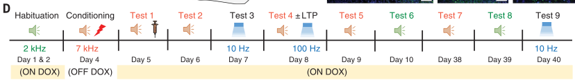
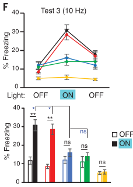
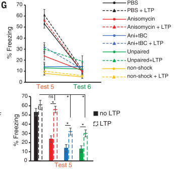
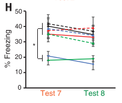

## Research Questions

Previously, [Rashid et al. 2016](../_kernel_papers_drafts/rashid_science_2016_competition_memory_engrams.md)
and [Cai et al. 2016](../_kernel_papers_drafts/cai_nature_2016_shared_memory_engrams.md) showed that conditioning
close in time result in overlapping engrams, and [Yokose et al. 2017](yokose_science_2017_overlapping_memory_engrams.md)
further showed that the overlap in neurons between engrams is responsible for linking the 
shared experiences. This paper asks and answers:

- How does the brain distinguish identity of particular memory amid many
memories in the same ensemble?
  

## Experiments

### Exp 1

- There are a lot of details here!
- Previous results showed plasticity between auditory cortex (AC), medial
  geniculate nucleus (MGn) and lateral amygdala (LA) is necessary for auditory fear conditioning
- Day 1-2: Auditory cue (2 kHz)
- Day 4: Fear conditioning (7 kHz)
- Day 5: Test fear recall. Immediately after, mice injected with one of: saline (PBS), anisomycin (ani), 
  anisomycin + tat-beclin (Ani+tBC)

  

- Test 2: Ani resulted in partial retrograde amnesia; Ani+tBC resulted in complete retrograde amnesia (1E)
- Optogenetic activation of AC and MGn engram neurons with axons in LA induced fear recall in
 PBS and Ani gropus, but not Ani + tBC (consistent with prior results) (1F)

- Day 7: Try recovering AC & MGn synapses to LA with optogenetic stimulation
- Test 3: Ani group recovered to baseline (1G, left) whereas Ani+tBC did not (1G, left) 

- Day 38-39 (test 7 & 8): Test fear retrieval. Ani + tBC remained low, comparable to unconditioned

- Day 40 (test 9): Test fear retrieval with optogenetic stimulation. Ani + tBC + LTP on day 8
recovers association, but Ani + tBC does not.
- Same result if recall was tested using optogenetic activation instead of tone
- Takeaway: Ani + tBC prevents AC and MGn synapses from activating LA engram 

