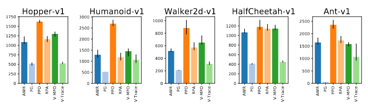
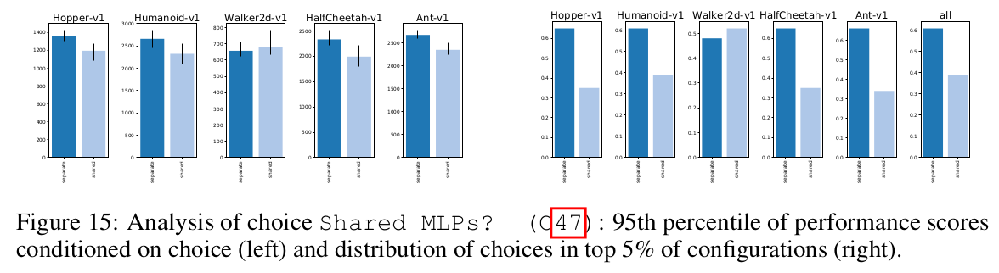
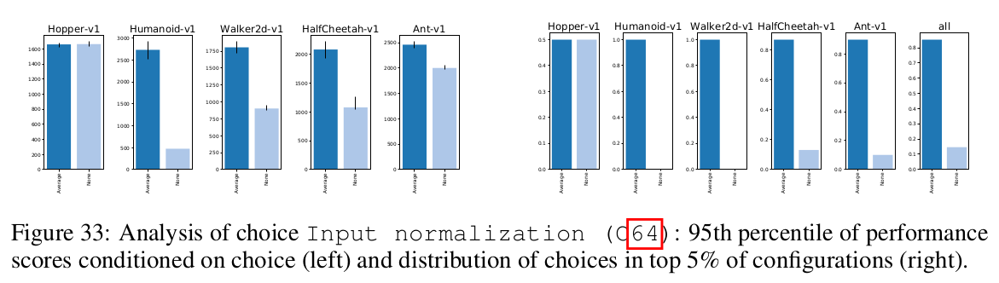
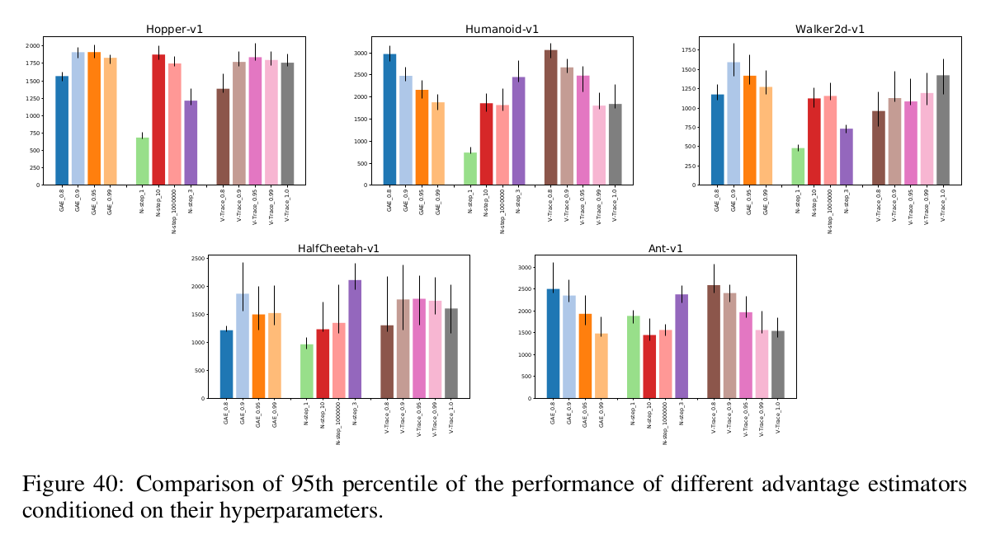
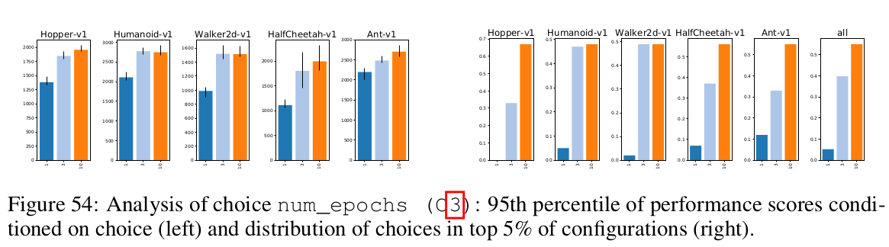

## Background

On-policy deep actor critics are a pervasive approach for reinforcement 
learning (RL) in challenging tasks that are also known to be fickle, especially
when combined with function approximation. These authors sought to empirically study
what matters for making them work in practice.

Broadly, the authors trained 250k agents on 5 continuous control environments
with $$\geq 50$$ choices.

The paper was grouped into 8 high-level studies.

1. What is the best policy loss?

The authors considered vanilla Policy Gradient (PG), V-trace, PPO, AWR
V-MPO and a variant of V-MPO called Repeat Positive Advantages. The authors
found that PPO performs best in 4 of the 5 environments.

2. What network architecture (structure, size, activation function, initialization) works best? 

Separate policy and value networks lead to better performance on 4 out
of 5 environments (dark blue is separate networks):

One key finding is that initializing the policy such that (a) it is centered around 0
(n.b. all environments expect normalized actions in [-1, 1]), (b) has small standard
deviation and (c) is independent from the observation. The initialization of the value
MLP matters less than the policy MLP.

Recommendation: Initialize last policy layer with 100x smaller weights.

3. What is the best normalization and clipping?

Input normalization is crucial for good performance on most environments.

5. What is the best function for the critic to learn?

The authors compare different ways of estimating the advantage: an N-step returns
estimate based on $$V$$, GAE and V-Trace.  N-Step Returns seems to perform worst,
and the other two are comparable.

As for the target, Huber loss performed worse than MSE in all environments.

6. What is the best training setup: number of parallel environments, number
of transitions, number of passes over data, minibatch size, how the data is split 
into minibatches?

Going over the same experience repeatedly improves sample complexity.

7. Time Step Handling

Performance depends heavily on discount factor. $$\gamma = 0.99$$ performs reasonably
well.

8. What optimizer to use?

Adam and RMSProp are roughly the same. A default learning rate of 0.0003 for adam works well.
Linear rate decay increases performance on 4/5 tasks.

9. What policy regularization to use?

It mostly doesn't matter.