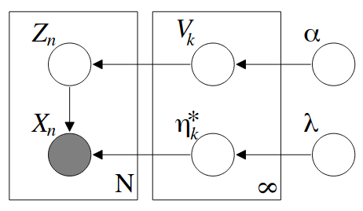

## Research Questions

- How to perform variational inference in Dirichlet Process (DP) Mixture Model?

## Background
 
For a quick primer on Dirichlet processes and their use in mixture
modeling, see [my notes on DPs]({site.url}/content/learning/stochastic_processes/dirichlet_process.html)

## Approach

Assuming the observable data is drawn from an exponential family distribution
and the base distribution is the conjugate prior, we have a nice probabilistic model:

1. Draw $$V_i | \alpha \sim Beta(1, \alpha)$$. Let $$\underline{V} = \{V_1, V_2, ...\}$$
2. Draw parameters for the mixing distributions $$\eta_i^* | G_0 \sim G_0$$, where $$G_0$$ is the
base measure of the DP. Let $$\underline{\eta^*} = \{\eta_1^*, \eta_2^*, ...\}$$.
3. For the $$n= 1, ..., N$$ data point
    - Draw $$Z_n | \underline{V} \sim Multi(\pi(V))$$
    - Draw $$X_n | Z_n \sim p(x_n | \eta_{z_n^*})$$

In constructing the variational family, we take the usual approach of breaking dependencies between
latent variables that make computing the posterior difficult. Our variational family is

$$q(\underline{V}, \underline{\eta^*}, \underline{Z}) = \prod_{k=1}^{K-1} q_{\gamma_k}(V_k)
\prod_{k=1}^K q_{\tau_k}(\eta_t^*)\prod_{n=1}^N q_{\phi_n}(z_n)$$

where $$K$$ is the variational truncation of the number of mixing components
and $$\{\gamma_k\} \cup \{tau_k\} \cup \{\phi_n \}$$ are our variational parameters.