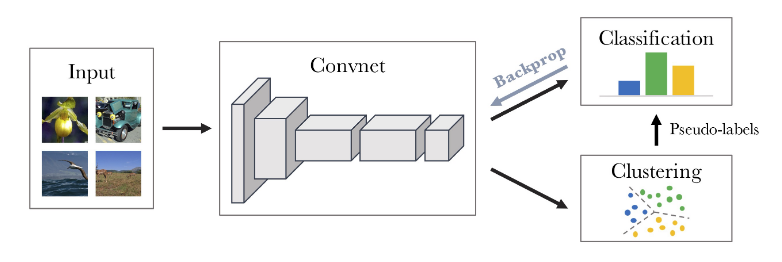
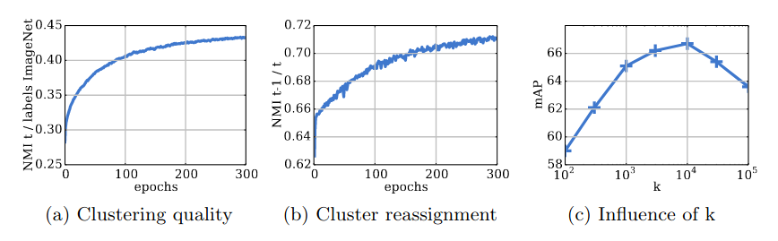

## Research Questions

How to adapt clustering in end-to-end training of 
visual features on large-scale datasets?

## Approach

Proposes **DeepCluster**, a clustering method that learns
parameters of neural network as well as cluster assignments
of resulting features.

Idea: alternate clustering logits of the network and then training the
network via classification, using the cluster identities as targets.
Use K-Means to cluster logits.

Questions:
- How to prevent degenerate solutions?
- Cluster labels are arbitrary, whereas class labels are not. How do
  we ensure cluster labels are stable learning targets?
- Why use classification at all? Why not just backprop on network parameters
  in K-means objective function?

## Heuristics

- When a cluster has no points assigned, delete that cluster and create
a new one by splitting a big cluster in two.
- To prevent cluster imbalance, sample points such that each cluster is
equally represented
- Use data augmentations (random horizontal flips, crops, aspect ratios)

## Results

Left: NMI between ground truth classes and unsupervised cluster labels 
on ImageNet

