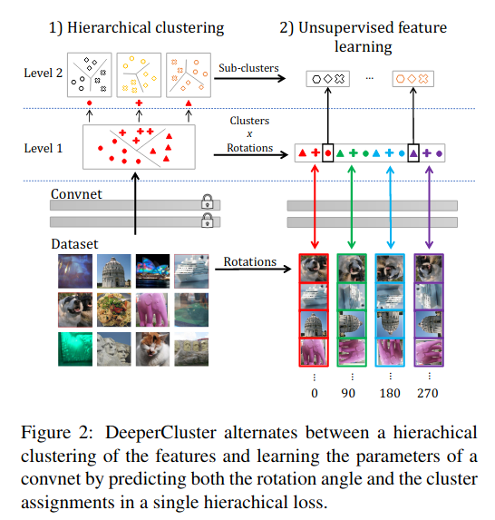
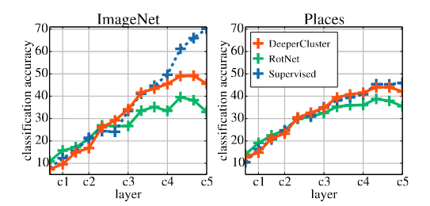
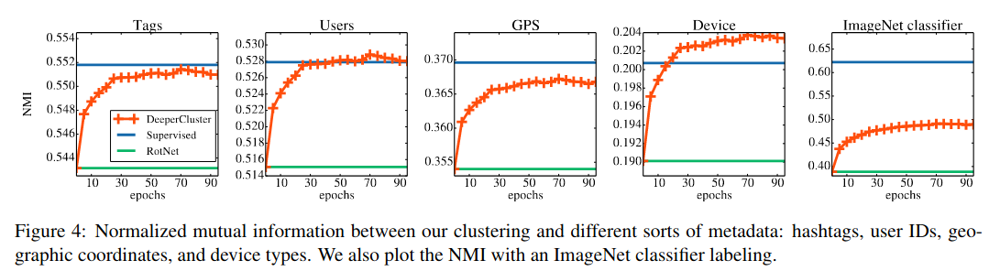

## Background

See the author's [previous paper](../_kernel_papers/caron_eccv_2019_deep_clustering.html)
which introduced DeepCluster.

## Research Goal

Use self-supervised training and clustering to do unsupervised learning

## Approach

Deeper Cluster. Rotate images (set of possible rotations: $$Y$$) and optimize K-Means,
where $$Z$$ are the cluster assignments

$$\arg \min_{\theta, W} \frac{1}{N}\sum_{n=1}^N l(y_n  \otimes z_n, W f_{\theta}(x_n)) $$ 

To make the space $$Z \times Y$$ smaller, they use 2-level hierarchy of cluster labels.
Use 2-level hierarchy. To get superclusters, they split the dataset into $$m$$ subsets.

## Results

Accuracy of linear classifiers on ImageNet and
Places205 using the activations from different layers as fea-
tures. We compare a VGG-16 trained with supervision on
ImageNet to VGG-16 trained with either RotNet or Deep-
erCluster on YFCC100M. Exact numbers are in Appendix

