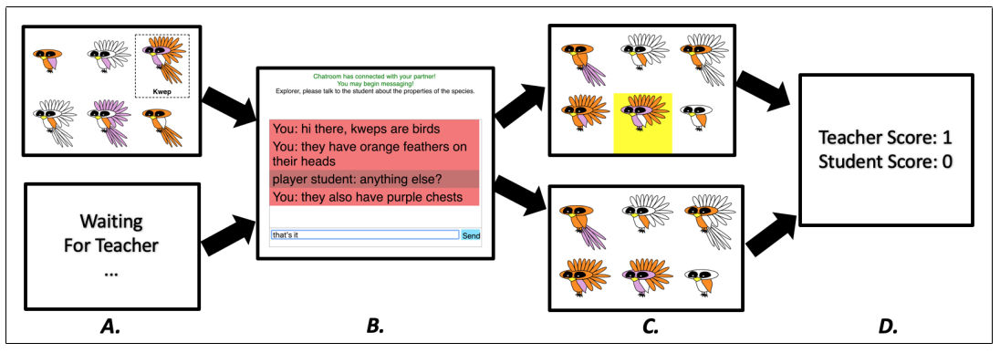
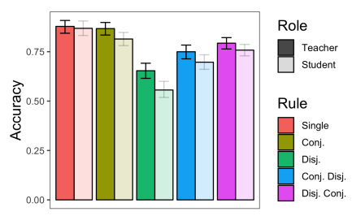
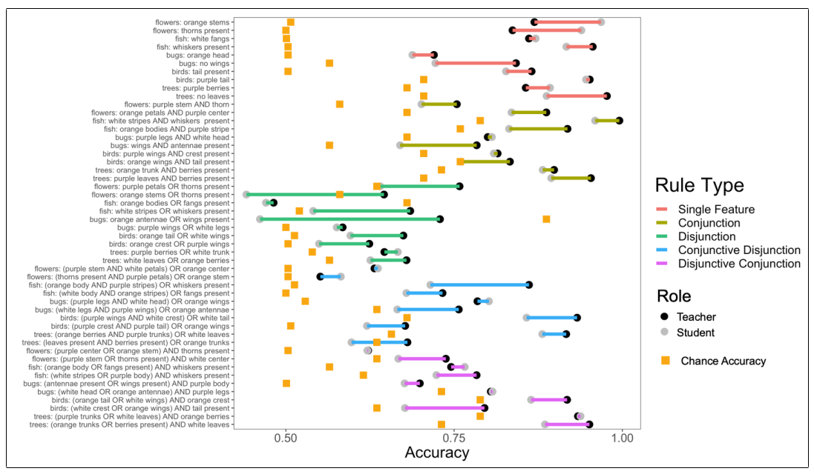
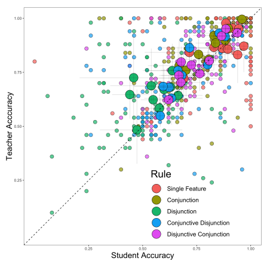
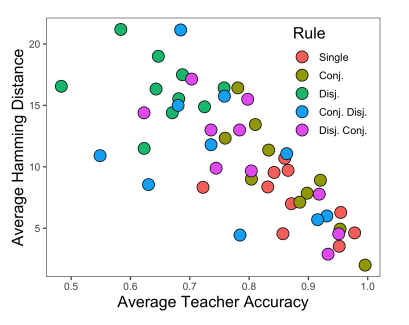
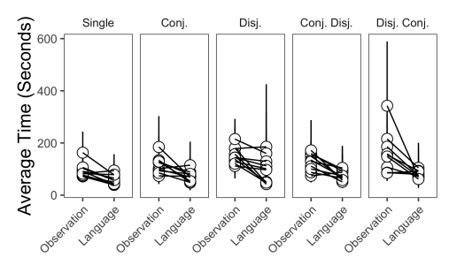
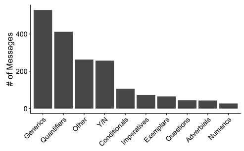
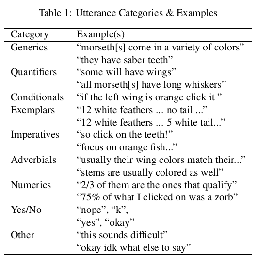

## Research Questions

Human knowledge accumulates over generations. Language is the mechanism
for this accumulation, but how specifically does language enable the efficient
and accurate transmission of knowledge? This paper looks at how one
human learns a novel concept and transmits that concept to another human via
language.

## Experiment 1

## Setup

Two humans are paired together. In the concept learning phase, one human (the teacher) learns 
a Boolean concept from examples. In the concept communicating phase, the teacher explains
the concept to the other human (the student). In the concept testing phase, both 
participants were shown the same grid of held-out samples. Participants were then shown their
own score and their partner's score.

Concepts were generated by 5 different rules: single features, conjunction, disjunction, conjunctive
disjunction, disjunctive conjunction. Each pair went through 5 rounds, where each round had a new
concept created with a new rule. Teachers learned the rule through clicking on 6 examples, each of
which were labeled with "concept" or "not concept."

## Results

- How accurate is learning from language, relative to learning from examples? Answer: comparable.
 The average difference in accuracy is 5.3% (95% credible interval: 2.7%-8.2%).

- The difference between student and teacher performance depends on the particular rule to communicate,
 with harder rules being more difficult to transmit

- What effect does the quality of the teacher (measured by accuracy) have on the student (also measured
  by accuracy)? The two are decently correlated (r = 0.60, p < 0.001)

- Additionally, students tend to make the same mistakes as their teachers (which can be quantified because
 the test data is the same for the teacher and student). Null hypothesis is computed using permutations of 
 teacher-student pairs: Hamming edit distance is 11.1 for true student-teacher pairs, but 13.53 for permuted
 student-teacher pairs. The plot below is from the concept testing phase. The "Average Hamming Distance"
 is how much the student's choices differ from the teacher's choices. 

- How efficient is learning time for observations versus language? Can quantify how much time the teacher
spent in concept learning phase versus how much time the student spent in concept communicating phase.
Learning time is typically faster for language learning than observation learning, with a parameter -0.64 
(95% credible interval: -0.82, -0.48) seconds

- What properties of language enable the efficient and accurate transmission of knowledge? Coding message
 types shows that generics and quantifies dominated:

## Comments

- The authors don't dissect how particular language choices influence the accuracy or efficiency of knowledge
 transmission
- It's also difficult to imagine what other language choices are possible for transmitting these sorts of concepts
 through the message interface
- None of the concepts are probabilistic; they're all deterministically true or false