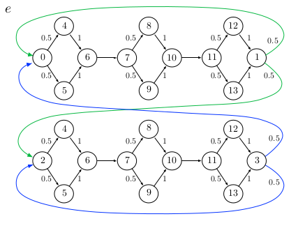
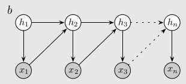
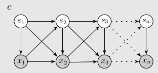
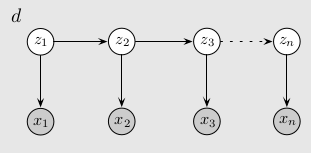

## Idea

This paper offers an interesting twist on a classic idea: take an HMM, but have
each hidden state deterministically produce an output, with several states producing
the same output. These are called "clones", hence the name: Cloned HMM.

## Explanation

I don't have a good intuitive explanation for why this idea makes sense. If we think
that sensory observations are determined by some underlying graph, in principle,
an HMM should be capable of learning this graph and its transition dynamics. However,
in practice, HMMs struggle to do so. For a concrete example, suppose we have the following
finite state machine. The details don't much matter; what does matter is that although
the machine is complicated (with 24 states), only 2 are necessary (so long as we can
remember whether we're in the top sequence or the bottom sequence.)

If we try to learn this full machine with an HMM, our directed graphical model might look something
like:

However, if we allow the previous emission to affect the next latent state, then we can
instead learn the simpler 2-state distilled version. That graphical model might look something like:

We can achieve that graphical model by defining new state variables $$z_n = (s_n, x_n)$$, where
$$s_n$$ are the previous model's states and $$x_n$$ the emitted observations.

In this redefined state space, the emissions become deterministic but modeling long-range dependencies
somehow becomes easier.

## Experiments

The paper offers some theory and numerical experiments that the Cloned HMM converges faster and to a 
better optimum than a HMM.

