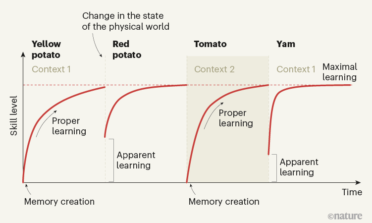
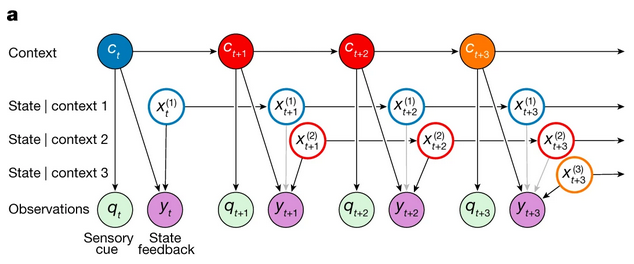
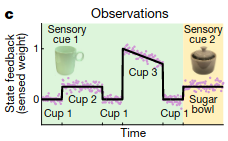
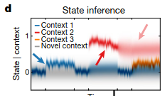
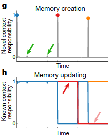
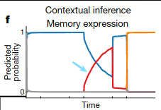
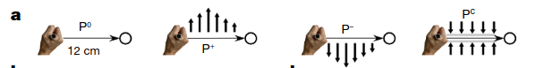
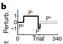
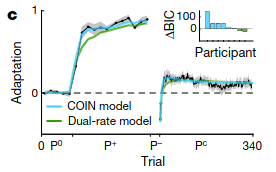

## Background

Suppose an apprentice chef is learning to chop food. As they move from practicing
with yellow potatoes to red potatoes to tomatoes to yams, their learning curves on 
each food item might look like the following:

Conventional models of motor learning typically study motor learning with a single goal
(e.g. yellow potatoes) and thus struggle to explain the ability of motor memories
to be adapted (what the authors term "apparent learning") to a new task. The authors
hypothesize that the brain's strategy is to learn multiple motor memories and then,
in a given context, infer which is most appropriate to use.

## Idea

- Motor memory creation, updating and expression are all controlled by contextual 
  inference
- Adaptation can arise from both
  - Creating and updating motor memories (proper learning)
  - Changing how existing motor memories are expressed (apparent learning)
- Offers a unified explanation of key features of motor learning
  - Spontaneous recovery
  - Savings
  - Anterograde interference
  - Environmental consistency affecting learning rate
  - Distinction between explicit and implicit learning
- Predicts new phenomena that authors experimentally confirm
  - Evoked Recovery
  - Context-dependent single-trial learning

- Proper learning: creation and updating of memories
- Apparent learning: updating of predicted context probabilities
  - i.e. altering extent to which existing memories are ultimately expressed in behavior

## Model

- COntextual INference (COIN)
  - Generative Model
    - An unbounded number of discrete contexts exist, with Markovian transitions
    - Each context $$c_t$$ is associated with a time varying state $$x_t^{(j)}$$
      - What is the state?
    - Current context generates sensory cue $$q_t$$
    - Context determines which state is observed as state feedback $$y_t$$
    - Rylan: What is the difference between context and state?
  - Inference:
    - Agent infers contexts and states
    - 

As an intuitive example, suppose the agent sees 3 visually identical cups and picks them up
before picking up a visually different sugar bowl.

As the agent does this, the agent will infer different contexts for the relevant motor responses:

New motor memories are created when new information that is significantly different from
past information is encountered:

And probabilities of the relevant context adjust as more time is spent interacting with each object:

## Experiments

### Memory Recovery

Participants were told to hold a robotic interface and then move their hand from
a starting position to an end position. On each trial, the participant might experience
one of four possible forces (a.k.a. perturbations).

The sequence of trials used the following perturbations. Let's call each sequence of trials
in which the same perturbation is applied a "phase."

Humans show "spontaneous recovery," which means that after the $$P^-$$ trials, when 
a corrective perturbation that prevents any deviation ($$P^C$$) is applied, the 
participants show a diminished recovery of their motor memory for $$P^+$$.

How can COIN explain this? COIN starts with a motor memory for moving with no perturbations
applied ($$P^0$$). In the two unidirectional perturbation phases, COIN creates new motor
memories for correcting against the perturbations. Since $$P^+$$ was present for the most
number of trials, the agent predicts that the most likely next context is $$P^+$$, and thus
exerts a $$P^+$$-like adaptation.

(Rylan: This should yield a prediction that $$P^-$$ should emerge if there were more
$$P^-$$ trials. Does it?) 

### Savings

- Phenomenon: A motor behavior is acquired, forgotten and then relearnt. Empirically, 
  relearning is faster than the original learning
  - What is meant by forgotten? How can this be confirmed?

### Setup 1

## Future Questions

- What networks in the brain enable contextual inference?
- How do feedback mediated control and contextual inference interact?
- Suppose the agent is split on which context it's in, and each context recommends conflicting
  actions. How does the agent adjudicate?
- 
