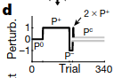
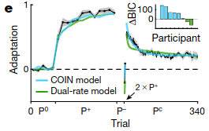
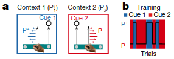
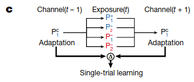
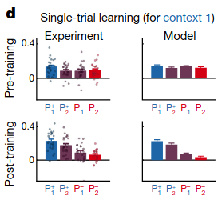

## Background

Suppose an apprentice chef is learning to chop food. As they move from practicing
with yellow potatoes to red potatoes to tomatoes to yams, their learning curves on 
each food item might look like the following:

Conventional models of motor learning typically study motor learning with a single goal
(e.g. yellow potatoes) and thus struggle to explain the ability of motor memories
to be adapted (what the authors term "apparent learning") to a new task. The authors
hypothesize that the brain's strategy is to learn multiple motor memories and then,
in a given context, infer which is most appropriate to use.

## Idea

- Motor memory creation, updating and expression are all controlled by contextual 
  inference
- Adaptation can arise from both
  - Creating and updating motor memories (proper learning)
  - Changing how existing motor memories are expressed (apparent learning)
- Offers a unified explanation of key features of motor learning
  - Spontaneous recovery
  - Savings
  - Anterograde interference
  - Environmental consistency affecting learning rate
  - Distinction between explicit and implicit learning
- Predicts new phenomena that authors experimentally confirm
  - Evoked Recovery
  - Context-dependent single-trial learning

- Proper learning: creation and updating of memories
- Apparent learning: updating of predicted context probabilities
  - i.e. altering extent to which existing memories are ultimately expressed in behavior

## Model

- COntextual INference (COIN)
  - Generative Model
    - An unbounded number of discrete contexts exist, with Markovian transitions
    - Each context $$c_t$$ is associated with a time varying state $$x_t^{(j)}$$
      - What is the state?
    - Current context generates sensory cue $$q_t$$
    - Context determines which state is observed as state feedback $$y_t$$
    - Rylan: What is the difference between context and state?
  - Inference:
    - Agent infers contexts and states
    - 

As an intuitive example, suppose the agent sees 3 visually identical cups and picks them up
before picking up a visually different sugar bowl.

As the agent does this, the agent will infer different contexts for the relevant motor responses:

New motor memories are created when new information that is significantly different from
past information is encountered:

And probabilities of the relevant context adjust as more time is spent interacting with each object:

## Experiments

### Spontaneous Recovery

Participants were told to hold a robotic interface and then move their hand from
a starting position to an end position. On each trial, the participant might experience
one of four possible forces (a.k.a. perturbations).

The four perturbations were applied in the following sequence:

Humans show "spontaneous recovery," which means that after the $$P^-$$ trials, when 
a corrective perturbation that prevents any deviation ($$P^C$$) is applied, the 
participants show a diminished recovery of their motor memory for $$P^+$$.

How can COIN explain this? COIN starts with a motor memory for moving with no perturbations
applied ($$P^0$$). In the two unidirectional perturbation phases, COIN creates new motor
memories for correcting against the perturbations. Since $$P^+$$ was present for the most
number of trials, the agent predicts that the most likely next context is $$P^+$$, and thus
exerts a $$P^+$$-like adaptation. COIN matches when $$P^+$$ phase is extended or reduced.

- Question: This should yield a prediction that $$P^-$$ should emerge if there were more
$$P^-$$ trials. Is that correct, and does the prediction empirically hold? Yes.
- Question: Does timing matter e.g. suppose a long delay follows the $$P-$$ phase?

The authors modified the previous experiment by adding two $$P^+$$ trials before starting
the $$P^C$$ phase. COIN predicts a stronger recovery of the $$P^+$$$ behavior because the
$$P^+$$ context is now active.

Results show that this is indeed true of participants: 

### Motor Memory Updating

COIN posits that all contexts should be updated at all times, proportional 
to probability that the context is active at the current time. To test this, 
the authors tested to what extent two contexts memories are updated when 
controlling sensory cues and state feedback. Participants first went through
extensive training to associate two cues with two different perturbations,
which were consistently paired:

Then, after learning, participants' trials were grouped in triplets. The first 
trial in a triplet had a cue and a corrective perturbation, and the third trial
in the triplet was identical. The middle trial (called the "exposure trial") 
had one of four possibilities:
one of the two cues was shown, and one of the two different perturbations were
applied.

Participants showed distinct patterns depending on the middle trial: if the 
cue matched the perturbation as well as the first trial's cue, then the
motor movement was strengthened on the third trial, whereas if the cue matched
the perturbation but the first trial had the opposite cue, the motor movement
was weakened on the third trial:

The authors argue that COIN explains this because when the cue matches the perturbation,
the agent is strongly confident in which context is active, whereas when the two
disagree, the probability of any particular context is reduced and updated less.

### Saving

"Savings" refers to the phenomenon where when a motor behavior is acquired, forgotten and 
then re-learnt, relearning is faster than the original learning.
  - Question: What is meant by forgotten? How can this be confirmed?

In anterograde interference, learning a perturbation is slower if an opposite perturbation 
has been learnt previously, with the amount of inference increasing with the length of the 
first perturbation learning.

### Setup 1

## Model

Let $$c_t$$ denote the discrete context at time $$t$$. The generative model posits that 
there are an unbounded number of discrete contexts that evolve 
according to a Markov chain for some transition probability matrix $$\Pi$$:

$$c_t | c_{t-1}, \Pi \sim Discrete(\Pi_{c_{t-1}})$$

where $$\Pi_{c_{t-1}}$$ is the $$c_{t-1}$$-th column of the transition matrix. For every 
context, $$c_k$$ is associated with a continuous latent variable $$x_t^{(k)}$$ that evolves
according to linear-Gaussian dynamics:

$$x_t^{(k)} = a^{(k)} x_{t-1}^{(k)} + d^{(k)} + w_t^{(k)}$$

where $$a^{(k)}, d^{(k)}$$ are the context-specific state retention factor and drift, respectively,
and $$w_t^{(k)} \sim \mathcal{N}(0, \sigma_q^2)$$ is the process noise. At each time step,
a continuous variable $$y_t$$ (the state feedback) is emitted:

$$y_t = x_t^{(c_t)} + v_t$$

where $$v_t \sim \mathcal{N}(0, \sigma_r^2)$$ is the state feedback noise. Additionally, 
another discrete observation (the context cue) is emitted:

$$ q_t | c_t, \Phi \sim Discrete(\Phi_{c_t})$$

The authors place Hierarchical Dirichlet Process (HDP) priors on the state transition probabilities
and cue probabilities. They use a sticky variant of the HDP for the state transition probabilities
to capture that contexts should persist across time.

- Question: How is this different from an Infinite Hidden Markov Model (Beal 2006)?
- Question: Why use Sequential Monte Carlo (SMC) for inference?
- Question: Could SMC scale to realistic problems?

## Future Questions

- What networks in the brain enable contextual inference?
- How do feedback mediated control and contextual inference interact?
- Suppose the agent is split on which context it's in, and each context recommends conflicting
  actions. How does the agent adjudicate?
- 

