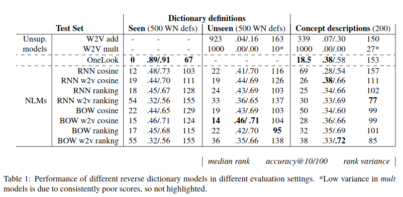
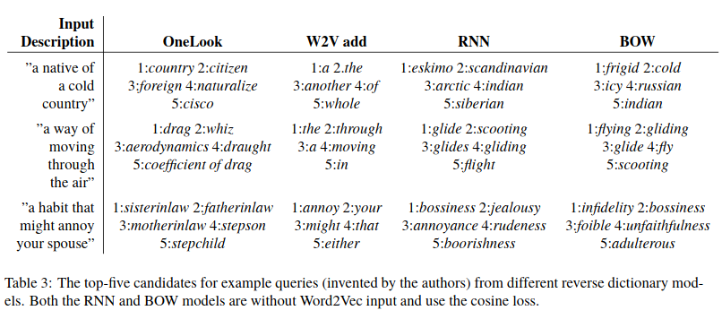
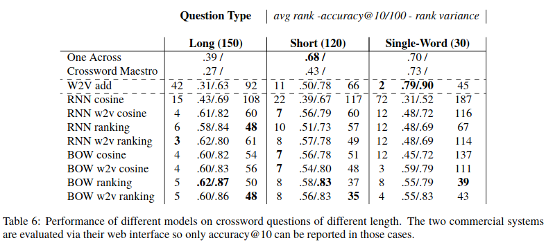

## Background

Semantics, the linguistic study of meaning, has at least two subfields: (1) lexical semantics,
which concerns how the meaning of word acts in grammar in composition as well as how
different uses of a word relate, and (2) phrasal semantics, which concerns the meaning of syntactic units
larger than a word (e.g. a phrase, a sentence, a paragraph).

## Research Questions

- Can we train neural language model to map words to definitions and vice versa? 

## Approach

- Train Word2Vec on 8 billion words from large corpus with 500 dimensional embeddings
- Consider three models (RNN, LSTM, Bag of Words), each with own randomly initialized embedding,
  and train to output the Word2Vec embedding of a word given the word's definition. 
- Consider 2 losses: (1) cosine distance, and (2) rank loss, where $$c$$ is the test word,
  $$s_c$$ is the definition sequence, $$M(s_c)$$ is the language model's output, $$v_c$$ is the 
  pretrained embedding from Word2Vec and $$v_r$$ is the pretrained embedding of a randomly selected
  word:

$$\text{max}(0, m - \cos(M(s_c), v_c) - cos(M(s_c), v_r)) $$

## Experiment 1: Reverse Dictionary

- Compare neural models against online tool OneLook, which is a reverse dictionary: given a sentence,
  return a list of candidate words

## Experiment 2: Crossword Solving

- Compare neural models against Word2Vec addition and online tool OneAcross

