## Background

Previously, [Rashid et al. 2016](rashid_science_2016_competition_memory_engrams.md)
and [Cai et al. 2016](cai_nature_2016_shared_memory_engrams.md) showed that conditioning
close in time result in overlapping engrams, and [Yokose et al. 2017](yokose_science_2017_overlapping_memory_engrams.md)
further showed that the overlap in neurons between engrams is responsible for linking the
shared experiences.

## Research Questions

This paper asks and answers:

- Is creating a behavioral response to a false memory possible? Answer: Yes
- How does the behavioral response depend on elapsed time? Answer: 3 hours is possible, 24 hours is not.

## Experiments

### Exp 1 (Behavior)

- Day 1: Fear condition Tone A. Then, either 3hr or 24hr later, present a neutral stimulus Tone B
- Day 2: Test Tone B 
- Day 3: Test Tone A.

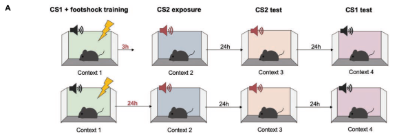

- Freezing in response to Tone B during first presentation is equal between 3h and 24 hr groups
- Freezing to Tone B during test is higher for 3h than 24 hr group

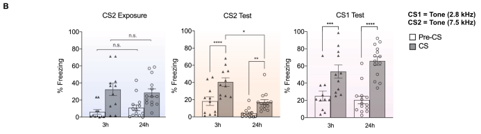

- For control, repeat experiment with no Tone B exposure.

- Freezing (in decreasing order): Tone A > Tone B (3 hr) > Tone B (24 hours) = No Tone B exposure

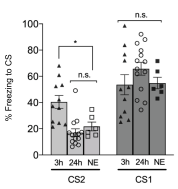

### Exp 2 (Behavior)

- Repeat the same experiment, replacing the negative Tone A with negative Light A

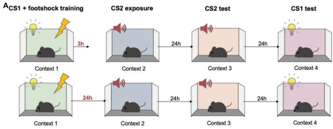

- Same results as before
- Freezing in response to Tone B during first presentation is equal between 3h and 24 hr groups  
- Freezing during test (in decreasing order): Light A > Tone B (3 hr) > Tone B (24 hr)

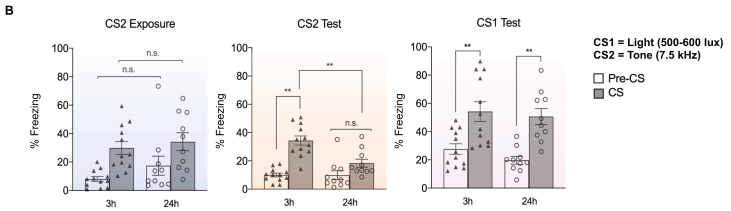

### Exp 3 (Neural)

- Later experiments will need to manipulate engrams in 3 hours. This is too short for
  the typical tag-and-manipulate approach, necessitating allocate-and-manipulate approach
- Consequently, need to test that allocate-and-manipulate is valid. Want to test that
  optogenetical manipulation increases probability of neurons being recruited to engram strategy
- Group 1: Use blue-light to activate specific neurons during fear conditioning. Use red light 
  to inhibit those same neurons.

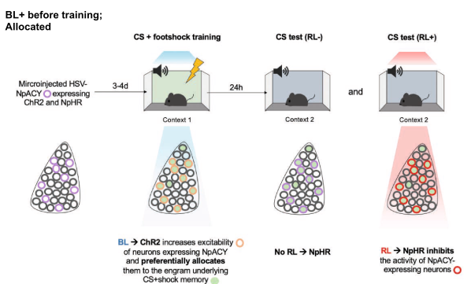
  

- Group 2: No blue-light to activate specific neurons during fear conditioning. Use red light
  to inhibit those same targeted neurons.

- Result: Group 1 freeze less when red light activated
- Takeaway: Optogenetic stimulation controllably biases which neurons are recruited to the engram

### Exp 4 (Neural)

- Three conditions: auditory fear condition (FC), blue light with no fear conditioning (BL), 
 blue light with fear conditioning (BL+FC)
- Measure c-fos+ immunohistochemistry (which I guess measures cell activity / synaptic formation)
- In targeted neurons, highest c-fos+ expression in BL+FC, then FC, then BL

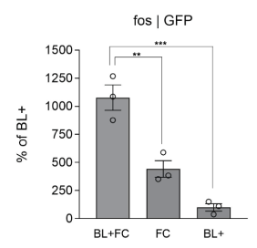

- Takeaway: further suggests that blue light biases which neurons are allocated to the memory engram

### Exp 5 (Neural, Behavioral)

- THE BIG EXPERIMENT in this paper
- Hypothesis: false association learnt if CS2 was presented 3 hours post conditioning because
co-allocated to same engram
- Group 3h-NpACY-RL: Fear condition CS1 using blue light to bias preselected neurons towards inclusion in engram. 
  3 hours later, expose to CS2 but use Red Light (RL) to inhibit preselected neurons.
  
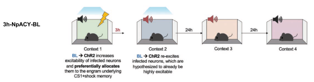  

- Group 3h-NpACY-BL: Fear condition CS1 using blue light to bias preselected neurons towards inclusion in engram.
  3 hours later, expose to CS2 but use Blue Light (BL) to similarly bias preselected neurons.
  
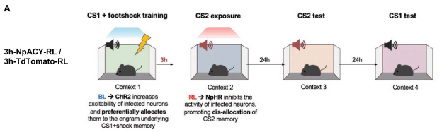

- Group 24h-NpACY-RL: Fear condition CS1 using blue light to bias preselected neurons towards inclusion in engram.
  24 hours later, expose to CS2 but use Red Light (RL) to inhibit preselected neurons.

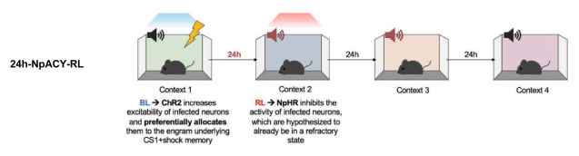

- Group 24h-NpACY-BL: Fear condition CS1 using blue light to bias preselected neurons towards inclusion in engram.
  3 hours later, expose to CS2 but use Red Light (RL) to inhibit preselected neurons.

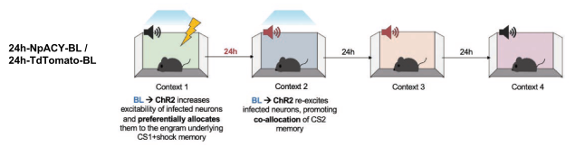  

- Results 
- 3 hours: optogenetically inhibiting, but not exciting, engram neurons impaired creation of 
  freezing response to CS2
- 24 hours: optogenetically exciting, but not inhibiting, engram neurons created freezing
  response to CS2

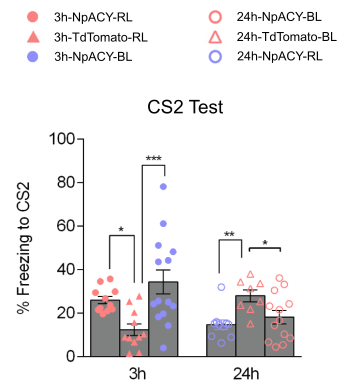

- 3 hour - Red light in 3 hour case impaired learning freezing response to CS1 

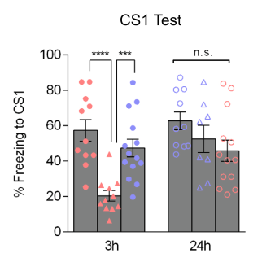

- Takeaway: persistent excitability is key for linking experiences in shared engram

### Exp 6 (Neural, Behavioral)

- Group 1: Blue light before CS1 fear conditioning. CS2 exposure after 3 hours. 
24 hours later, test retrieval to CS2 (with or without red light, inhibiting selected neurons),
  then test retrieval to CS1 (with or without red light)

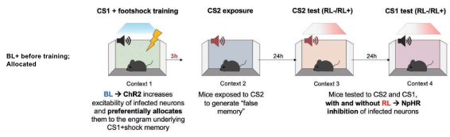  

- Group 2: No blue light before CS  

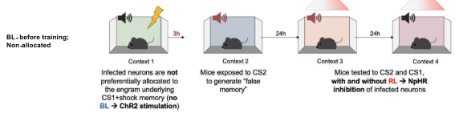

- Results:
- With blue light during CS1 conditioning and no red light during CS2 retrieval, high freezing
- With blue light during CS1 conditioning and red light during CS2 retrieval, low freezing
- With blue light during CS1 conditioning and red light during CS1 retrieval, low freezing
- Red light had no effect if no blue light used

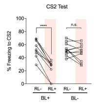

- Takeaway: Neutral stimulus is coallocated to the same engram as a negative stimulus if 
separated by 3 hours
- Freezing during red light + CS1 retrieval suggests CS1 and CS2 neurons are largely one and the same 