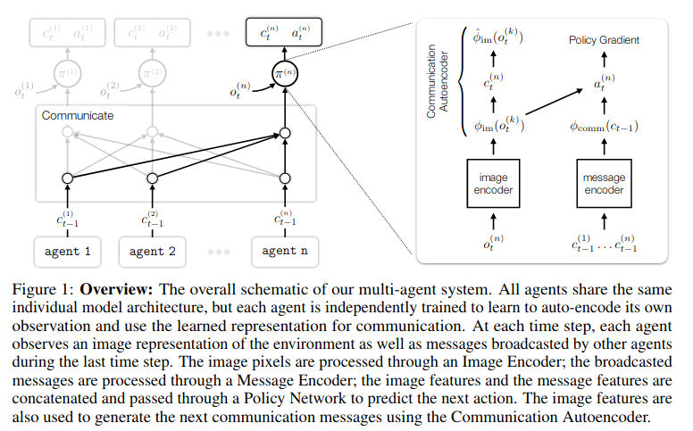
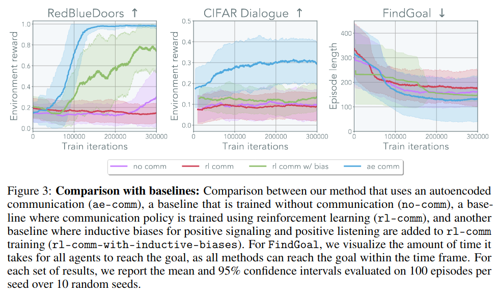
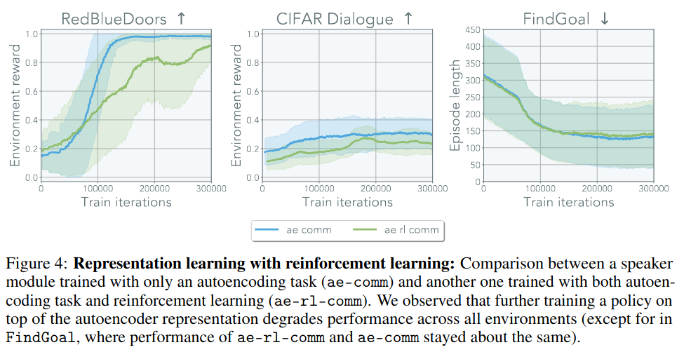

## Research Questions

Communication requires a common language, a lingua franca. How could such a lingua france
emerge?

## Background

Studies by cognitive science and evolutionary linguistics have some evidence to suggest
that communication began with sounds that had grounded meaning.

Emergent communication in Multi-Agent RL (MARL) is a challenging problem due to non-stationary
and non-Markovian transition dynamics. MARL models unable to solve tasks that rely on 
emergent communication, even with centralized learning and shared policy parameters.

Previous work shows that because there is no grounded information for agents to 
associate symbolic utterances with, communication channel goes unused.

## Setting

Consider N fully cooperative MARL agents in partially observable MDP.

Policy networks trained using A3C with Generalized Advantage Estimation.

No centralized training or self-play. Each agent has independent policy.

## Approach

1. Ground speaking through learned representations of the world
2. Listen to interpret grounded utterances

More specifically, equip each agent with (1) an image autoencoder for its
own observations, and (2) a communication autoencoder that maps from
the image autoencoder's latent to the communication symbols. The autoencoded 
image is concatenated with the output of the message encoder.

## Experiments

3 environments:
1. CIFAR Game: Non-ordinal, 2 agent referential game. One agent observes CIFAR image
  and communicates to its partner which of 10 images is the correct one.
2. FindGoal: 3 agents with partial view - want to all reach green goal ASAP.
3. RedBlueDoors: ordinal, 2 agent, non-referential game. To receive reward, need to open
  red door then blue door.

### Baselines

- No comm: no communication channel
- RL-comm: no distinction between listener module and speaker moduel
- RL-comm-with-biases: inductive biases for positive signaling and positive listening
- AE-RL-comm: adds communication autoencoder to RL-comm

### Results

Autoencoder trained jointly with GRU policy performed worse than separately trained 
autoencoder and GRU policy.

