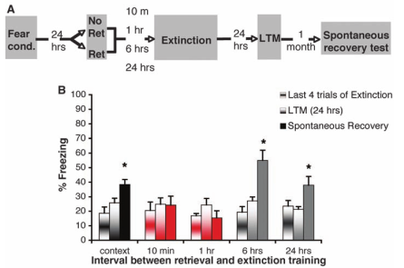
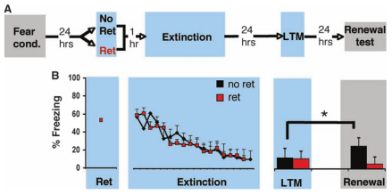
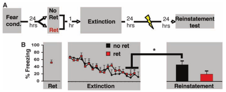
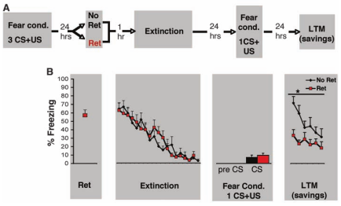
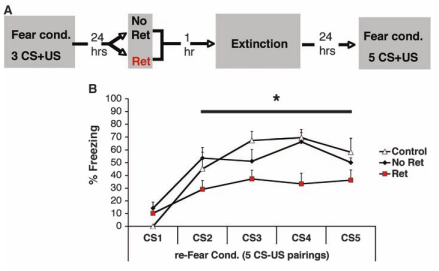

## Background

Three well-reproduced findings in the fear conditioning literature are

1. Spontaneous recovery: increasing time between extinction and test increases responding
   to the conditioned stimulus (CS).
2. Reinstatement: after extinction, re-exposure to unconditioned stimulus (US) increases
   responding to the CS
3. Renewal: after extinction, returning animal to acquisition context increases responding to 
   the CS

## Research Questions

- Is there a pharmacologically-free method to reduce the presence of all three effects?
    Yes!

## Experiments

### Exp 1 (Behavior)

- 3 CS-US pairings
- Extinction consists of either (a) 19 extinction trials or (b) 1 extinction trial followed
by 18 more extinction trials
- 5 groups: 19 back-to-back trials, 10 minutes between 1st extinction trial and
  18 subsequent trials, 1hr, 6hr, 24hr
- Compare fear retrieval 24 hours later and 1 months later (spontaneous recovery) to
 fear retrieval at end of extinction

- In 10 minute and 1 hr groups, freezing is approximately the same 
- All other groups display spontaneous recovery
- Takeaway: pre-exposing 1 extinction trial within ~1hr of extinction reduces spontaneous recovery

### Exp 2 (Behavior)

- Next, test effect on renewal (place back in FC context)
- Grey is context A, Blue is context B

- Takeaway: presenting one extinction trial 1 hour before extinction blocks renewal

### Exp 3 (Behavior)

- Next, test effect on reinstatement (shock before testing)
- Specifically, 5 shocks (US) without CS

- Takeaway: presenting one extinction trial 1 hour before extinction blocks reinstatement

### Exp 4 (Neural)

- Molecular identification. Skipped.

### Exp 5 (Behavior)

- Examine subsequent susceptibility to 2nd fear conditioning (1 CS+US)
- Then test mice over 5 CS trials

- Takeaway: Mice with 1 hour between first extinction trial and 18 subsequent extinction trials
  recover fear response to lesser extent

### Exp 6 (Behavior)

- How quickly do mice recover fear response?
- Again, use 2nd fear conditioning (5 CS+US)

- 1 hour group acquires fear response to lesser extent than (1) group with no previous CS-US
  exposure (control) and (2) group with no gap between first extinction trial and 18 subsequent
  extinction trials