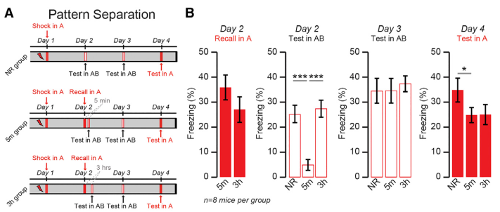
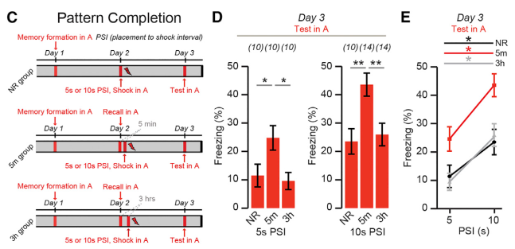
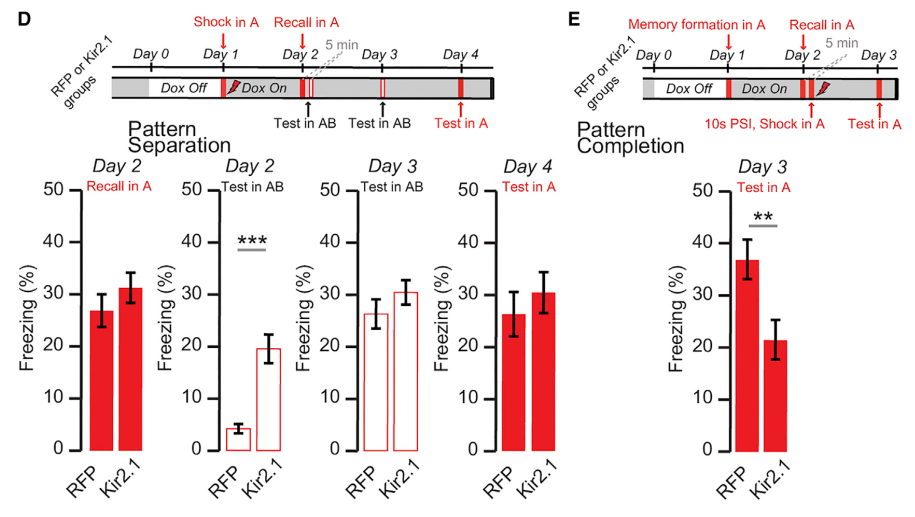

## Research Questions

Excitability was previously shown to be key in determining which neurons
are ultimately recruited to an engram ([Yiu et al. 2014](../_kernel_papers_drafts/yiu_neuron_2014_neurons_recruited_memory_trace.md),
[Rashid et al. 2016](../_kernel_papers_drafts/rashid_science_2016_competition_memory_engrams.md)). Here, the 
authors ask and answer:

- What role does excitability play in memory recall? Memory recall
increases excitability of engram cells for ~1 hour
- What effect does this transient enhancement of excitability have? Short-term excitability
  causes behavioral changes, including improved recall if primed on correct timescale (5min-1hr)

## Experiments

### Exp 1 (Cellular)

- Contextual fear condition mice and tag engram neurons
- Three groups: (1) not returned to fear chamber; (2) sacrificed 5 minutes post-recall
  (3) sacrificed 3 hours post-recall
- Only group (2) showed increased excitability  
- Detected 5 min, 10 min, 30 min, 1 hr after recall, decayed to baseline at 2 hr
- Same result even without conditioning; novel context C had same effect as conditioned context A
- Membrane excitability abolished by NMDA receptor antagonist before recall
- Membrane excitability decay prevented by protein synthesis inhibitor after recall

### Exp 2 (Behavioral)

- Fear condition mice in context A
- Assessed response in context AB, which had same visual features as context A but odor, lighting,
floor material, cage shape and experimental room were from context B (as far as I can tell, the mouse
  wasn't exposed to context B)
- Day 2: mice were either exposed to AB directly, or AB 5 minutes after exposure to A, or AB 3 hours
after exposure to A
- In context A, 5m and 3h groups froze at similar levels
- In context AB, no A exposure and 3h groups froze at similar levels. 5m group did not freeze

- on Day 3, all groups showed robust and similar levels of freezing
- Result held for AB exposure 1 hour after exposure to A
- Takeaway: Reactivating memory of context A within 5 minutes of context AB causes mouse
  to freeze less
  
### Exp 3 (Behavioral)

- Day 1: Expose all mice to context A without shock
- Day 2: Mice either not shown context A (no recall) or recall (either 5min, 1 hr or 3 hr)
- Day 2: Half of all three groups then shocked for 5s and other half shocked for 10s
- Day 3: test fear response
- All mice with 10s shock showed more freezing than mice with 5s shock
- Mice with 5m recall or 1hr recall had higher freezing than no recall mice and 3hr recall mice

- Takeaway: excitability correlates with easier retrieval of fear memory

### Exp 4 (Cellular, Neural, Behavioral)

- Is the previous result causal? That is, does excitability enable easier retrieval of fear memory?
- Kir2.1 prevents this short term excitability
- TODO: how to interpret 4D? I can't find what difference is between RFP and Kir2.1
- Impairing short-term excitability decreased ability to recall memory (4E)

- Effect did not hold for different context C, displaying context-specificity
- Takeaway: excitability allows for easier retrieval of fear memory