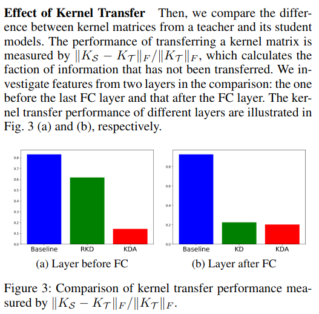
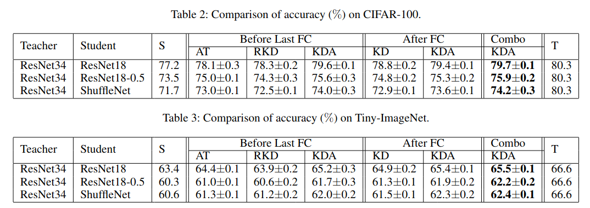

## Background

Knowledge distillation (KD) aims to transfer the knowledge of one model (the teacher)
into another model (the student). Typical KD works by optimizing the student to 
match the teacher's outputs.

## Research Approach

Here, the authors aim to distill useful **features** (not predictions c.f. probabilities, logits)
from the teacher to the student. Because the kernel matrix grows quadratically with the
number of data, the authors also propose a low-rank approximation of the kernel (a.k.a. Gram) matrix
via the Nystrom approximation.

## Approach

Define a kernel matrix distillation loss:

$$\ell_{S, T} = \lvert \lvert K_S - K_T \lvert \lvert_F$$

The authors use the [Nystrom approximation](/content/learning/kernel_methods/nystrom_method.md)
to replace the kernel matrix $$K$$ with a rank-k approximation. Let $$D_S \in \mathbb{R}^{d_S \times m},
D_T \in \mathbb{R}^{d_T \times m}$$ denote the $$m$$ landmark points for the student and teacher
kernel matrices respectively. Define $$C_S := X_S^T D_S, C_T := X_T^T D_T$$ and $$W_S := D_S^T D_S, W_T
:= D_T^T D_T$$.

__Corollary 1__: Assuming that $$\lvert \lvert C_S \lvert \lvert_F \leq c$$ and $$\lvert \lvert C_T \lvert \lvert_F \leq c$$
i.e. the two matrices are upper bounded by a constant and the smallest eigenvalues of $$W_S^k, W_T^k$$
are larger than 1, then we can upper bound the kernel matrix distillation loss:

$$\lvert \lvert K_S - K_T \lvert \lvert_F \leq 2 \epsilon + 2 c^2 \lvert \lvert C_S W_S^{k, 1/2} - C_T W_T^{k, 1/2} \lvert \lvert_F $$

__Corollary 2__: The kernel matrix distillation loss can be upper bounded as:

$$\lvert \lvert K_S - K_T \lvert \lvert_F \leq 2 \epsilon + O(\lvert \lvert C_S - C_T \lvert \lvert_F) $$

### Landmark Selection

The authors then consider performing $$L$$-way classification, with $$m = L$$ landmark points. The authors
show that the kernel matrix distillation loss can be written as a standard clustering problem.

## Experiments

They quantify the amount of information that has been transferred by learning via the 
landmark (i.e. class centroids) points.

Using the method (Knowledge Distillation by Approximated Ker-
nel Transfer (KDA)) on all layers with CIFAR-100 and Tiny-ImageNet yields sub-teacher improved performance
when combined with KD. Following Tian et al. 2020's Contrastive Representation Distillation paper, maybe KDA offers
no absolute benefit by itself (note: Tian et al. did not include KDA in their work, as far as I can tell).

