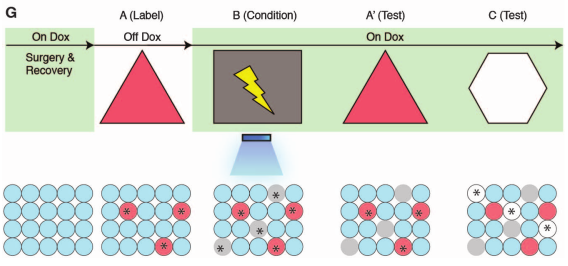
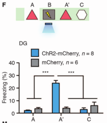
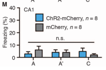
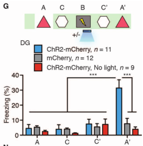
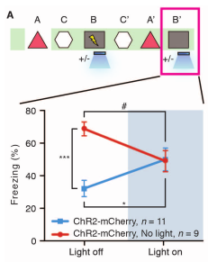
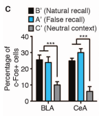
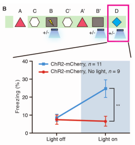
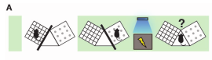
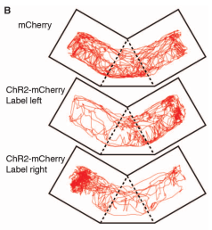
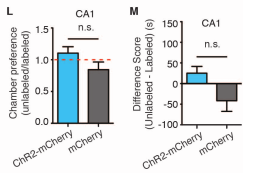

## Background

Previously, ablating/inactivating memory engram neurons prevented
retrieval of fear response

[Previous work](liu_nature_2012_optogenetic_stimulation.md) by the Tonegawa lab showed
that optogenetically activating memory engram cells (specifically in dentate gyrus (DG) during
contextual fear conditioning) would reactive the fear memory.

## Research Questions

- Is creating a false memory (i.e. fear association) with optogenetic interventions possible? Yes

## Experiments

### Exp 1 (Cellular)

- Tag hipppocampal (dentate gyrus) cells

### Exp 2 (Behavioral)

The mouse
is placed on DOX, then DOX is removed and the mouse is allowed to explore neutral context A.
Later, in Context B, mouse is shocked while neurons tagged in context A are optogenetically
activated. The mouse is then placed back in Context A and subsequently Context C.

- Experimental group (ChR2-mCherry) freezes in context A' (i.e. the second time being placed in Context A)

- Control group (mCherry) does not freeze in contexts A, A' or C
- Takeaway: Optogenetic stimulation during shocks in context B cause context A to gain negative 
association
- Repeating, but replacing injections in dentate gyrus with injections in CA1 resulted in no effect 

### Exp 3 (Behavioral)

- To test for whether presence of ChR2-mCherry was the cause of the previous effects, repeat
without the light stimulation (ChR2-mCherry, No light)
- No freezing during A, C, C' or A' except for group exposed to light during B

- Takeaway: acquired fear response to context A cannot be explained by presence of ChR2-mCherry
- Repeating, but replacing injections in dentate gyrus with injections in CA1 resulted in no effect

### Exp 4 (Behavioral)

- Does fake fear memory interfere with genuine fear memory of Context B that should exist?
- Repeat Experiment 2, but now testing fear recall in Context B
- For group with optogenetic intervention, low freezing in context B without light and
  more freezing in context B with light
- For group without optogenetic intervention, high freezing in Context B without light
  and less freezing in context B with light  

- Authors explain as competitive conditioning: contexts A and B compete to explain the shock
  
### Exp 5 (Neural)
- Test the role of Basolateral Amygdala (BLA) and Central Amygdala (CeA)
- Three groups of mice underwent previous experiment and were killed after testing in B' 
  (natural recall), A' (false recall) or C' (neutral context)
- Significantly more cells in BLA and CeA were active during Natural Recall and Fear Recall
than the neutral context

- Takeaway: conditioning recruits BLA and CeA neurons

### Exp 6 (Neural, Behavioral)

- Using Context B for shocking and testing context B allows for possibility of competitive
conditioning
- Retest freezing, in a totally new Context D
- For group without optogenetic intervention, no difference in freezing
- For group with optogenetic intervention, light induced more freezing

### Exp 7 (Neural, Behavioral)

- Does creation of false fear memory cause different behavior
in freely exploring mice?
- Tag either left side of the room or right side of the room,
then shock mouse in different context while optogenetically stimulating
  the labeled cells
- mCherry = no optogenetic intervention, ChR2-mCherry = optogenetic intervention
  

- Mice with optogenetic intervention spend less time on tagged side (Fig 4B, Fig 4LM) 

