## Background

Memory consolidation is process by which a new memory transitions from a fragile state
to a long-term stable state. For short time after learning, memory is susceptible
to disruption e.g. by protein synthesis inhibitor (PSI), which can cause retrograde amnesia. 

__Disclaimer__: This paper explains its experiments very poorly. Reading the supplement directly
is highly recommended.

## Research Questions

- How does retrograde amnesia (induced by PSI) interact with the formation and function
of memory engrams?

## Experiments

### Exp 1 (Cellular)

- Take mice off Dox, perform contextual fear conditioning (CFC) and inject either saline
or anisomycin (a protein synthesis inhibitor) into hippocampal dentate gyrus (DG)
  
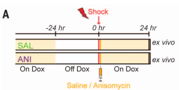

- Test synaptic strength by optogenetically activating tagged engram neurons (mCherry+) 
or non-engram neurons (mCherry-)
- mCherry+ neurons (engram neurons) had significantly stronger synapses in the saline condition
but not in the anisomycin condition

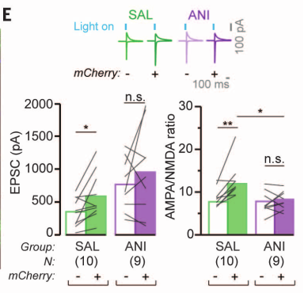

- mCherry+ (engram) neurons had higher dendritic spine density in the saline condition than
in the anisomycin condition

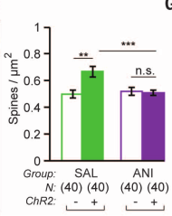

- Takeaway: Injecting anisomycin (ANI) into dentate gyrus after CFC impairs synaptic strengthening
and dendritic density
  
### Exp 2 (Behavioral)

- What is the behavioral effect of optogenetically stimulating engram cells in amnesic mice?

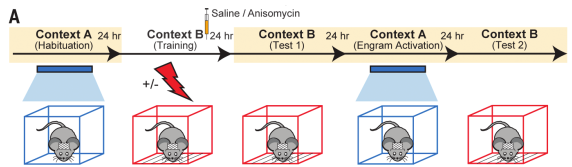

- For control, some mice not exposed to shock
- Freezing in decreasing order: saline + shock, anisomycin + shock, saline (no shock), anisomycin (no shock) (Fig 2C)
- Optogenetically activating DG neurons results in freezing behavior regardless of saline/anisomycin

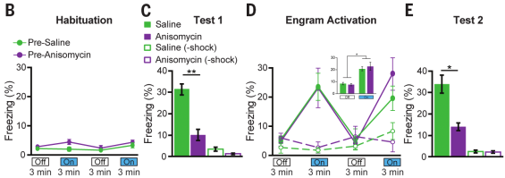

- Replicated using another PSI cycloheximide (CHM)
- Injecting ANI 24 hours later had no effect
- Authors: Recovery from amnesia through light activation of DG engram
cells was unexpected because these cells showed neither synaptic potentiation
  nor increased dendritic spine density

### Exp 3 (Behavioral)
- Can recovery from amnesia can be demonstrated with light-induced optogenetic
place avoidance test (OptoPA)?
- The below figure oversimplifies this experiment
- Mice placed in context with two "zones" and given 3 minutes to explore; the preferred
  zone became the "target zone"
- For minutes 3-6 and 9-12, turn on light whenever mouse enters the target zone 
- Fear condition Context B, then immediately injecting saline or ANI into (can't tell; my guess is
  dentate gyrus?). Use Dox diet to label the active neurons.
- Mice placed back in first context and given 3 minutes to explore; the preferred zone 
  became the "target zone"
- During 3-6 minutes, 9-12 minutes, light was turned on
  

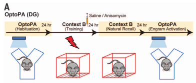

- Difference score := time in target zone without light - (time in target zone with light on 
  minutes 3-6 + time in target zone with light on minutes 9-12) / 2
- ANI causes significantly less freezing than saline during natural recall 
- Cells are equally activated during optogenetic

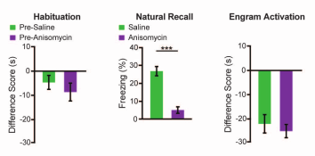

- Takeaway: Anisomycin in DG impairs natural fear recovery, but optogenetically activating those
  neurons retrieves the fear response in another context

### Exp 4 (Behavioral)
- Skipping

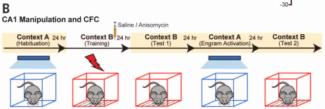

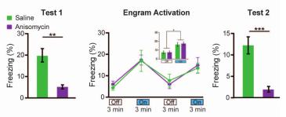

### Exp 5 (Behavioral)
- Auditory fear conditioning.
- Same experimental setup as previous experiment, but replacing contexts with tones and injecting
ANI or Saline into lateral amygdala
- Fear engram neurons were identified with Dox diet after Context B training  

- Again, ANI reduced freezing of mouse to CS tone by 20%
- Again, activating engram in neutral Context A increased freezing comparable to saline group

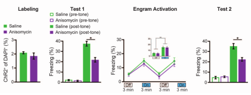

### Exp 6 (Behavioral)

- Can amnesia caused by disruption of reconsolidation of CFC be recovered
through light-activation of DG engram cells?
- Context A engram labeled, followed by injection of saline or anisomycin
- Mice fear conditioned in Context C, while light was activated

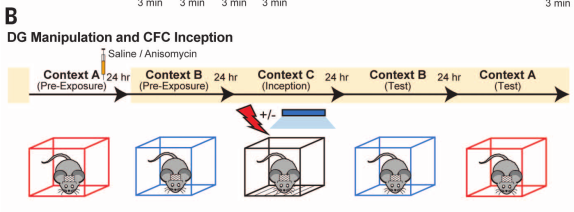

- Freezing to irrelevant context B remained low
- Mice acquired fear to Context A, with greater fear response in anisomycin context

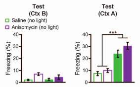

- Takeaway: Can create freezing response to forgotten context A by shocking context A dentate gyrus 
  neurons while mouse in Context C
  
### Exp 7 (Neural)

- How are basolateral amygdala and central amygdala involved in constructing fear memory?
- Label and activate Context A. Fear condition Context B, then inject saline or anisomycin.
Test recall to Context B or Context A with DG activation

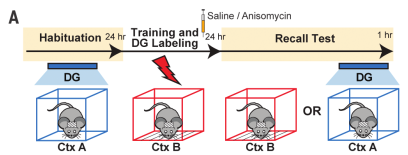

- Natural recall results in lower c-Fos+ cell counts for anisomycin, not saline, in 
  both BLA and CeA
- Optogenetic activation of DG removes effect

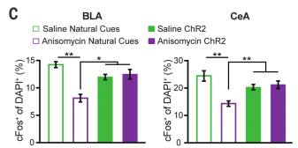

- Takeaway: BLA and CeA are more active either without anisomycin or with optogenetic 
stimulation

