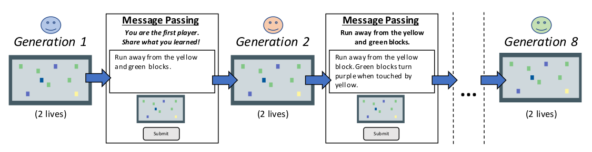
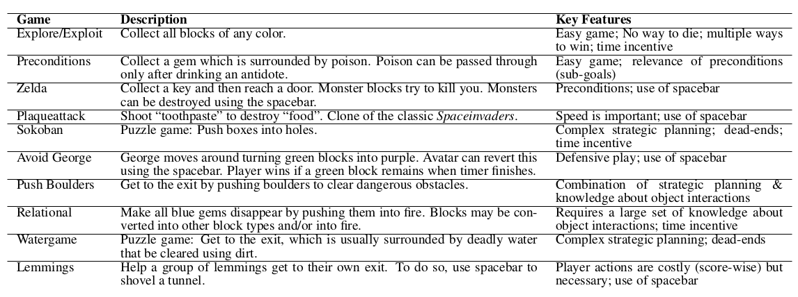

## Research Questions

The authors want to understand how language enables the accumulation of knowledge
across generations. The approach is specifically to compare learning curves between (a) multiple generations,
where each generation receives two lives at a game and can pass their knowledge to the next generation
via language, and (b) a single learner who can continually learn with the same total number of lives.

## Experiment 1

### Setup

As stated above, the idea is to compare individual players against a "multi-generational player"
i.e. a sequence of players who pass written information to the next generation. This multi-generational
players looks like:

Each individual player and "multi-generational player" (sometimes referred to as chains)
play 10 games, which each require a different type of problem-solving:

Messages stay within a single lineage. There are 10 parallel chains, with 8 generations 
(a.k.a. participants) per chain. N=80 total participants.

### Results

- Completing more levels (harder levels) correlated with generation index, meaning
later generations perform better at the tasks, although the coefficient is 0.21 with
a 95% credible interval of (0.11, 0.31) 

- Number of steps per level is negatively correlated with generation index, meaning
 later generations complete levels faster than earlier generations, with a coefficient
 of -3.86; interval (-7.26, -0.44)

- Each game appears to have a signature learning curve, such that the multi-generational player
 learning curves look like the single player learning curves

- Area under the learning curves is decently correlated

- Messages lengths increase across generations (coefficient: 0.5 sentences), and players
 that performed better were more likely to make more edits to the text

## Comments

- No analyses on the content of the inter-generational messages, and how they affect the next generation's performance

- Generations are based on chained, meaning message will persist regardless of performance it provides. Ideally,
  one would want messages to be passed proportionally to how successful the progenitor was, regardless
  of generation? Two of the strengths of cultural learning is that (a) we can select who we learn from, and
  (b) written instructions aren't reliant on the weakest link in a chain of descendants.
