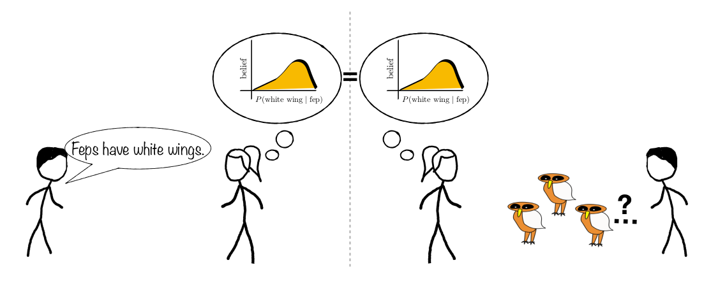
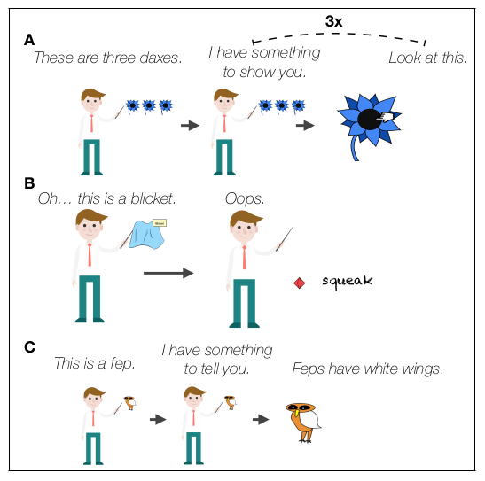
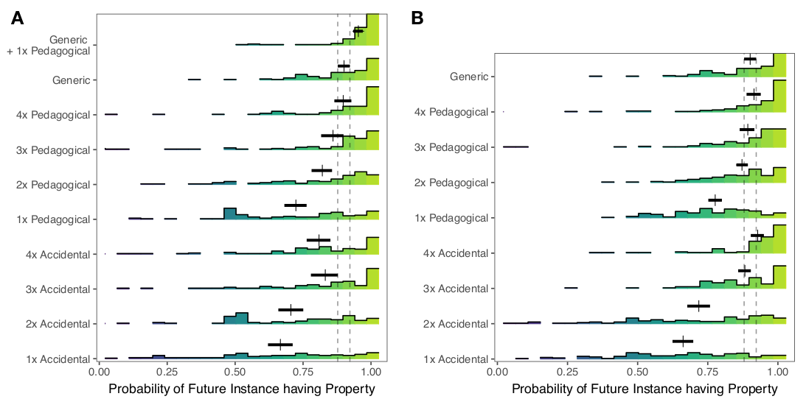
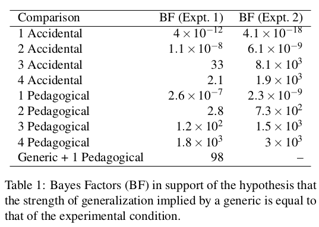
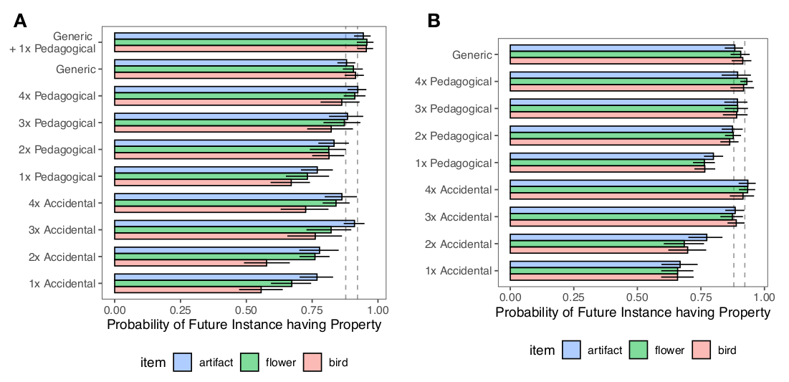

## Background

In a [previous paper](../_kernel_papers_drafts/tessler_psyarxiv_2019_learning_from_generic_language.md),
the authors posited that the generic construct in language is equivalent to an observation
and used this equivalence to model human concept learning via language as Bayesian belief updating
(albeit with generics rather than observations). In this paper, the authors seek to titrate how effective
a single generic is at communicating a concept.  This also relates to how flexible generics can be; for
instance, the three following generics have different prevalence.

- Triangles have 3 sides (all, by definition)
- Swans are white (most)
- Mosquitoes carry malaria (very few)

One motivating reason to think that a generic utterance is more impactful than an observation is that
if the utterance comes from an informed, well-intentioned partner, then the utterance is equivalent 
to the purest observation possible, as opposed to some noisy/ambiguous observation.

## Research Questions

What is the exchange rate between 1 generic (e.g. "Feps have white wings") and observations (e.g. 3
pictures of Feps)?

## Experiment 1

Humans participants are tasked to learn novel categories from examples, generic language or a combination
of both. There are 10 conditions. 8 of the conditions are formed from the cross product of how many examples
(1, 2, 3, or 4) and whether the examples are pedagogical or accidental. The remaining two conditions are either
a generic utterance, or a generic utterance with a single pedagogical example. The figure
below shows 3 of the 10 conditions: (A) three pedagogical examples, (B) one accidental example, (C) one generic
utterance with a single pedagogical example.

## Experiment 2

One problem with the previous experiment is that in the examples, the feature that will
be generalized (e.g. wing color) is not explicitly individuated. For instance, the cursor would point to the
wing of the Fep, but that leaves ambiguity about the exact feature being pedagogically highlighted
or accidentally observed. Consequently, the authors ran the experiment again with more explicit 
labeling of the feature e.g. "The **wings** are white"

## Results

- Exp 1: 347 participants
- Exp 2: 378 participants

- How quickly do participants learn to generalize? In experiment 1 (left), a generic
 is less effective than a generic + a pedagogical example, but roughly equivalent to 3-4
 pedagogical examples. In experiment 2 (right), a generic is roughly equivalent to 2-4 
 pedagogical examples.

- The previous analysis can be more accurately quantified using hypothesis testing, specifically
 with the hypothesis that 2 conditions came from the same distribution. The Bayes factors below
 show strongest evidence for 4 pedagogical examples in Exp 1 and strongest evidence for 3-4 pedagogical
 examples in Exp 2

- Participants were most confident that a future instance would have a property in Generic + 1 pedagogical,
 then Generic, then 4 > 3 > 2 pedagogical examples:

- The differences between Exp 1 and Exp 2 shows that part of the benefit of generics arises solely 
 from identifying which feature(s) the generic will describe / clarify
