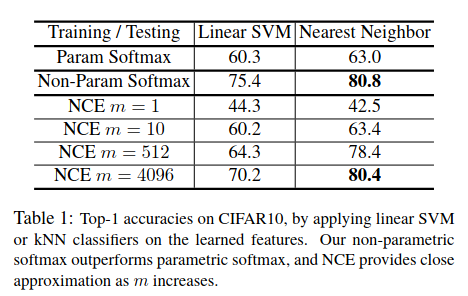

## Research Questions

Can a good feature representation be learnt that captures similarity among instances
rather than classes, by asking features to be discriminative of individual instances?

Question: what is an instance? A single image.

## Approach

### Approach: High level

- Treat each image in ImageNet as a class (1.2M instead of 1K)
- Approximate the full softmax distribution with noise-constrastive estimation (NCE)
  and use a proximal regularization method to stabilize learning

### Approach: Low level

1. Extract features $$v_n = f_{\theta}(x_n)$$ from each image. Then, for each image,
enforce that $$\lvert \lvert v_n \lvert \lvert = 1$$. Try to maximize the probability
that each instance belongs to itself. For a given $$v$$, the probability it belongs
to the $$i$$ instance is:

$$P(i | v_i) = Softmax(v_i^T v / \tau)$$

Then minimize the negative log likelihood over the training set.

2. Instead of computing all pairwise inner products at every gradient step, they 
use a memory bank and update the computed features for particular instances
every so often. Values in the bank are randomly initialized unit vectors.

3. Replace the full softmax with noise contrasive estimation. The idea is
to treat each instance as binary classification between data samples and noise samples.
Since there's only one datum per instance, training is unstable.

4. Add proximal optimization i.e. penalize features from moving from their previous values

## Results

### Results: Parametric vs Nonparametric Softmax

On CIFAR-10 (50K instances from 10 classes), can compute nonparametric softmax exactly.
Then train linear classifier and nearest-neighbor classifier to predict test data.

Note that NCE is poor unless the number of noise samples is massive.

### Results: Comparison with other Unsupervised Methods

Compare on ImageNet ILSVRC.

### Results: Semi-Supervised Learning

### Results: Object Detection