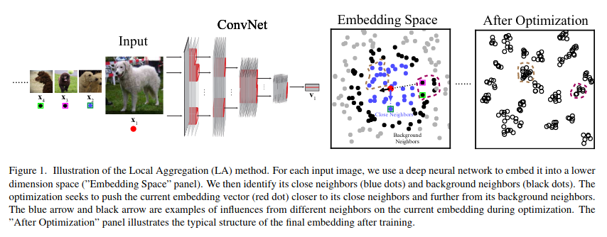

## Background

Lots of work in self-supervised learning for computer vision. [Wu 2018](wu_cvpr_2018_unsupervised_feature_learning.html) is most relevant.

Here, the authors train an embedding function to maximize a metric of local aggregation.
Aggregation is dynamic, allowing clusters of different scales to emerge.

## Approach

### Approach: Summary

Embed images in learnt embedding space. Identify closest neighbors,
then optimize embedding function to strengthen degree of local aggregation.

Termed **Local Aggregation**.

### Approach: Detailed

During training, for each image $$x_i$$, identify close neighbors $$C_i$$ (other embedded images
that we would like to make more similar to the particular image) and 
background neighbors $$B_i$$ (used to determine distance scale for judgement of closeness).

Number of background neighbors is a hyperparameter. Apply clustering repeatedly to all
points and aggregate (average?) across repeat clusterings to identify close neighbors.
Use K-means clustering (is k-another hyperparameter?)

Then use [Wu 2018](wu_cvpr_2018_unsupervised_feature_learning.html)'s non-parametric softmax
on the clusters rather than the individual images.

Optimize the negative log likelihood of the probability that the image embedding is
recognized as a close neighbor given that it is also recognized as a background neighbor.

Also use a memory bank of running averages for image embeddings.

## Results

