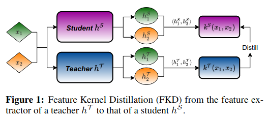
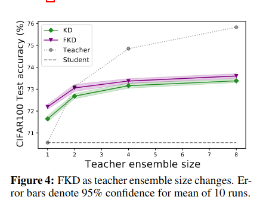
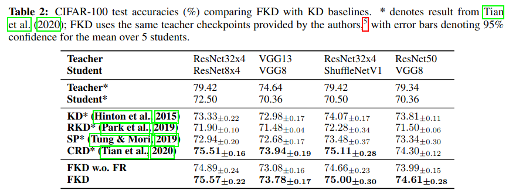

## Background

## Research Idea

Train student network's feature map to produce same kernel as teacher:

Using the following modified objective function:

$$\mathcal{L}_{\lambda}^{KD}(\theta) := L(\theta) + \lambda \mathbb{D}(k_S, k_T)$$

where

$$\mathbb{D}(k_S, k_T) = \mathbf{E}_{x_1, x_2 \sim D} [k_S(x_1, x_2) - k_T(x_1, x_2)]$$

## Theoretical Analysis

Builds off a [previous paper](https://www.microsoft.com/en-us/research/blog/three-mysteries-in-deep-learning-ensemble-knowledge-distillation-and-self-distillation/).
that paper claims to show that a single model trained on a multi-view data
distribution (i.e. using data augmentations), training accuracy is perfect but test 
accuracy is consistently bad (the model makes predictions at chance).

Here, the authors claim that an ensemble of teachers can be distilled into a single
student model such that training accuracy is perfect and test accuracy is good. The offered intuition
is that each model in the ensemble will acquire features for one particular class
and distilling allows the student to learn the union of these attributes which means
the student will fail on $$1/2^{E+!}$$ where $$E$$ is the number of teachers in the ensemble.

## Practical Considerations

Instead of using $$\mathbb{D}(k_S, k_T)$$ in the loss, instead define

$$\rho(x_1, x_2) := \frac{k(x_1, x_2)}{\sqrt{k(x_1, x_1) k(x_2, x_2)}} $$

and then use $$\mathbb{D}(\rho_S, \rho_T) $$. Apparently this normalization of data is key.
In Appendix D.1, they show that non-zero diagonal differences encourage the student to learn noise.

Feature regularization: Add another term to the loss function called "feature regularization"
to minimize $$\lvert \lvert f(x, \theta) \lvert \lvert_2^2 $$. Apparently this encourages
better empirical performance. Ablations are included in Section 4.

## Results

There's still a gap between theory and practice, but using multiply separately trained
teachers enables the student to perform better

Their method outperforms several methods and (nearly?) matches CRD.

