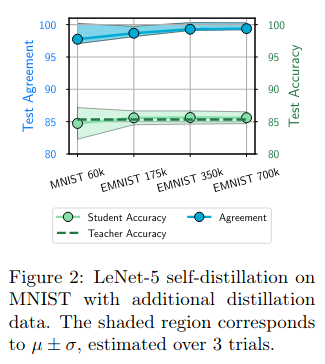
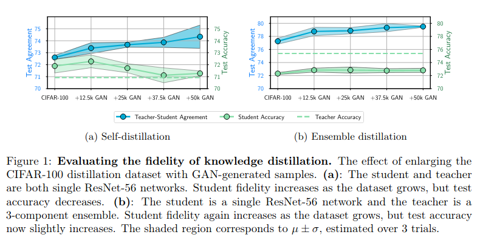
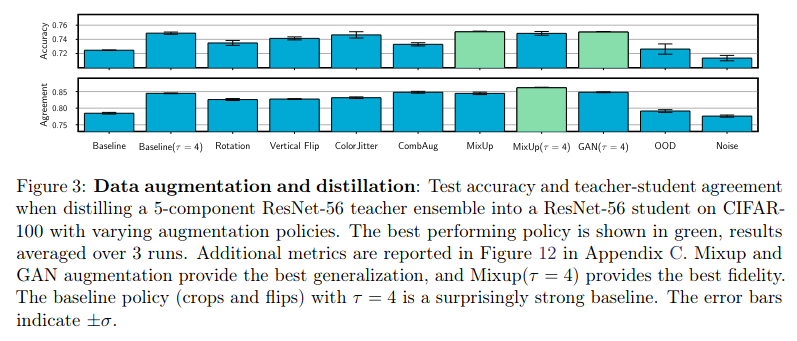

## Research Questions

- Does knowledge distillation really work?
- More specifically, we distinguish between generalization (i.e. how well the
  student performs on a test set) and fidelity (i.e. how well the student
  matches the teacher)
- Claim: "Does knowledge distillation really work? In short: Yes, in the
  sense that it often improves student generalization. No, in that knowledge
  distillation often fails to live up to its name, transferring very limited
  knowledge from teacher to student."

## Setup

- Consider classifiers trained under cross entropy with temperature
- Consider two metrics:
  1. Average top-1 agreement: averaged over many data, how frequently does the student's #1 choice
    match the teacher's #1 choice
  2. Average predictive KL agreement: averaged over many data, what is the average KL divergence
    between the student's prediction and the teacher's prediction
- Warning: Interpreting fidelity is tricky. The authors point out that independently trained models
  with different generalization error will have different possible fidelity scores, even though they are 
  all totally independent, because the higher performing ones must agree more (by virtue of being
  higher performing)
  - Rylan's comment: I don't understand their exact solution: " To account for such confounding when evaluating the
    distillation of a student s from a teacher t, we also evaluate another student s′ distilled through
    an identical procedure from an independent teacher. By comparing the fidelity of (t,s) and
    (t,s′) we can distinguish between a generic improvement in generalization and an improvement
    specifically to fidelity. If s and s′ have comparable fidelity, then the students agree with the
    teacher at many points because they generalize well, and not the reverse."
  - I guess their point is to introduce a control student to see whether the student trained by the teacher
    has answers that are more similar to the teacher than a student trained by some other teacher

## Experiment 1

- LeNet. Train teacher on 200 MNIST digits to reach 84-86% test accuracy.

- Claim: Student-teacher agreement (blue) increases with more data (moving to the right).
  - Rylan's comment: This is a very marginal change, at best.
- Claim: student has same test accuracy (green) as teacher for all dataset sizes,
  showing that self-distillation here does not aid generalization
- Rylan's comment: where are the two metrics, top-1 agreement and KL agreement?

## Experiment 2

- ResNet-56 self-distillation on CIFAR100. Generate additional data using SN-GAN
  trained on CIFAR100.

- Claim: student-teacher agreement (blue) increase with more data, but student test accuracy
  decreases
- Rylan's comment: this trend isn't particularly clear. It also shows that for
  less data, the student outperforms the teacher 
- Repeating the experiment, but using an ensemble of teachers rather than a single
  teacher more clearly shows that test accuracy does not change with more data

## Experiment 3

- Question: have we shown the student enough of the right input-teacher
  label pairs to define the solution we want?
  - Rylan's comment: at this point, I'm convinced of nothing. There's two experiments,
    with messy results
- Approach: Evaluate what effect different data augmentation schemes have on
  generalization error and fidelity:
- Use a 5-ensemble of ResNet-56 trained on CIFAR-100

- Rylan's comment: higher temperature seems to have the greatest positive effect on fidelity
  and test error. That's interesting because higher temperature means matching the teacher
  more closely, so maybe 

## Closing Comments

- These results are ambiguous and unclear at best
- None of these focus on sample efficiency. Suppose the student does 1% worse than the teacher,
  but using 1% of the data the teacher saw. That might be a valuable tradeoff
- 