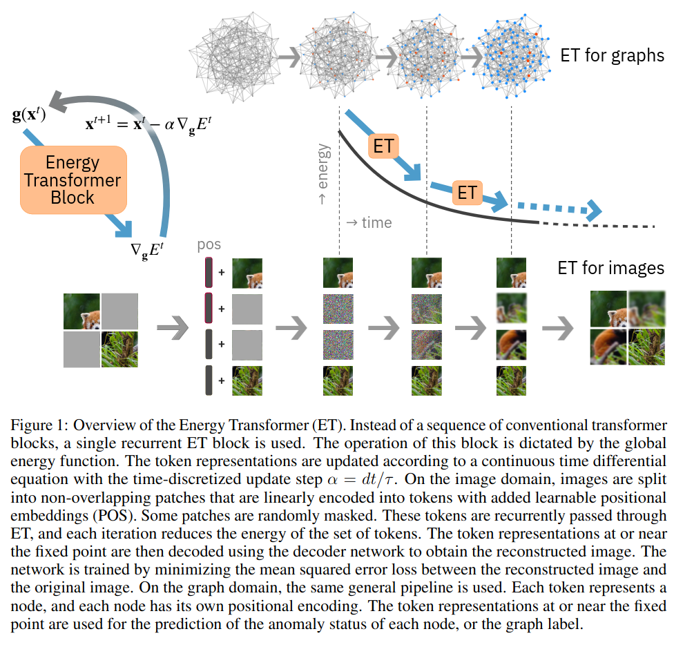
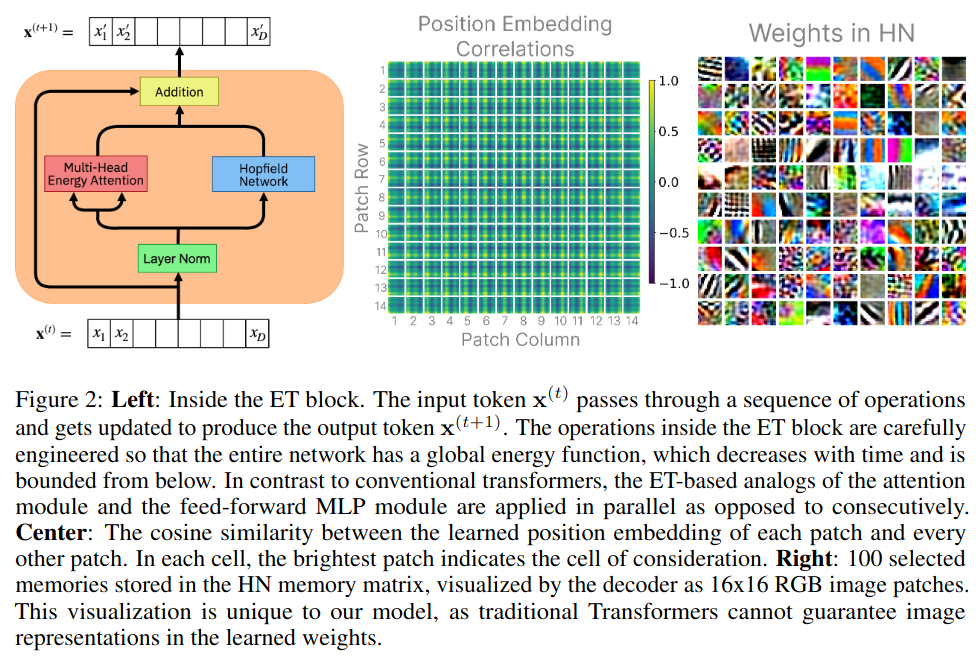
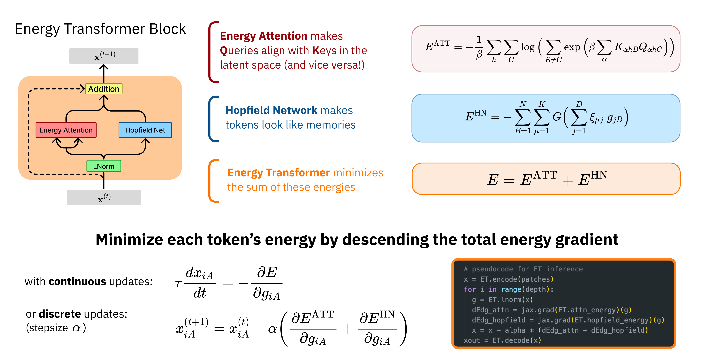
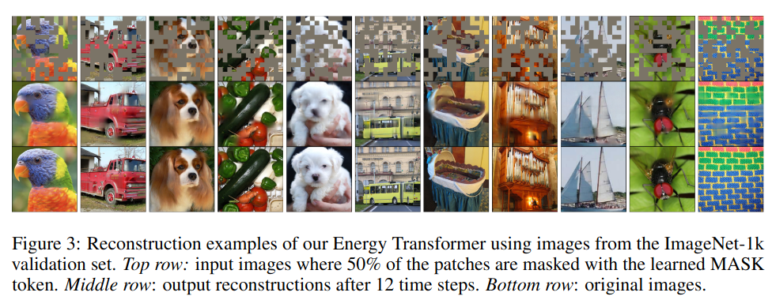

# Energy Transformer

[Hoover et al (NeurIPS 2023)](https://arxiv.org/abs/2302.07253) proposed the Energy Transformer as a novel
[assocative memory network](../associative_memory.html). The Energy Transformer begins by designing an 
energy function to route information between tokens, then designs a transformer-like architecture that replaces a 
sequence of transformer blocks (i.e., self-attention, feed-forward, normalization). The global energy function
imposes strong constraints on the operations inside the energy transformer, the order in which the operations
take place and the weight symmetries of the network.

The below schematic shows how a energy transformer is a recurrent network. The block iteratively processes the input to 
minimize a global energy function, iteratively updating the token representations.

## Energy Transformer

### Data Preprocessing

The input datum is split into non-overlapping patches, some of which are masked, and others of which are not.
Each patch and its positional information $$A$$ are encoded into a $$D$$-dimensional vector $$x_A$$; the authors
call these "tokens" but such terminology is confusing when compared against language models, because "embeddings" would be 
more appropriate. The "open" (note: I think "known" or "unmasked" would be better terminology) particles know their 
identity and location, but the "masked" particles know only their position.

### Energy Transformer Block

The energy transformer block is a recurrent network that iteratively updates the representations to minimize
a designed energy function. Tokens are first hit with a [Layer Norm](../deep_learning/normalization.html),
then information is exchanged using a "Multi-Head Energy Attention". Each token generates a pair of queries
and keys. The goal of the energy-based attention is to evolve the tokens such that the keys of 
the unmasked patches align with the queries of the masked patches:

- Query: Given the position of patch and its current contents, where in the image should it look for guidance on how to evolve in time?
- Key: Given the current contents of the patch and its position, what should be the contents of the patches that attend to it? 

The multi-head energy attention has energy:

$$E^{ATT} := -\frac{1}{\beta} \sum_{h=1}^H \sum_{C=1}^N \log \Big( \sum_{B \neq C} exp(\beta A_{hBC}) \Big)$$

The Hopfield Network module ensures that "token representations" (i.e. the vectors) are consistent with what one expects
to see in realistic images. Its energy is:

$$E^{HN} := - \sum_{B=1}^N \sum_{\mu=1}^K G(\sum_{j=1}^D \zeta_{\mu j} g_{jB})$$

where $$\zeta \in \mathbb{R}^{K \times D}$$ are learnable weights (i.e. memories of the Hopfield Network).
The total energy is the sum of both:

$$E = E^{ATT} + E^{HN}$$

### Inference

The token representations are iteratively updated to minimize the total energy:

$$ \tau \frac{dx_A}{dt} = - \frac{\partial E}{\partial g_A}$$

where $$\tau$$ is a time constant and $$g_A$$ is the layer-normalized version of the token embedding.

### Learning

The Energy Transformer Block is run recurrently for $$T$$ steps. The token representations are then passed
to a simple linear decoder (layer norm + affine transformation) and the loss is mean squared error
between predicted and actual pixels for the occluded patches.

Appendix H has the full details.

## Comparison to Modern Continuous Hopfield Networks

The Energy Transformer is similar to the [Modern Continuous Hopfield Network](../associative_memory/modern_continuous_hopfield_network.html)
but different in that MCHN requires the keys must be constant parameters, but in the Energy Attention, the keys
are dynamic variables that evolve in time with the queries.