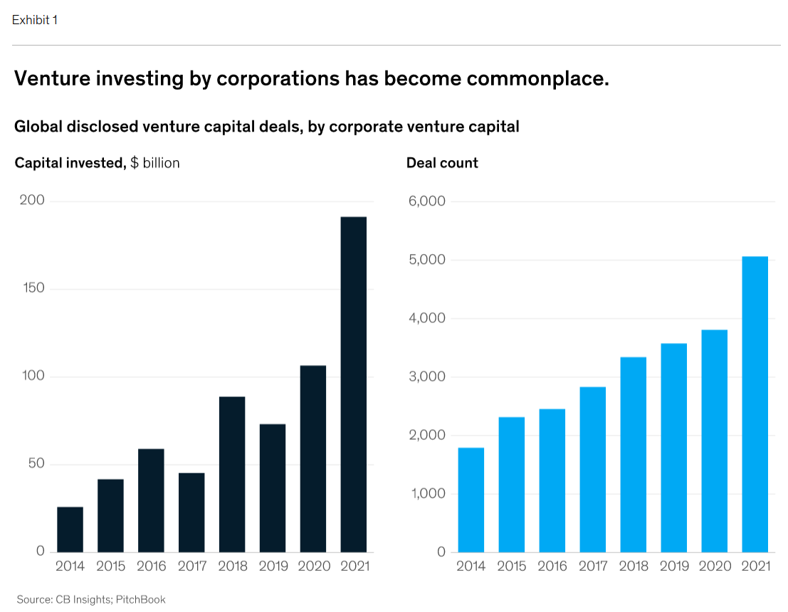

# Corporate Venture Capital

Corporate venture capital (CVC) refers to (typically large) corporations making
venture capital investments, typically in smaller startups. Examples include GV (formerly Google Ventures)
and Intel Ventures.

CVC typically focuses less on financial returns and more on advancing strategic objectives.

- Cyclic
- Late 1960s: ~25% of Fortune 500s had divisions mimicking VC firms. Ended with oil shocks on 1973.
- Mid 1980s
- Late 1990s: 16% of total venture financing in 2000 from VCV. Collapsed with dot com bubble in 2001.
- 2010 - Present:

From [McKinsey](https://www.mckinsey.com/capabilities/strategy-and-corporate-finance/our-insights/three-essentials-of-successful-corporate-venture-capital):

## Strengths and Weaknesses

### Strengths

- Corporate investors typically have large scale operations and market-specific expertise, e.g., if you need help
  with chip manufacturing, then Intel Ventures would be fantastic given their scale and historical dominance.
- CVCs often assist VCs with capital-intensive or highly technical areas, e.g., AI, health, clean tech
- CVCs might have less of a focus on delivering financial returns, which means less pressure for the startup

### Weaknesses

- The CVC might just steal the startup's technology and/or strategy, e.g., what Masimo alleges Apple did to them
- 

## Structure

- Off-balance sheet vs On-balance sheet: CVCs can be somewhat separated from their corporate parent (off-balance sheet) that 
  allows for greater independence & longer-horizon timelines