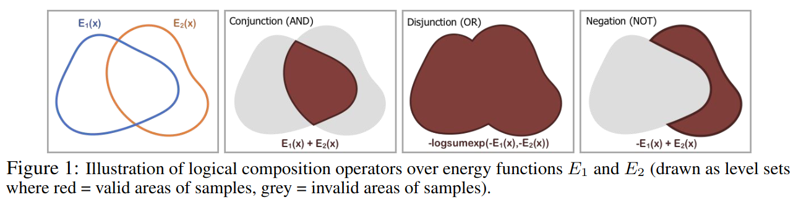
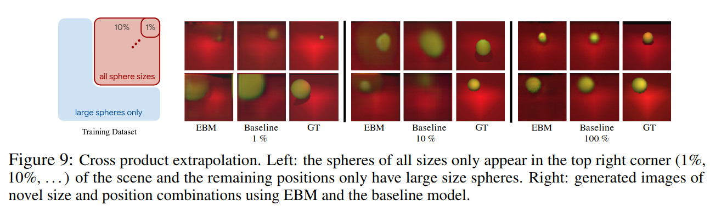
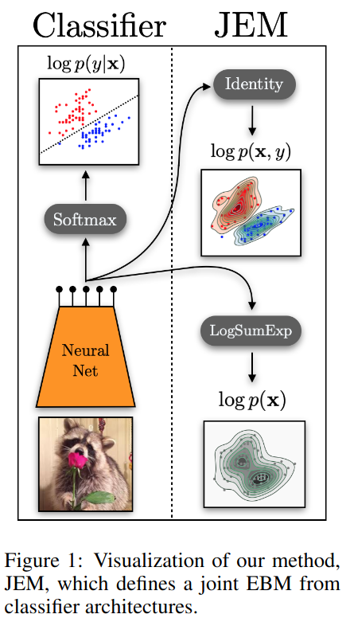

# Energy-Based Models (EBMs)

Probability distributions can be expressed as:

$$p(x;\theta) = \frac{\exp(-E(x;\theta))}{Z(\theta)} $$

for some energy function $$E(x;\theta)$$ and partition function $$Z(\theta) := \int_{x \in \mathcal{X}} \exp(-E(x ;\theta))$$. 
The partition function is typically difficult to work with (if not impossible), so the approach in
energy-based models is to train a model to learn the energy function $$E(x;\theta)$$.

## Generating (Sampling) Data

Once one has the energy function, one can sample data from $$p(x;\theta)$$ by sampling $$x$$ from
some initial distribution and then performing gradient ascent using the gradient of the learned energy function.
Some specific ways to do this are Metropolis-Hastings MCMC and Unadjusted Langevin MCMC. 

### Unadjusted Langevin MCMC

using Langevin dynamics:

$$x^k \leftarrow x^{k-1} - \frac{\lambda}{2} \nabla_x E(x; \theta) + \omega^k $$

where $$\omega^k \sim \mathcal{N}(0, \lambda)$$ is Gaussian noise. [Welling & Yeh (ICML 2011)](https://www.stats.ox.ac.uk/~teh/research/compstats/WelTeh2011a.pdf)
showed that if we define $$x^k \sim q_k(x)$$, then as $$k \rightarrow \infty$$ and $$\lambda \rightarrow 0$$,
$$q_k(x) \rightarrow p(x;\theta)$$.

### Metropolis-Hastings MCMC

TODO: https://deepgenerativemodels.github.io/assets/slides/cs236_lecture12.pdf

## Learning the Energy Function

### Contrastive Divergence Training

Give a set of data $$\{x_n\}_{n=1}^N := p_{\mathcal{D}}$$, we would like to learn a good energy function $$E(x;\theta)$$
for the data. The immediately obvious approach is to minimize the negative log-likelihood:

$$\mathcal{L}(\theta) := \mathbb{E}_{x \sim p_{\mathcal{D}}}[-\log p(x;\theta)] = \mathbb{E}_{x \sim p_{\mathcal{D}}}[E(x;\theta) - \log Z(\theta)]$$

This is intractable because of the partition function $$Z(\theta)$$, so we can instead use

$$\nabla_{\theta} \mathcal{L}(\theta) \approx \mathbb{E}_{x^+ \sim p_{\mathcal{D}}}[\nabla_{\theta} E(x^+;\theta)] - \mathbb{E}_{x^- \sim q_k(x)}[\nabla_{\theta} E(x^-;\theta)]$$

where $$x^+ \sim p_{\mathcal{D}}$$ and $$x^- \sim q_k(x)$$ are sampled using the learned energy function. A derivation
of this can be found in [Richard Turner's 2005 notes](http://www.gatsby.ucl.ac.uk/~turner/Notes/ContrastiveDivergence/CDv3.pdf?ref=inference.vc)"

$$\begin{align*}
\nabla_{\theta} \mathcal{L}(\theta) &= \frac{1}{N}\sum_n \nabla_{\theta} \log p(x_n;\theta) \\
&= \frac{1}{N}\sum_n \nabla_{\theta} \log \frac{\exp(-E(x_n;\theta))}{Z(\theta)} \\
&= \frac{1}{N}\sum_n \frac{1}{Z(\theta)} \nabla_{\theta} Z(\theta) - \nabla_{\theta} E(x_n;\theta) \\
&= \frac{1}{N}\sum -\frac{1}{Z(\theta)} \int x \nabla_{\theta} E(x;\theta) \exp(-E(x;\theta)) dx - \nabla_{\theta} E(x_n;\theta) \\
&= \mathbb{E}_{x^+ \sim p_{\mathcal{D}}}[\nabla_{\theta} E(x^+;\theta)] - \mathbb{E}_{x^- \sim q_k(x)}[\nabla_{\theta} E(x^-;\theta)]
\end{align*}$$

What intuitively does this contrastive divergence mean? The gradient of the log likelihood is the difference
between the gradient of the energy function at the real data and the gradient of the energy function at the model's
generated data. Turner's notes have a beautiful quote: "The algorithm coverges when the ‘dreams’ of the model match ‘reality’.
If the ‘dreams’ do not match reality, the parameters are altered so that the next round of dreams will 
be more like reality."

Note: Hinton found that only a few steps of gradient ascent were necessary to get good results.

[Du and Mordatch (NeurIPS 2019)](https://arxiv.org/abs/1903.08689) found that several implementation details improved the
quality of generated data:

- Initializing new samples using either uniform noise (5% of the time) or using a replay buffer of previously generated samples (95% of the time)
- Constraining the Lipschitz constant of the energy network by (a) adding spectral normalization to all layers and (b) adding weak L2 regularization to energy of positive and negative samples

[Du, Li, Tenenbaum and Mordatch (ICML 2021)](https://arxiv.org/abs/2012.01316) noted that the above contrastive divergence loss
actually approximates the true CD loss, since the true CD loss prescribes taking infinitely many MCMC
steps but in practice, only finitely many steps are taken. The authors propose a new loss:

$$\nabla_{\theta} \mathcal{L}(\theta) = \mathbb{E}_{x^+ \sim p_{\mathcal{D}}}[\nabla_{\theta} E(x^+;\theta)] - \mathbb{E}_{x^- \sim q_k(x)}[\nabla_{\theta} E(x^-;\theta)] + \nabla_{\theta} q_k(x; \theta) \partial_{q_k(x; \theta)} KL(q_k(x; \theta)|| q_{\infty}(x;\theta))$$

where $$q_{\infty}(x;\theta)$$ is the stationary distribution of the MCMC chain. Du & colleagues propose a full
contrastive divergence loss:

$$\begin{align*}
\mathcal{L}_{Full} &= \mathcal{L}_{CD} + \mathcal{L}_{KL}\\
\mathcal{L}_{CD} &= \mathbb{E}_{x^+ \sim p_{\mathcal{D}}}[E(x^+;\theta)] - \mathbb{E}_{stopgrad(x^- \sim q_k(x))}[E(x^-;\theta)] \\
\mathcal{L}_{KL} &= \mathbb{E}_{x^- \sim q_k(x)}[E(x^-; stopgrad(\theta))] + \mathbb{E}_{x^- \sim q_k(x)}[\log q_k(x;\theta)]
\end{align*}$$

The stop-gradient operators are necessary to ensure the correctness of the gradients. The authors note that
without the KL loss term, the optimization process leads to an "adversarial" sampling landscape whereby
the network learns an energy function that makes sampling difficult, but the KL divergence term counteracts
this effect. The authors found this second loss terms improves the stability of training, the generality of
different architectures and the quality of generated samples.

## Compositional Energy-Based Models

[Du, Li & Mordatch (NeurIPS 2020)](https://proceedings.neurips.cc/paper/2020/hash/49856ed476ad01fcff881d57e161d73f-Abstract.html)
propose learning compositional representations with energy-based models. The idea is that each factor will be 
represented by an individual energy function that is low when the factor is present and high when the factor is absent.
Then, one can apply base operators (logical conjunction, disjunction or negation) to flexibly and recursively
combine multiple energy functions.

For different factors (now renamed by the authors as "concept codes" $$c_1, c_2, ...$$), one can combine energy functions:

- Conjunction: Given independent concepts $$c_1, c_2, ..., c_N$$:

$$p(x | c_1 \wedge c_2 \wedge ... \wedge c_N) = \prod_n p(x | c_n) \propto \exp (- \sum_n E(x|c_n) )$$

- Disjunction: Under the assumption that all partition functions $$Z(c_n)$$ are equal:

$$\sum_n p(x|c_n) \propto \sum_n \exp(- E(x | c_n)) = \exp(\log \sum_n \exp(-E(x| c_n))) $$

- Negation: The authors ground "not" by adding another concept by arguing that "not c" is too ambiguious by itself.

$$p(x| \neg c_1 \wedge c_2) \propto \frac{p(x|c_2)}{p(x|c_1)^{\alpha}} \propto \exp(\alpha E(x|c_1) - E(x|c_2)) $$

How do the authors actually extract the factors i.e. concept codes? The answers either (a) the data is generated 
with known factors of variation or (b) the dataset was annotated with concepts (e.g. Male $\wedge$ Smiling).

The authors also study cross-product extrapolation i.e. can the model generate combinations of factors
that were not included in the training data?

## Converting a Classifier Into an Energy Based Model

[Grathwohl et al (ICLR 2020)](https://arxiv.org/abs/1912.03263) argue that a standard discriminative classifier
$$p(y|x)$$ can be reinterpreted as an EBM for the joint distribution $$p(x, y)$$, and show that 
energy-based training of the joint distribution improves calibration, robustness and out-of-distribution detection,
while also enabling sampmling of $$x$$ with quality rivaling recent GANs.

Classifiers are typically a softmax applied to the logits output by a model (e.g., a neural network):

$$p_{\theta}(y|x) = \frac{\exp(f_{\theta}(x)[y])}{\sum_{y'} \exp(f_{\theta}(x)[y'])}$$

One can reinterpret the logits obtained from the model $$f_{\theta}$$ to define the joint $$p(x, y)$$:

$$p(x, y) = \frac{\exp(f_{\theta}(x)[y])}{Z(\theta)}$$

as well as the marginal $$p(x)$$:

$$p(x) = \sum_y p_{\theta}(x, y) = \frac{\sum_y \exp(f_{\theta}(x)[y])}{Z(\theta)}$$

Consequently, the authors call the classifier a "Joint Energy-based Model" (JEM).
