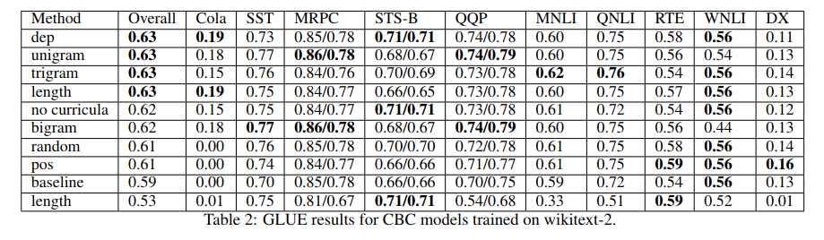

# Curriculum Learning for Language Modeling

__Authors__: Campos

__Venue__: Arxiv

__PDF__: https://arxiv.org/pdf/2108.02170.pdf

## Idea

Wide variety of curriculum learning (CL) experiments language modeling show no compelling evidence
that curriculum learning (CL) improves language modeling results.

## Background

- Curriculum learning (CL) has been shown to help models train faster and produce better results in 
 neural machine translation 

## Results

- Train ELMo with a variety of curricula on [wikitext-2 and wikitext-103](../../datasets/wikitext.md)
  then evaluate on GLUE
- Use Platanios et al.'s competence based curriculum (CBC): for each sequence of words, sort by difficulty
 using a heuristic like sentence length or unigram rarity. Model is given an initial competence scalar
 and can be trained using data with difficulty below its competence level
- Test 2 baselines: no curriculum, random difficulty
- Test 6 heuristics: sample length, unigram/bigram/trigram entropy, parse tree depth, parts of speech diversity

## Notes

- Not a great paper. One master's student, lots of typos, experiments incomplete and poorly plotted

- LOL: "Seeking to represent natural language, researchers have found language models (LM) with Sesame Street-inspired
names [1] [2] [3] to be incredibly effective methods of producing language representations (LR)."