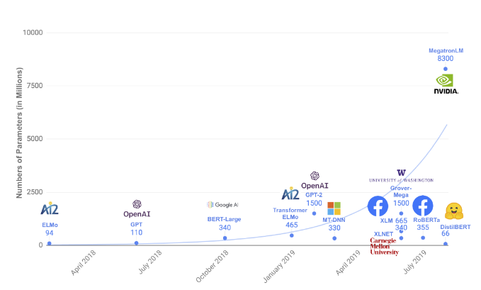
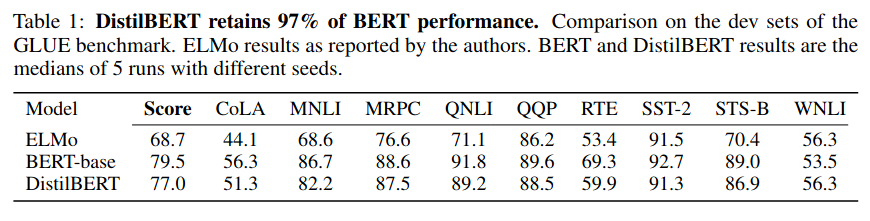
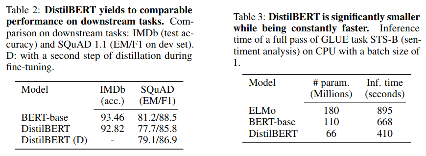
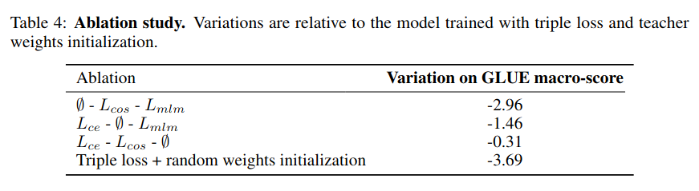

# DistilBERT, a distilled version of BERT: smaller, faster, cheaper and lighter

__Authors__: Sanh, Debut, Chaumond, Wolf (HuggingFace)

__Venue__: EMC @ NeurIPS 2019.

__PDF__: https://arxiv.org/pdf/1910.01108.pdf

## Background

Parameters per language model have been rapidly increasing

## Idea

Distill pretrained transformer into smaller transformer that is 60% the size of the original.
DistilBert is 60% faster at inference time. Student training loss is triple loss:

1. Supervised training loss i.e. masked language modeling loss
2. Cross entropy between student and teacher, with temperature parameter in softmax
3. Cosine embedding loss between student and teacher hidden representations

- Initialize student by taking one out of every two layers

## Results

On GLUE benchmark, DistilBERT reaches 97% of BERT performance

DistilBERT also performs well on downstream tasks and is faster

Ablation shows that the following changes have the biggest (negative) impact:
1. Random weight initialization hurt most
2. Student-teacher cross entropy
3. Student-teacher representation cosine similarity
4. Masked Language Modeling loss (i.e. the task loss used to train the teacher)

## Notes

- TODO: Investigate what the following means: "We applied best practices for training BERT model
  recently proposed in Liu et al. [2019]. As such, DistilBERT is distilled on very large batches
  leveraging gradient accumulation (up to 4K
  examples per batch) using dynamic masking and without the next sentence prediction objective."