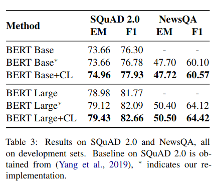
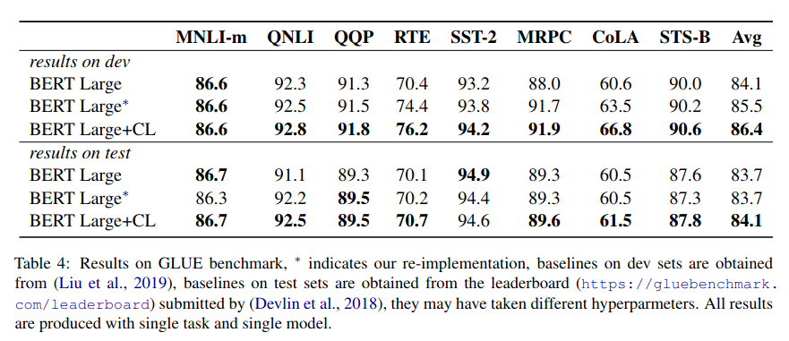
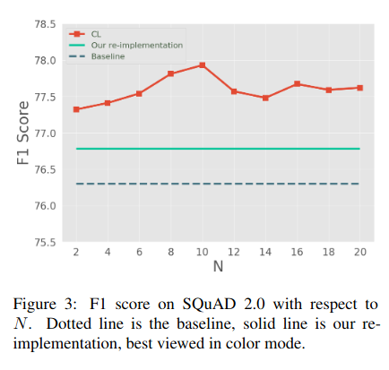

# Curriculum Learning for Natural Language Understanding

__Authors__: Xu et al.

__Venue__: ACL 2020

## Idea

Given a dataset for a natural language model, the authors aim
to automate construction of a curriculum. To do this, they propose the
following:

1. Split your dataset into N random, equal sized data subsets
2. Train N models
3. For each model, feed it the data subsets used to train the other models
 and measure the model's performance (e.g. accuracy, F1, MSE, whatever) on each datum. That means each datum has 
 N-1 values measuring how well the other N-1 models that haven't seen it performed
 on it.
4. For each datum, average the N-1 scores and sort based on the average score
5. Train a new model from scratch, starting with the easiest datum and adding more over time

## Results

On SQuAD (reading comprehension) and NewsQA (reading comprehension), the curriculum enables
a trained model to perform better at the end of training

They make a similar claim on GLUE

I didn't see any learning curves to better understand the effect the curriculum has.

Bizarrely, having even N=2 seemed to deliver almost as much benefit as N=10,
and there was no monotonic non-decrease with N.

