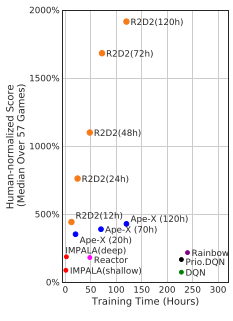

# Recurrent Replay Distributed DQN (R2D2)

The Recurrent Replay Distributed DQN (or R2D2 for short) paper asks two questions:

1. What happens if we replace [DQN](../value_based/dqn.md)'s feedforward architecture
    with a recurrent architecture?
2. How can we train such a model in a distributed manner?

## Background

[Ape-X](ape_x.md) used distributed replay to decouple learning from acting. Actors
would generate experiences for a shared replay buffer, while the learner receives
random training batches.

[IMPALA](impala.md) used an off-policy correction to learn from experiences in a 
First-In-First-Out (FIFO) queue.

## R2D2

R2D2 is similar to Ape-X in that it uses

- prioritized distributed replay
- n-step double Q-Learning
- Batches of replayed experiences

The biggest difference is that R2D2 adds an LSTM layer after DQN's convolutional stack.
The next biggest difference explored in the paper is how to initialize the LSTM
cell. Suppose there was some sampled trajectory $s_1, a_1, r_1, ..., r_{T_1}, s_T$$
that we want to train the network on. One option might be initializing the LSTM cell to 
0, but then the network has to be capable of starting from any initial state $$s_k$$
and making accurate predictions when its own state is always the same (0). Another option
is using the entire episode's trajectory, but this raises computational challenges (
how to handle different length trajectories? how to remove high autocorrelation in the 
trajectory?). This paper proposes and evaluates two non-mutually exclusive solutions:

1. Stored state: Store the LSTM cell state in memory. This increases the storage cost and runs the 
risk of "representational drift" i.e. that a particular representation when a trajectory
   is collected may no longer be the same as when the trajectory is used for training.
   
2. Burn in: Unroll the network from the start of the trajectory to the desired starting
time step and use that unrolled LSTM cell state.

Other smaller differences, which aren't explained or explored significantly in-depth, include:

- Rewards are no longer clipped, but instead rescaled to 

$$\text{rescale}(r) = \text{sign}(r) * (\sqrt{|r| + 1} - 1) $$

- Replay prioritization for a given trajectory is defined as a mixture of max and
  mean absolute n-step TD errors in that trajectory $$\{\delta_t \}_{t=1}^T$$:

$$\text{priority} = \eta \ \text{max}_t \delta_t + (1 - \eta) \Big(\frac{1}{T} \sum_{t=1}^T \delta_t \Big) $$

TODO: check that max is indeed over steps within a trajectory

## Results

### Atari-57

On the Atari-57 benchmark, R2D2 crushes most competitors in terms of human normalized
score and training time, although the training time is questionable since we aren't told
how many parallel training steps are being performed.

Interestingly, the authors claim this level of performance is achieved with a single setting of
hyperparameters. Why do hyperparameters matter less for this algorithm than, say, IMPALA, which
uses per-environment hyperparameters? Relatedly, how much better does R2D2 perform with 
task-specific hyperparameters?

### DMLab-30

Basically indistinguishable from IMPALA (the only baseline).

### Investigating Role of LSTM

The reviewers were surprised that the LSTM improved performance so much on Atari, given that 
most of those games are fully observed. These authors verified the importance of the LSTM 
by ablating it. Why does having memory help?
