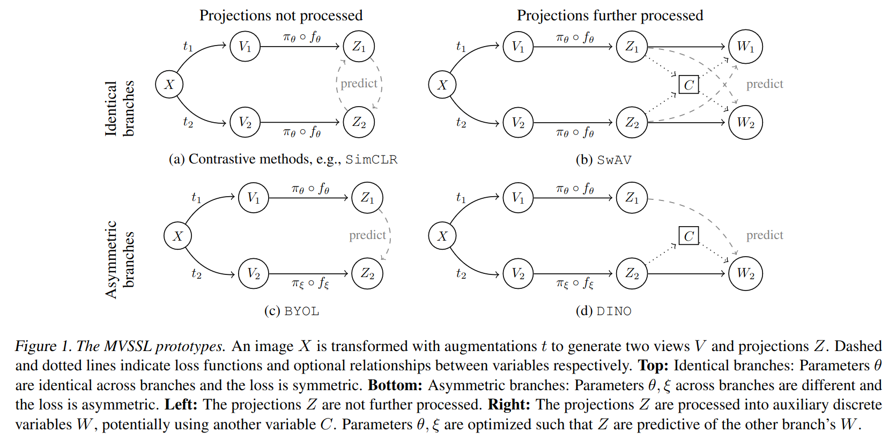
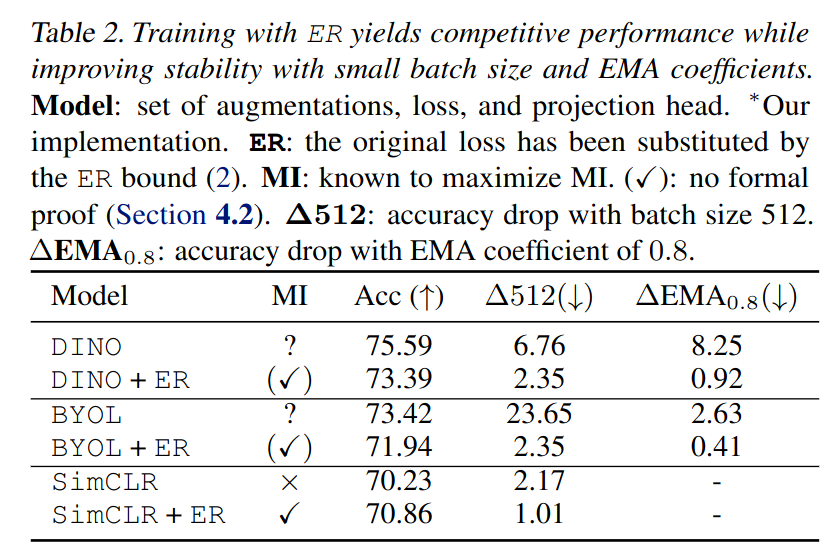

# Connections between Joint Embedding Self-Supervised Learning and Information Theory

Many methods in [joint embedding self-supervised learning](../joint_embedding_ssl_overview.html) 
are directly inspired by or closely related to information theory. The general claim is 
that loss functions should maximize the mutual information between multiple views/augmentations/transformations
of the same datum.

TODO: Read these papers from Rodriguez-Galvez et al. (ICML 2023):
<blockquote>
Small batch sizes degrade
the performance of MVSSL methods, especially contrastive
ones (Chen et al., 2020a; Grill et al., 2020; Caron et al.,
2021). Potentially, this is due to the fact that most meth-
ods maximize the entropy either explicitly or implicitly, as
shown in this paper, and the entropy estimation is limited to
log k bits for a batch size of k (McAllester & Stratos, 2020).
Some works (HaoChen et al., 2021; Chen et al., 2021; Yuan
et al., 2022) addressed this issue and modified existing meth-
ods to perform well under the small batch size regime
</blockquote>

## Maximizing Mutual Information Insufficient For Learning Good Representations

Mutual information is invariant under arbitrary invertible transformations, meaning maximizing mutual information
has little-to-no incentive to avoid learning highly entangled representations. Additionally, mutual information
is difficult to estimate in practice, and so many methods use surrogates. Based on these observations,
[Tschannen, Djolonga et al. (ICLR 2020)](https://arxiv.org/abs/1907.13625) questioned whether an information-theoretic
view of JESSL can explain its success. The authors argued that maximizing mutual information is insufficient
for learning good representations. The authors focus on two mutual information estimators: 

1. [InfoNCE](info_nce.html): 

$$I(X ; Y) \geq \mathbb{E} [ \frac{1}{K} \sum_{i=1}^K \log \frac{\exp f(x_i, y_i)}{\frac{1}{K} \sum_{j=1}^K exp f(x_i, y_j)} ]$$

where $$f()$$ is a "critic" that tries to predict the $$y$$ that $$x$$ corresponds to, i.e., is paired with.

2. NJW:

$$I(X ; Y) \geq \mathbb{E}_{p(x, y)}[f(x, y)] - \exp(-1) \mathbb{E}_{x \sim p(x), y \sim p(y)}[\exp(f(x,y))]$$

InfoNCE is maximized by $$f^*(x, y) = \log p(y| x)$$ and NJW is maximized by $$f^*(x, y) = 1 + \log p(y | x)$$.

### Evidence 1: Bijective Encoders Fix Mutual Information But Improve Downstream Classification

Experiment:
- Learn representations for top half of MNIST images (similar results for CIFAR10)
- Network is RealNVP with 30 coupling layers
- Train a linear classifier on the representations: 89% accuracy
- Baseline: 
  - Linear classifier on pixel space: 85% accuracy
  - Supervised MLP / ConvNet: 94% accuracy

Rylan's comments:
- The main result (a network constrained such that MI must be constant for all parameters but achieves better downstream linear classification accuracy) is correct
- But the experimental methodology seems odd
  - This top half/bottom half data augmentation seems quite different from the standard JESSL setup
  - Using MNIST and one architecture (RealNVP) makes it difficult to generalize to other datasets, architectures and augmentations
  - Accuracy is a metric I generally try to avoid
  - The accuracy is barely better than a linear classifier on pixel space
  - The y axis scaling for $$I_{EST}$$ might not be linear. 

Maybe the takeaway from this result is that this particular top half/bottom half augmentation doesn't correspond to 

### Evidence 2: Maximizing Mutual Information Can Hurt Downstream Classification

Experiment:
- Train a bijective representation to maximize MI and minimize downstream linear classification (trained adversarially)
- 

### Evidence 3:

## Entropy & Reconstruction in JESSL

[Rodriguez-Galvez et al. (ICML 2023)](https://arxiv.org/abs/2307.10907) later studied the relationship between 
mutual information and 3 families of JESSL methods:
(1) Contrastive methods, e.g., [SimCLR](simclr.html), (2) Clustering methods, e.g., [SwAV](swav.html)
and (3) Distillation methods, e.g., [BYOL](byol.html). 

The authors specifically studied the "entropy and reconstruction" (ER)
lower bound:

$$I(Z_1; Z_2) \geq H[Z_2] + \mathbb{E}_{Z_2} [\log q(Z_1 | Z_2)]$$

Rodriguez-Galvez et al. showed that:

1. None of the three families directly maximize the ER lower bound, but instead approximate it
2. Clustering-based methods approximately maximize the ER lower bound
3. Distillation-based methods don't maximize entropy but ensure it does not collapse

The authors propose training with an ER-based loss, using a KDE-based entropy estimator:

$$\begin{align*}
\hat{p}(z) &= \frac{1}{N} \sum_{n=1}^N k(\frac{z - z_n }{h}) \\
\hat{H}[Z] &= - \sum_{n=1}^N \hat{p}(z_n) \log \hat{p}(z) 
\end{align*}$$

for kernel function $$k$$ with bandwidth $$h$$. Oddly, Rodriguez-Galvez et al. found that training with ER
yields the same or slightly worse downstream performance. However, the networks trained with ER are more robust.

