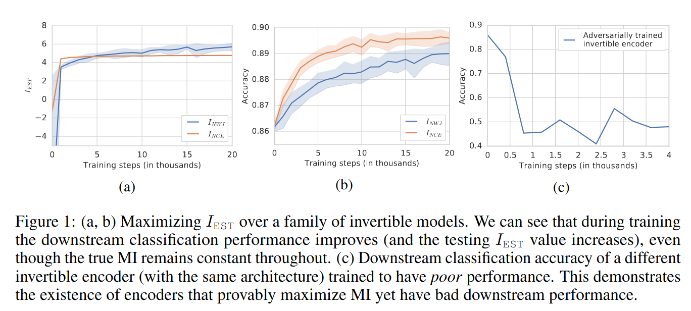

# Connections between Joint Embedding Self-Supervised Learning and Information Theory

Many methods in [joint embedding self-supervised learning](../joint_embedding_ssl_overview.html) 
are directly inspired by or closely related to information theory. The general claim is 
that loss functions should maximize the mutual information between multiple views/augmentations/transformations
of the same datum.

## Questioning the Connection between JESSL and Information Theory

Mutual information is invariant under arbitrary invertible transformations, meaning maximizing mutual information
has little-to-no incentive to avoid learning highly entangled representations. Additionally, mutual information
is difficult to estimate in practice, and so many methods use surrogates. Based on these observations,
[Tschannen, Djolonga et al. (ICLR 2020)](https://arxiv.org/abs/1907.13625) questioned whether an information-theoretic
view of JESSL can explain the success of these methods. The authors argue that success of JESSL methods is 
perhaps more likely due to deep metric learning.

The authors first focus on two mutual information estimators: 

1. [InfoNCE](info_nce.html): 

$$I(X ; Y) \geq \mathbb{E} [ \frac{1}{K} \sum_{i=1}^K \log \frac{\exp f(x_i, y_i)}{\frac{1}{K} \sum_{j=1}^K exp f(x_i, y_j)} ]$$

where $$f()$$ is a "critic" that tries to predict the $$y$$ that $$x$$ corresponds to, i.e., is paired with.

2. NJW:

$$I(X ; Y) \geq \mathbb{E}_{p(x, y)}[f(x, y)] - \exp(-1) \mathbb{E}_{x \sim p(x), y \sim p(y)}[\exp(f(x,y))]$$

InfoNCE is maximized by $$f^*(x, y) = \log p(y| x)$$ and NJW is maximized by $$f^*(x, y) = 1 + \log p(y | x)$$.

### Evidence 1: Bijective Encoders Fix Mutual Information But Improve Downstream Classification

Experiment:
- Learn representations for top half of MNIST images (similar results for CIFAR10)
- Network is RealNVP with 30 coupling layers
- Train a linear classifier on the representations: 89% accuracy
- Baseline: 
  - Linear classifier on pixel space: 85% accuracy
  - Supervised MLP / ConvNet: 94% accuracy

Rylan's comments:
- The main result (a network constrained such that MI must be constant for all parameters but achieves better downstream linear classification accuracy) is correct
- But the experimental methodology seems odd
  - This top half/bottom half data augmentation seems quite different from the standard JESSL setup
  - Using MNIST and one architecture (RealNVP) makes it difficult to generalize to other datasets, architectures and augmentations
  - Accuracy is a metric I generally try to avoid
  - The accuracy is barely better than a linear classifier on pixel space
  - The y axis scaling for $$I_{EST}$$ might not be linear. 

Maybe the takeaway from this result is that this particular top half/bottom half augmentation doesn't correspond to 

### Evidence 2: Maximizing Mutual Information Can Hurt Downstream Classification

Experiment:
- Train a bijective representation to maximize MI and minimize downstream linear classification (trained adversarially)
- 

### Evidence 3:

