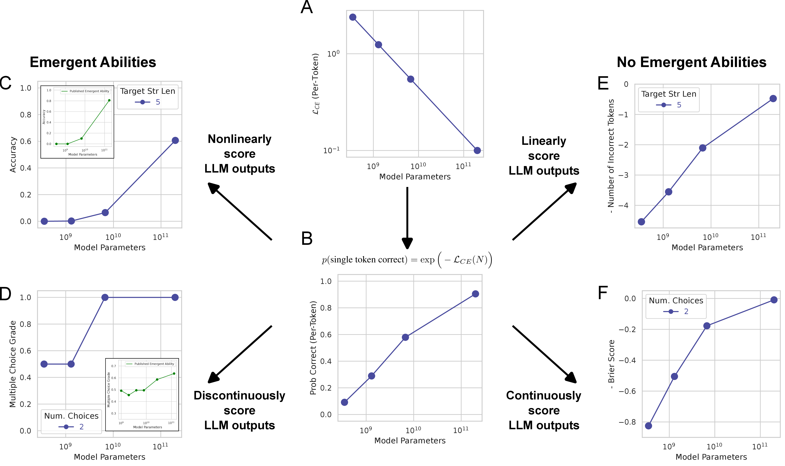
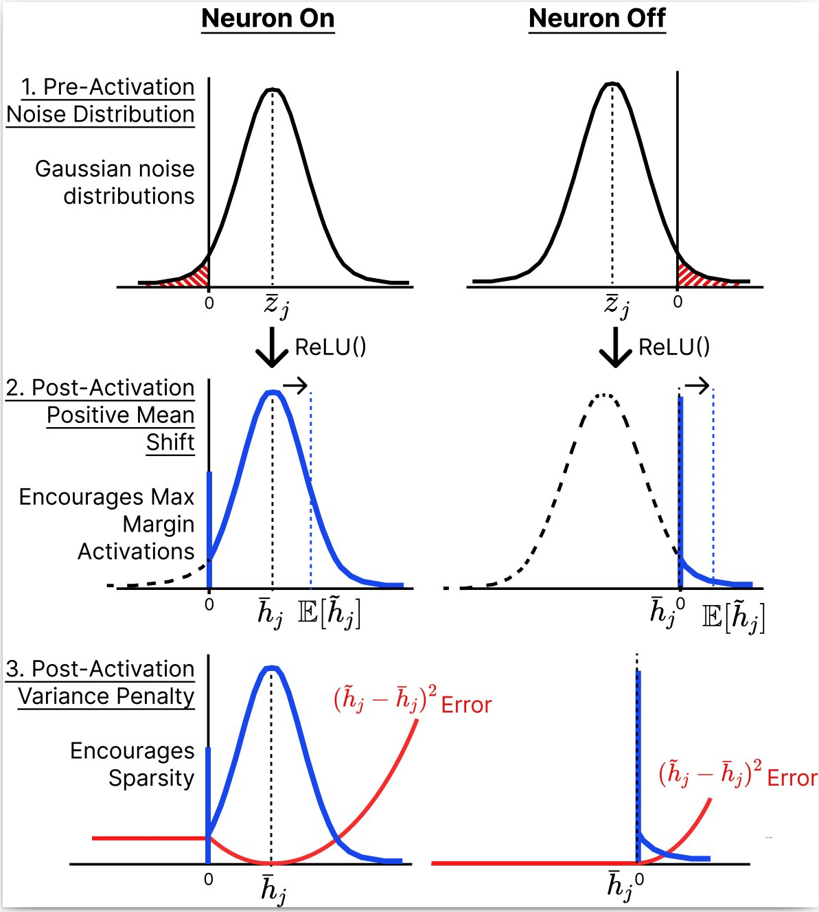
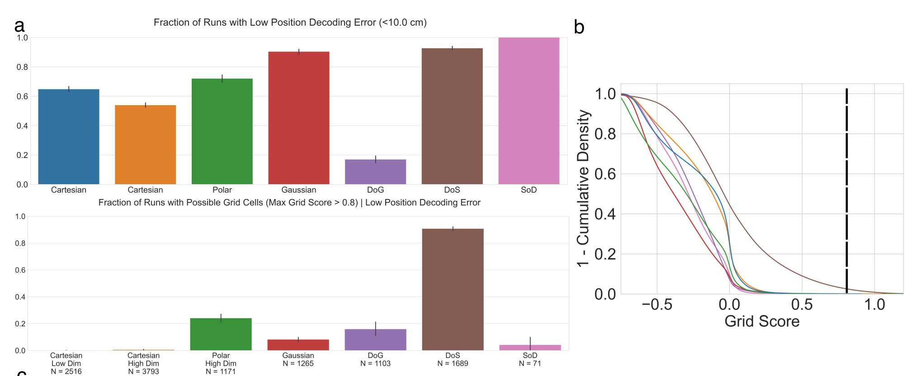
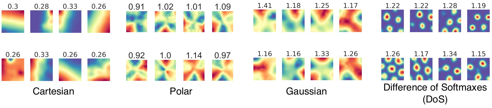
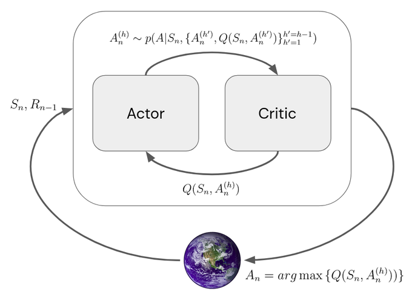
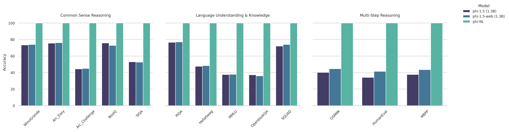

# Research

## Conference Publications

-----

[Are Emergent Abilities of Large Language Models a Mirage?](research/2023_neurips_llm_emergent_abilities_mirage/main.md) __NeurIPS 2023 (Oral)__.

-----

DecodingTrust: A Comprehensive Assessment of Trustworthiness in GPT Models. __NeurIPS 2023 Benchmark Track__.

-----

[Self-Supervised Learning of Representations for Space Generates Multi-Modular Grid Cells.](research/2023_neurips_ssl_gc/main.md) __NeurIPS 2023__.

-----

[Emergence of Sparse Representations from Noise.](research/2023_icml_noise_sparse_coding/main.md) __ICML 2023__.

-----

[No Free Lunch from Deep Learning in Neuroscience: A Case Study through Models of the Entorhinal-Hippocampal Circuit.](research/2022_neurips_no_free_lunch/main.md) __NeurIPS 2022__.

-----

Streaming Inference for Infinite Non-Stationary Clustering. __CoLLAs 2022__.

-----

[Streaming Inference for Infinite Latent Feature Models.](research/2022_icml_streaming_ibp/main.md) __ICML 2022__.

-----

[Efficient Online Inference for Nonparametric Mixture Models.](research/2021_uai_streaming_crp/main.md) __UAI 2021__.

-----

[Neural network model of amygdalar memory engram formation and function.](research/2021_cosyne_amygdalar_engram/main.md) __COSYNE 2021__.
-----

[Reverse-engineering recurrent neural network solutions to a hierarchical inference task for mice.](research/2020_neurips_reverse_engineering/main.md) __NeurIPS 2020__.

-----

## Workshop Publications

-----

[Divergence at the Interpolation Threshold: Identifying, Interpreting & Ablating the Sources of a Deep Learning Puzzle.](research/2023_neurips_workshop_double_descent/main.md) __NeurIPS 2023 Workshops: ATTRIB, Mathematics of Modern Machine Learning__.

-----

[An Information-Theoretic Understanding of Maximum Manifold Capacity Representations.](research/2023_neurips_workshop_mmcr_infotheory/main.md) __NeurIPS Workshops: NeurReps (Oral), UniReps (Oral), InfoCog (Spotlight), SSL__.

-----

[Associative Memory Under the Probabilistic Lens: Improved Transformers & Dynamic Memory Creation.](research/2023_neurips_workshop_infinite_associative_memory/main.md) __NeurIPS 2023 Workshop: Associative Memories & Hopfield Networks__.

-----

[Testing Assumptions Underlying a Unified Theory for the Origin of Grid Cells.](research/2023_neurips_workshop_unified_theory_assumptions/main.md)  __NeurIPS 2023 Workshops: UniReps, NeurReps, AI4Science__.

-----

Beyond Expectations: Model-Driven Amplification of Dataset Biases in Data Feedback Loops. __NeurIPS 2023 Workshop: Algorithmic Fairness through the Lens of Time__.

-----

Invalid Logic, Equivalent Gains: The Bizarreness of Reasoning in Language Model Prompting. __ICML 2023 Workshop: Knowledge and Logical Reasoning in the Era of Data-driven Learning__.
  - [Paper](research/2023_icml_workshop_logically_invalid_chain_of_thought/paper.pdf)
  - [Poster](research/2023_icml_workshop_logically_invalid_chain_of_thought/poster.pdf)
  - [Tweeprint](https://twitter.com/RylanSchaeffer/status/1684701838661332997)

-----

Carranza, Pai, Schaeffer, Tandon, Koyejo. Deceptive Alignment Monitoring. __ICML 2023 AdvML Workshop (Blue Sky Oral)__.
  - [Recorded Talk](https://slideslive.com/39006212/deceptive-alignment-monitoring)

-----

Pai, Carranza, Schaeffer, Tandon, Koyejo. FACADE: A Framework for Adversarial Circuit Anomaly Detection and Evaluation. __ICML 2023 AdvML Workshop__.

-----

[No Free Lunch from Deep Learning in Neuroscience: A Case Study through Models of the Entorhinal-Hippocampal Circuit.](research/2022_icml_workshop_no_free_lunch/main.md) __ICML 2022 Workshop: AI for Science__.

-----

[Streaming Inference for Infinite Non-Stationary Clustering.](research/2022_iclr_workshop_aloe/main.md) __ICLR 2022 Workshop: Agent Learning in Open Endedness__.

-----

[An Algorithmic Theory of Metacognition in Minds and Machines.](research/2021_neurips_workshop_metacognition/main.html) __NeurIPS 2021 Workshop: Metacognition in the Age of AI__.

-----

[Neural population dynamics for hierarchical inference in mice performing
  the International Brain Lab task.](research/2021_sfn_ibl/main.md) __Society for Neuroscience 2021__.

-----

## Journals  (Accepted)

-----

## Under Review

-----

Divergence at the Interpolation Threshold: Identifying, Interpreting & Ablating the Sources of a Deep Learning Puzzle. __Under Review at ICLR 2024 Blog Track__. Schaeffer, et al.
- [Tweeprint](https://twitter.com/RylanSchaeffer/status/1640762626987925505)

-----

Liu, Schaeffer et al. Brain-wide population codes for hierarchical inference in mice. __In Preparation__.

-----

International Brain Lab. Brain-wide representations of prior information in mouse decision-making.  __bioRxiv 2023__.

-----

International Brain Lab. A Brain-Wide Map of Neural Activity during Complex Behaviour. __bioRxiv 2023__.

-----

## Preprints

-----

[Disentangling Fact from Grid Cell Fiction in Trained Deep Path Integrators.](research/2023_biorxiv_disentangling_fact_from_grid_cell_fiction/main.md) __Biorxiv 2023__.

-----

[Pretraining on the Test Set Is All You Need.](research/2023_arxiv_pretraining_on_test_set/main.md) __Arxiv 2023__.

-----

-----

## In Preparation

-----

An Information-Theoretic Understanding of Maximum Manifold Capacity Representations.

-----

Associative Memory Under the Probabilistic Lens: Improved Transformers & Dynamic Memory Creation.

-----

Testing Assumptions Underlying a Unified Theory for the Origin of Grid Cells.

-----

## One Day

-----

Memory Engrams Perform Nonparametric Latent State Associative Learning.

-----
Recovering low dimensional, interpretable mechanistic models via Representations and Dynamics Distillation (RADD).

-----

## Unpublished Papers

-----

Schaeffer, et al. Towards Unifying Smooth Neural Codes with Adversarially Robust Representations. 2019.
  - [Paper](research/2019_am226_smooth_neural_codes/paper.pdf)

-----

## Collaboration Requests

If you're interested in collaborating, email me at rylanschaeffer@gmail.com. I've posted
a (work-in-progress) [summary of my research approach](research/research_philosophy.md).

-----

## Explanations of Others' Research

- [Neural Turing Machines](research/neural_turing_machine/main.html)
- [One-shot Learning with Memory-Augmented Neural Networks](research/one_shot_learning_with_memory_augmented_nn/main.html)
- [Neural Episodic Control](research/neural_episodic_control/main.html)
- [Elastic Weight Consolidation](research/elastic_weight_consolidation/main.html)
- [Early Visual Concept Learning with Unsupervised Deep Learning](research/early_visual_concept_learning/main.html)
