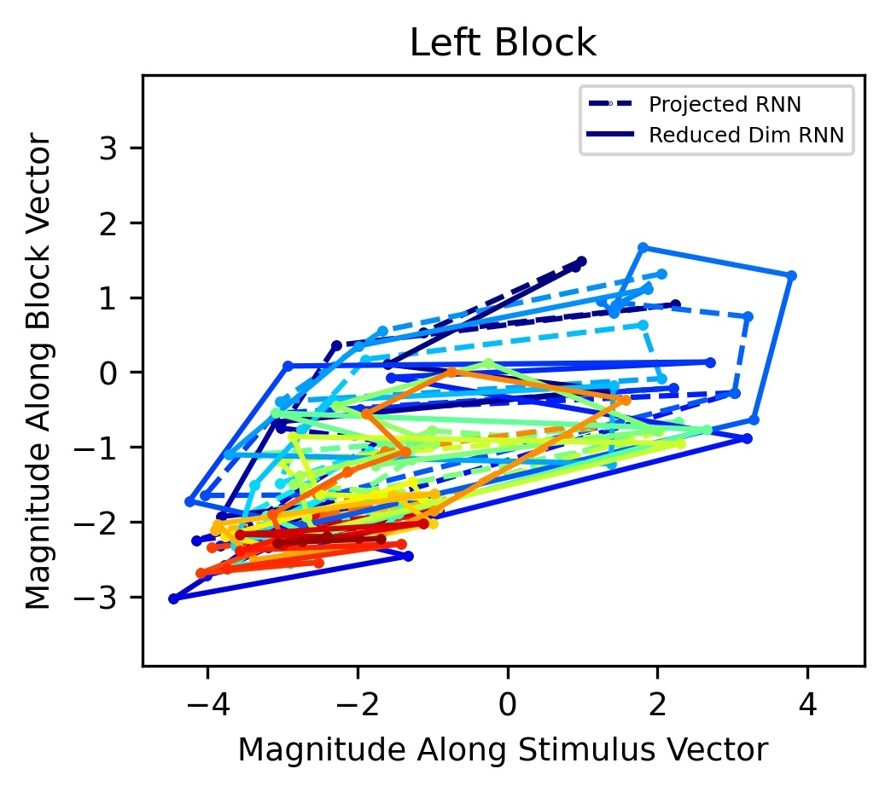

## Reverse-engineering recurrent neural network solutions to a hierarchical inference task for mice

### Authors:
- Rylan Schaeffer
- Mikail Khona
- Leenoy Meshulam
- Ila Rani Fiete

### Abstract

We study how recurrent neural networks (RNNs) solve a hierarchical inference task
involving two latent variables and disparate timescales separated by 1-2 orders
of magnitude. The task is of interest to the International Brain Laboratory, a
global collaboration of experimental and theoretical neuroscientists studying
how the mammalian brain generates behavior. We make four discoveries. First, 
RNNs learn behavior that is quantitatively similar to ideal Bayesian baselines.
Second, RNNs perform inference by learning a two-dimensional subspace defining
beliefs about the latent variables. Third, the geometry of RNN dynamics reflects 
an induced coupling between the two separate inference processes necessary to 
solve the task. Fourth, we perform model compression through a novel form of 
knowledge distillation on hidden representations  -- Representations and Dynamics 
Distillation (RADD)-- to reduce the RNN dynamics to a low-dimensional, highly 
interpretable model. This technique promises a useful tool for interpretability 
of high dimensional nonlinear dynamical systems. Altogether, this work yields 
predictions to guide exploration and analysis of mouse neural data and circuity.

### Walkthrough

How do recurrent neural networks perform inference, and how well do they approach
Bayes-optimality? To answer both these questions, we trained RNNs to perform a task
used by the [International Brain Laboratory](internationalbrainlab.com/) that
combines perceptual decision-making with hierarchical inference of latent (i.e.
unobserved) variables.

How does the IBL task work? On each _trial_, the mouse is shown a (low or medium contrast) stimulus in its left 
or right visual fields and must indicate on which side it perceived the stimulus. Upon 
choosing the correct side, it receives a small reward.

Over a number of consecutive 
trials (a _block_), the stimulus has a higher probability of appearing on one side 
(left stimulus probability $$p_s$$, right stimulus probability $$1-p_s$$). In the next
block, the stimulus side probabilities switch. The change-points between blocks are not
signaled to the mouse. For a more detailed description, check out the 
[IBL behavioral preprint](https://www.biorxiv.org/content/10.1101/2020.01.17.909838v2).

We train RNNs on a slightly modified version of this task. For comparison, we
include two baselines, which we term the Bayesian _actor_ and the Bayesian _observer_.
The Bayesian actor tells us what ideal performance on the task is, and the 
Bayesian observer tells us how well the RNN could do given the actions it selects.

#### Claim 1: RNNs approach Bayes-optimal behavior

#### Claim 2: RNNs perform inference by learning a 2D representation of the stimulus side and block side

 

 

#### Claim 3:

#### Claim 4: 

